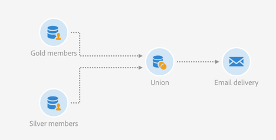

# União em dois públicos-alvos refinados {#example--union-on-two-refined-audiences}

O fluxo de trabalho definido neste exemplo mostra a união de duas atividades **[!UICONTROL Read audience]**. O objetivo desse fluxo de trabalho é enviar um email para os membros Gold ou Silver entre 18 e 30 anos. Já foram criados públicos-alvo específicos no sistema para rastrear esses membros.

O fluxo de trabalho de reconciliação foi criado deste modo:

* Uma primeira atividade [Read audience](../../automating/using/read-audience.md) que recupera o público-alvo dos membros Gold e o refina selecionando apenas os perfis entre 18 e 30 anos.
* Uma primeira atividade **[!UICONTROL Read audience]** que recupera o público-alvo dos membros Silver e o refina selecionando apenas os perfis entre 18 e 30 anos.
* Uma atividade [Union](../../automating/using/union.md) que une as populações das duas atividades **[!UICONTROL Read audiences]** em uma única população.
* Uma atividade de [Entrega de email](../../automating/using/email-delivery.md) que envia o email para a população da atividade **[!UICONTROL Union]**.
