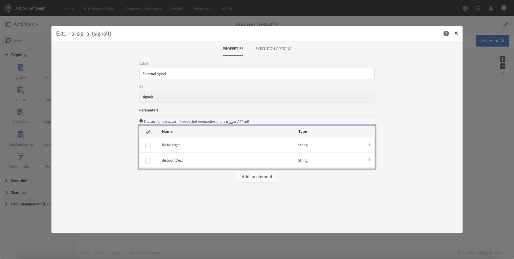

# Caso de uso {#use-case}

O caso de uso abaixo mostra como chamar o fluxo de trabalho com parâmetros em seus workflows.

O objetivo é acionar um fluxo de trabalho a partir de uma chamada de API com parâmetros externos. Esse fluxo de trabalho carregará dados no banco de dados a partir de um arquivo e criará uma audiência associada. Depois que a audiência for criada, um segundo fluxo de trabalho será acionado para enviar uma mensagem personalizada com os parâmetros externos definidos na chamada da API.

Para executar esse caso de uso, é necessário executar as ações abaixo:

1. **Faça uma chamada** de API para acionar o Workflow 1 com parâmetros externos. Consulte a [Etapa 1: Configuração da chamada](../../automating/using/use-case-calling-workflow.md#step-1--configuring-the-api-call)da API.
1. **Criar fluxo de trabalho 1**: o fluxo de trabalho transferirá um arquivo e o carregará no banco de dados. Em seguida, ele testará se os dados estão vazios ou não e, eventualmente, salvará os perfis em uma audiência. Finalmente, acionará o Workflow 2. Consulte a [Etapa 2: Configuração do fluxo de trabalho 1](../../automating/using/use-case-calling-workflow.md#step-2--configuring-workflow-1).
1. **Criar fluxo de trabalho 2**: o fluxo de trabalho lerá a audiência criada no Fluxo de trabalho 1 e, em seguida, enviará uma mensagem personalizada aos perfis, com um código de segmento personalizado com os parâmetros. Consulte a [Etapa 3: Configuração do fluxo de trabalho 2](../../automating/using/use-case-calling-workflow.md#step-3--configuring-workflow-2).


## Pré-requisitos {#prerequisites}

Antes de configurar os workflows, é necessário criar o Fluxo de trabalho 1 e 2 com uma **[!UICONTROL External signal]** atividade em cada um deles. Dessa forma, você poderá público alvo essas atividades de sinal ao chamar os workflows.

## Etapa 1: Configurar a chamada de API {#step-1--configuring-the-api-call}

Faça uma chamada de API para acionar o Workflow 1 com parâmetros. Para obter mais informações sobre a sintaxe de chamada da API, consulte a documentação [](../../api/using/triggering-a-signal-activity.md)Campaign Standard REST APIs.

Em nosso caso, queremos chamar o fluxo de trabalho com os parâmetros abaixo:

* **fileToTarget**: o nome do arquivo que queremos importar para o banco de dados.
* **discountDesc**: a descrição que queremos exibir no delivery do desconto.

```
-X POST https://mc.adobe.io/<ORGANIZATION>/campaign/<TRIGGER_URL>
-H 'Authorization: Bearer <ACCESS_TOKEN>' 
-H 'Cache-Control: no-cache' 
-H 'X-Api-Key: <API_KEY>' 
-H 'Content-Type: application/json;charset=utf-8' 
-H 'Content-Length:79' 
-i
-d {
-d "source:":"API",
-d "parameters":{
-d "fileToTarget":"profile.txt",
-d "discountDesc":"Running shoes"
-d } 
```

## Etapa 2: Configuração do fluxo de trabalho 1 {#step-2--configuring-workflow-1}

O fluxo de trabalho 1 será criado como abaixo:

* **[!UICONTROL External signal]** atividade: onde os parâmetros externos devem ser declarados para serem usados no fluxo de trabalho.
* **[!UICONTROL Transfer file]** atividade: importa o arquivo com o nome definido nos parâmetros.
* **[!UICONTROL Load file]** atividade: carrega dados do arquivo importado no banco de dados.
* **[!UICONTROL Update data]** atividade: insira ou atualize o banco de dados com dados do arquivo importado.
* **[!UICONTROL Test]** atividade: verifica se há dados importados.
* **[!UICONTROL Save audience]** atividade: se o arquivo contiver dados, salvará os perfis em uma audiência.
* **[!UICONTROL End activity]** atividade: chama o Workflow 2 com os parâmetros que você deseja usar dentro dele.


Siga as etapas abaixo para configurar o fluxo de trabalho:

1. Declarar os parâmetros que foram definidos na chamada da API. Para fazer isso, abra a **[!UICONTROL External signal]** atividade e adicione os nomes e os tipos dos parâmetros.

   

1. Adicione uma **[!UICONTROL Transfer file]** atividade para importar dados para o banco de dados.Para fazer isso, arraste e solte a atividade, abra-a e selecione a **[!UICONTROL Protocol]** guia.
1. Selecione a **[!UICONTROL Use a dynamic file path]** opção e use o parâmetro **fileToTarget** como o arquivo a ser transferido:

   ```
   $(vars/@fileToTarget)
   ```

   

1. Carregue os dados do arquivo no banco de dados.

   Para fazer isso, arraste e solte uma **[!UICONTROL Load file]** atividade no fluxo de trabalho e configure-a de acordo com suas necessidades.

1. Insira e atualize o banco de dados com dados do arquivo importado.

   Para fazer isso, arraste e solte uma **[!UICONTROL Update data]** atividade e, em seguida, selecione a guia **[!UICONTROL Identification]** para adicionar um critério de reconciliação (no nosso caso, o campo de **email** ).

   

1. Selecione a **[!UICONTROL Fields to update]** guia e especifique os campos a serem atualizados no banco de dados (no nosso caso, os campos **first name** e **email** ).

   

1. Verifique se os dados são recuperados do arquivo. Para fazer isso, arraste e solte uma **[!UICONTROL Test]** atividade no fluxo de trabalho e clique no **[!UICONTROL Add an element]** botão para adicionar uma condição.
1. Nomeie e defina a condição. Em nosso caso, queremos testar se a transição de saída contém dados com a sintaxe abaixo:

   ```
   $long(vars/@recCount)>0
   ```

   

1. Se os dados forem recuperados, salve-os em uma audiência. Para fazer isso, adicione uma **[!UICONTROL Save audience]** atividade ao **Público alvo e não a transição vazia** e abra-a.
1. Selecione a **[!UICONTROL Use a dynamic label]** opção e use o parâmetro **fileToTarget** como o rótulo da audiência:

   ```
   $(vars/@fileToTarget)
   ```

   

1. Arraste e solte uma **[!UICONTROL End]** atividade que chamará o Workflow 2 com parâmetros e, em seguida, abra-a.
1. Selecione a **[!UICONTROL External signal]** guia e especifique o fluxo de trabalho a ser acionado e sua atividade de sinal associada.
1. Defina os parâmetros que você deseja usar dentro do Workflow 2 e seus valores associados.

   Em nosso caso, queremos passar os parâmetros originalmente definidos na chamada da API (**fileToTarget** e **discountDesc**) e um parâmetro **segmentCode** adicional com um valor constante (&quot;desconto de 20%&quot;).

   

O fluxo de trabalho 1 está configurado, agora é possível criar o Fluxo de trabalho 2. Para obter mais informações, consulte [esta seção](../../automating/using/use-case-calling-workflow.md#step-3--configuring-workflow-2).

## Etapa 3: Configuração do fluxo de trabalho 2 {#step-3--configuring-workflow-2}

O fluxo de trabalho 2 será criado como abaixo:

* **[!UICONTROL External signal]** atividade: onde os parâmetros devem ser declarados para serem usados no fluxo de trabalho.
* **[!UICONTROL Read audience]** atividade: lê a audiência salva no Fluxo de trabalho 1.
* **[!UICONTROL Email delivery]** atividade: envia uma mensagem recorrente para a audiência direcionada, personalizada com parâmetros.


Siga as etapas abaixo para configurar o fluxo de trabalho:

1. Declarar os parâmetros que foram definidos no Workflow 1.

   Para fazer isso, abra a **[!UICONTROL External signal]** atividade e adicione o nome e o tipo de cada parâmetro definido na **[!UICONTROL End]** atividade do Workflow 1.

   

1. Use a audiência salva no Fluxo de trabalho 1. Para fazer isso, arraste e solte uma **[!UICONTROL Read audience]** atividade no fluxo de trabalho e abra-a.
1. Selecione a **[!UICONTROL Use a dynamic audience]** opção e use o parâmetro **fileToTarget** como o nome da audiência para ler:

   ```
   $(vars/@fileToTarget)
   ```

   

1. Nomeie a transição de saída de acordo com o parâmetro **segmentCode** .

   To do this, select the **[!UICONTROL Transition]** tab, then the **[!UICONTROL Use a dynamic segment code]** option.

1. Use o parâmetro **segmentCode** como o nome da transição de saída:

   ```
   $(vars/@segmentCode)
   ```

   

1. Arraste e solte uma **[!UICONTROL Email delivery]** atividade para enviar uma mensagem para a audiência.
1. Identifique os parâmetros a serem usados na mensagem para personalizá-la com o parâmetro **discountDesc** . Para fazer isso, abra as opções avançadas do atividade e adicione o nome e o valor do parâmetro.

   

1. Agora você pode configurar a mensagem. Abra a atividade e selecione **[!UICONTROL Recurring email]**.

   

1. Selecione o modelo a ser usado e defina as propriedades do email de acordo com suas necessidades.
1. Use o parâmetro **discountDesc** como um campo de personalização. Para fazer isso, selecione-o na lista campos de personalização.

   

1. Agora você pode concluir a configuração da mensagem e enviá-la como de costume.

   

## Execução dos workflows {#executing-the-workflows}

Depois que os workflows forem criados, você poderá executá-los. Verifique se os dois workflows foram iniciados antes de executar a chamada da API.
