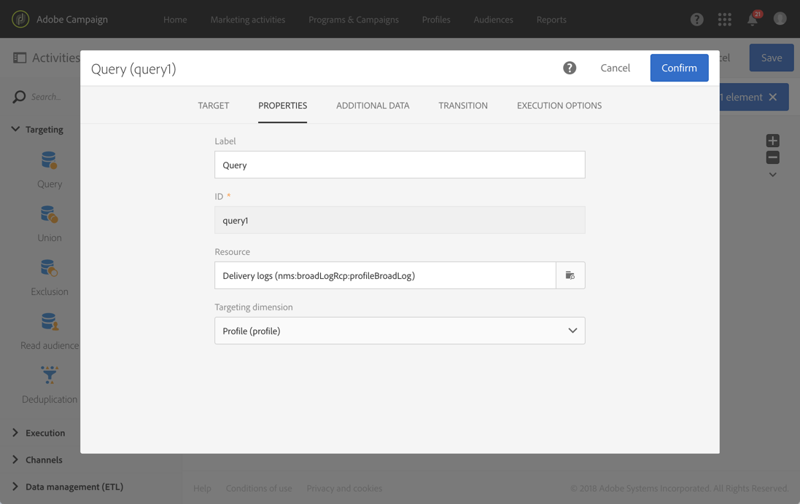

# Uso de recursos diferentes de dimensões de direcionamento {#using-resources-different-from-targeting-dimensions}

Esses casos de uso apresentam como usar um recurso diferente do targeting dimension, por exemplo, para procurar um registro específico em uma tabela distante.

Para obter mais informações sobre targeting dimensions e recursos, consulte [esta seção](../../automating/using/query.md#targeting-dimensions-and-resources)

**Exemplo 1: identificação de perfis direcionados pela entrega com o rótulo “Bem-vindo de volta!”**.

* Nesse caso, queremos direcionar os perfis. Definiremos a dimensão de direcionamento como **[!UICONTROL Profiles (profile)]**.
* Queremos filtrar os perfis selecionados de acordo com o rótulo da entrega. Por isso, definiremos o recurso como **[!UICONTROL Delivery logs]**. Dessa forma, estamos filtrando diretamente na tabela de logs do delivery, o que oferecerá melhor desempenho.

**Exemplo 2: identificação de perfis que não foram direcionados pela entrega com o rótulo “Bem-vindo de volta!”**

No exemplo anterior, usamos um recurso diferente da dimensão de direcionamento. Essa operação só será possível se você quiser encontrar um registro que **esteja presente** na tabela distante (os logs da entrega no nosso exemplo).

Para encontrar um registro que **não esteja presente** na tabela distante (por exemplo, perfis que não foram direcionados por uma entrega específica), use o mesmo recurso e dimensão de direcionamento já que o registro não estará presente na tabela distante (logs da entrega).

* Nesse caso, queremos direcionar os perfis. Definiremos a dimensão de direcionamento como **[!UICONTROL Profiles (profile)]**.
* Queremos filtrar os perfis selecionados de acordo com o rótulo da entrega. Não é possível filtrar diretamente nos logs da entrega, pois estamos procurando um registro que não está presente na tabela de logs da entrega. Portanto, definiremos os recursos como **[!UICONTROL Profile (profile)]** e criaremos nosso query na tabela de perfis.

