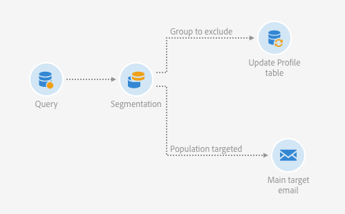
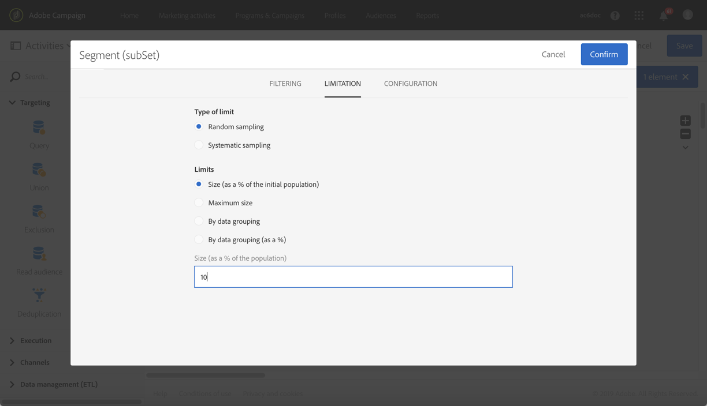

# Criação de um grupo de controle {#building-control-group}

Para medir o impacto de um delivery, é possível excluir alguns perfis do público alvo para que eles não recebam determinada mensagem. Este grupo de controle pode ser usado para fazer uma comparação com o comportamento da população do público alvo que recebeu a mensagem.

Para fazer isso no Adobe Campaign Standard, crie um fluxo de trabalho que inclua as seguintes atividades:
* Uma atividade [Query](../../automating/using/query.md) para público alvo de uma determinada população.
* Uma atividade de [segmentação](../../automating/using/segmentation.md) para isolar um grupo de controle aleatório dessa população.
* Uma atividade de delivery [de e-](../../automating/using/email-delivery.md) mail para enviar uma mensagem ao público alvo principal.
* Uma atividade de dados  Update para atualizar os perfis que foram excluídos do público alvo (o grupo de controle aleatório).

## Extensão do recurso de Perfil {#extending-profile}

Primeiro, é necessário estender o **[!UICONTROL Profile]** recurso com um novo campo correspondente ao grupo de controle. Depois que o fluxo de trabalho for executado, esse campo será verificado quanto aos perfis que foram excluídos do público alvo.

1. Em **[!UICONTROL Administration]** > **[!UICONTROL Development]** > **[!UICONTROL Custom Resources]**, clique em **[!UICONTROL Create]**.
1. Se ainda não o estendeu, selecione **[!UICONTROL Extend an existing resource]** e escolha o **[!UICONTROL Profile]** recurso.
1. Na **[!UICONTROL Data structure]** guia, adicione um novo campo para o grupo de controle e selecione **[!UICONTROL Boolean]** para o **[!UICONTROL Type]** campo.

   

1. Na **[!UICONTROL Screen definition]** guia, desdobre a **[!UICONTROL Detail screen configuration]** seção e selecione o campo que você acabou de criar para que seja exibido para cada perfil.

   

1. Salve as alterações.
1. Atualize a estrutura do banco de dados para publicar o recurso **[!UICONTROL Profile]** estendido. Consulte [Publicação de um recurso](../../developing/using/updating-the-database-structure.md#publishing-a-custom-resource)personalizado.

Para obter mais informações sobre como estender um recurso personalizado, consulte Etapas [principais para adicionar um recurso](../../developing/using/key-steps-to-add-a-resource.md).

## Criação de um workflow {#creating-a-workflow}

1. Em **[!UICONTROL Marketing Activities]**, clique **[!UICONTROL Create]** e selecione **[!UICONTROL Workflow]**.
1. Selecione **[!UICONTROL New Workflow]** como tipo de fluxo de trabalho e clique em **[!UICONTROL Next]**.
1. Insira as propriedades do fluxo de trabalho e clique em **[!UICONTROL Create]**.

As etapas detalhadas para criar um fluxo de trabalho são apresentadas na seção [Criação de um fluxo de trabalho](../../automating/using/building-a-workflow.md) .

## Creating a Query activity {#create-a-query-activity}

1. Em **[!UICONTROL Activities]** > **[!UICONTROL Targeting]**, arraste e solte uma atividade de [Query](../../automating/using/query.md) .
1. Clique na atividade com o Duplo para definir seu público alvo.
1. Por exemplo, em **[!UICONTROL Shortcuts]**, arraste e solte **[!UICONTROL Profile]**, selecione **[!UICONTROL Age]** com o operador **[!UICONTROL Greater than]** e digite 25 no **[!UICONTROL Value]** campo.
1. Clique em **[!UICONTROL Confirm]**.

## Criação de uma atividade de segmentação {#creating-a-segmentation-activity}

1. Arraste e solte uma atividade de [segmentação](../../automating/using/segmentation.md) e clique com o duplo nele.
1. Na **[!UICONTROL Segments]** guia, selecione um segmento para editar.
1. Na **[!UICONTROL Configuration]** guia desse segmento, selecione a **[!UICONTROL Limit the population of this segment]** opção.

   

1. Na **[!UICONTROL Limitation]** guia, verifique se a **[!UICONTROL Random sampling]** opção está selecionada.

   

1. Defina uma porcentagem da população inicial, por exemplo 10%, e clique em **[!UICONTROL Confirm]**. O grupo de controle será composto por 10% da população-alvo, selecionada aleatoriamente.
1. Na **[!UICONTROL Advanced options]** guia, selecione a **[!UICONTROL Generate complement]** opção e preencha os campos **[!UICONTROL Transition label]** e **[!UICONTROL Segment code]** .

   

1. Clique em **[!UICONTROL Confirm]**.

## Creating an Email activity {#creating-an-email-activity}

1. Em **[!UICONTROL Activities]** > **[!UICONTROL Channels]**, arraste e solte uma atividade de delivery [de e-](../../automating/using/email-delivery.md) mail após o segmento principal do público alvo.
1. Clique na atividade e selecione  para editá-la.
1. Selecione **[!UICONTROL Single send email]** e clique em **[!UICONTROL Next]**.
1. Selecione um modelo de email e clique em **[!UICONTROL Next]**.
1. Insira as propriedades do email e clique em **[!UICONTROL Next]**.
1. Para criar o layout do seu email, clique em **[!UICONTROL Use the Email Designer]**.
1. Edite e salve seu conteúdo.
1. Na **[!UICONTROL Schedule]** seção do painel de mensagem, desmarque a opção **[!UICONTROL Request confirm antes de enviar mensagens}** .

## Criando uma atividade de dados de atualização {#creating-update-data-activity}

1. Arraste e solte uma atividade [Atualizar dados](../../automating/using/update-data.md) após o segmento do grupo de controle.
1. Selecione a atividade e abra-a usando o  botão das ações rápidas que aparecem.
1. Na guia **[!UICONTROL General]**, selecione **[!UICONTROL Update]** na lista suspensa **[!UICONTROL Operation type]**.
1. Na **[!UICONTROL Identification]** guia, selecione a **[!UICONTROL Directly using the targeting dimension]** opção.
1. Selecione o **[!UICONTROL Profile]** recurso que você estendeu anteriormente como a dimensão a ser atualizada.

   

1. Na **[!UICONTROL Fields to update]** guia, selecione o campo grupo de controle que você adicionou ao **[!UICONTROL Profile]** recurso como a condição **[!UICONTROL Destination]** e digite true como a condição.

   

1. Clique em **[!UICONTROL Confirm]**.

## Execução do fluxo de trabalho {#running-the-workflow}

Click **[!UICONTROL Start]** to run the workflow.

Depois que o fluxo de trabalho é executado, a população do grupo de controle é excluída e a mensagem é enviada para o público alvo principal restante.

O recurso **[!UICONTROL Profile]** é atualizado da seguinte forma: se um perfil estava no grupo de controle, o campo correspondente está marcado.

Agora você pode comparar como os recipient da mensagem reagirão em relação ao pequeno grupo que foi excluído da mensagem e não a recebeu.

## Reutilização do mesmo grupo de controle {#reusing-same-control-group}

O exemplo acima permite criar um grupo de controle global, pois ele é armazenado como um atributo de perfil independentemente dos delivery. Na verdade, o novo campo &quot;Grupo de controle&quot; criado como parte da extensão de **[!UICONTROL Profile]** recursos é atualizado após a execução do fluxo de trabalho acima.

Consequentemente, da próxima vez que você quiser usar o mesmo grupo de controle, poderá segmentar o novo campo &quot;Grupo de controle&quot; em vez de fazer uma segmentação aleatória.

Para fazer isso:
1. Ao criar a **[!UICONTROL Segmentation]** atividade, selecione o segmento a ser editado na **[!UICONTROL Segments]** guia.
1. Na **[!UICONTROL Configuration]** guia desse segmento, certifique-se de não selecionar a **[!UICONTROL Limit the population of this segment]** opção.
1. Na **[!UICONTROL Filtering]** guia, arraste e solte **[!UICONTROL Profiles (attributes)]** no espaço de trabalho principal.

   

1. Na **[!UICONTROL Add a rule - Profiles (attributes)]** janela, selecione &quot;Grupo de controle&quot; (o campo adicionado ao **[!UICONTROL Profile]** recurso) e selecione **[!UICONTROL Yes]** como a condição de filtro.

   
