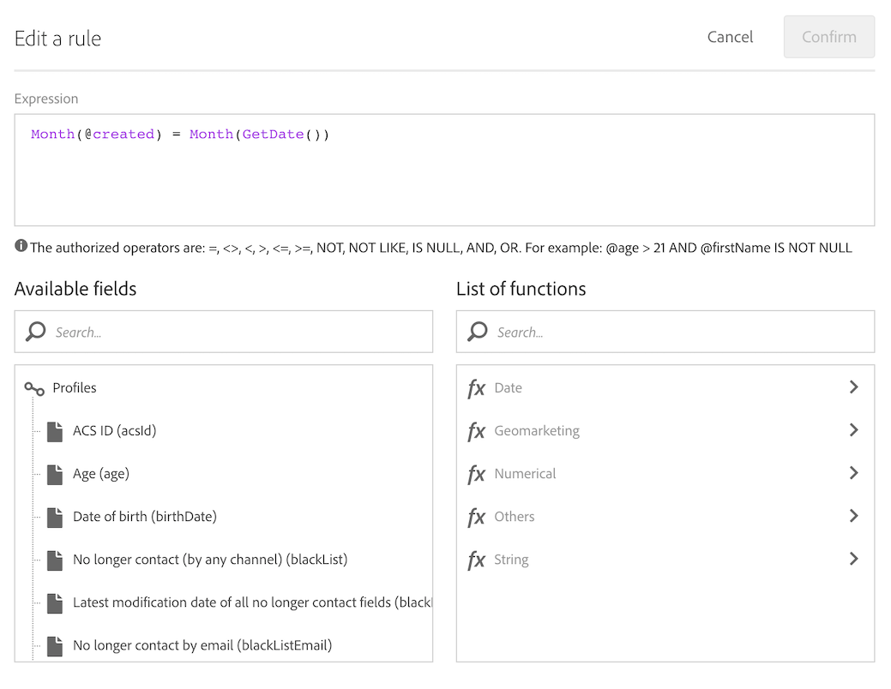

# Criar deliveries na data de criação de perfis {#creation-date-query}

Você pode enviar uma oferta por email no aniversário da criação do perfil do cliente.

1. Em **[!UICONTROL Marketing Activities]**, clique em **[!UICONTROL Create]** e selecione **[!UICONTROL Workflow]**.
1. Selecione **[!UICONTROL New Workflow]** como tipo de fluxo de trabalho e clique em **[!UICONTROL Next]**.
1. Insira as propriedades do fluxo de trabalho e clique em **[!UICONTROL Create]**.

## Criação de uma atividade do Scheduler {#creating-a-scheduler-activity}

1. In **[!UICONTROL Activities]** > **[!UICONTROL Execution]**, drag and drop a [Scheduler](../../automating/using/scheduler.md) activity.
1. Clique duas vezes na atividade.
1. Configure a execução do delivery.
1. Em **[!UICONTROL Execution frequency]**, selecione **[!UICONTROL Daily]**.
1. Selecione um **[!UICONTROL Time]** e a execução **[!UICONTROL Repetition frequency]** do seu fluxo de trabalho.
1. Selecione uma **[!UICONTROL Start]** data e **[!UICONTROL Expiration]** para seu fluxo de trabalho.
1. Confirme sua atividade e salve o fluxo de trabalho.

>[!NOTE]
>
>To start your workflow at a specific time zone, in the **[!UICONTROL Execution options]** tab, set up the time zone for your scheduler in the **[!UICONTROL Time zone]** field. Por padrão, o fuso horário selecionado é o definido nas propriedades do fluxo de trabalho (consulte [Criação de um fluxo de trabalho](../../automating/using/building-a-workflow.md)).


## Criação de uma atividade Query {#creating-a-query-activity}

1. To select recipients, drag and drop a [Query](../../automating/using/query.md) activity and double-click it.
1. Adicione **[!UICONTROL Profiles]** e selecione **[!UICONTROL no longer contact by email]** com o valor **[!UICONTROL no]**.

### Recuperando perfis criados no mesmo dia que o dia da execução {#retriving-profiles-created-on-the-same-day}

1. Em **[!UICONTROL Profile]**, arraste e solte o **[!UICONTROL Created]** campo. e clique em **[!UICONTROL Advanced Mode]**.
   
1. No **[!UICONTROL list of functions]**, clique com o duplo **[!UICONTROL Day]** do **[!UICONTROL Date]** nó.
1. Em seguida, insira o campo **[!UICONTROL Created]** como argumento.
1. Select **[!UICONTROL equals to (=)]** as the operator.
1. Para Valor, selecione **[!UICONTROL Day]** no **[!UICONTROL Date]** nó no **[!UICONTROL List of functions]**.
1. Insira a **[!UICONTROL GetDate()]** função como argumento.

Você recuperou os perfis cujo dia de criação é igual ao dia atual.

Você deve acabar com:

```Day(@created) = Day(GetDate())```


Clique em **[!UICONTROL Confirm]**.

### Recuperando perfis criados no mesmo mês que o mês de execução{#retriving-profiles-created-on-the-same-month}

1. No **[!UICONTROL Query]** editor, selecione o primeiro query e duplicado.
1. Abra o duplicado.
1. Substitua **[!UICONTROL Day]** por **[!UICONTROL Month]** no query.
1. Clique em **[!UICONTROL Confirm]**.



Você deve acabar com isso:

``` Month(@created) = Month(GetDate()) ```

O query final exibe:

```Day(@created) = Day(GetDate()) AND Month(@created) = Month(GetDate())```


## Criação de um delivery de email{#creating-an-email-delivery}

1. Arraste e solte uma atividade de delivery [](../../automating/using/email-delivery.md) de e-mail.
1. Clique na atividade e selecione  para editar.
1. Selecione **[!UICONTROL Recurring email]** e clique em **[!UICONTROL Next]**.
1. Selecione um template de email e clique em **[!UICONTROL Next]**.
1. Insira as propriedades do email e clique em **[!UICONTROL Next]**.
1. Para criar o layout do email, clique em **[!UICONTROL Email Designer]**.
1. Insira elementos ou selecione um template.
1. Personalize o email usando campos e links.
Para obter mais informações, consulte [Design de email](../../designing/using/designing-from-scratch.md#designing-an-email-content-from-scratch).
1. Clique em **[!UICONTROL Preview]** para verificar o layout.
1. Clique em **[!UICONTROL Save]**.

**Tópicos relacionados:**

* [Canal de email](../../channels/using/creating-an-email.md)
