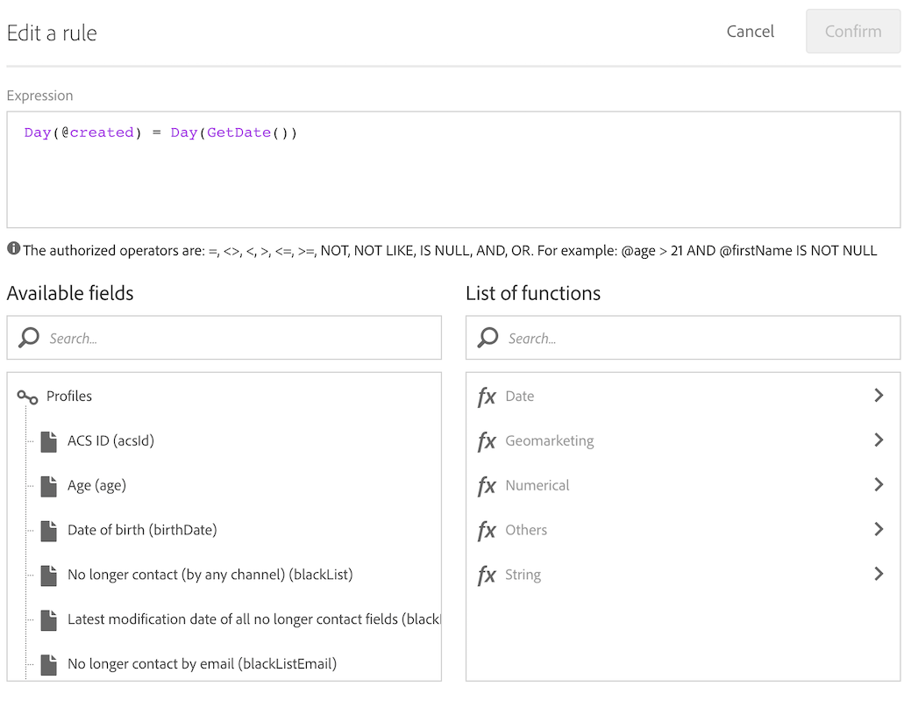

# Criar entregas na data de criação de perfis {#creation-date-query}

Você pode enviar uma oferta por email no aniversário da criação do perfil do cliente.

1. Em **[!UICONTROL Marketing Activities]**, clique em **[!UICONTROL Create]** e selecione **[!UICONTROL Workflow]**.
1. Selecione **[!UICONTROL New Workflow]** como tipo de fluxo de trabalho e clique em **[!UICONTROL Next]**.
1. Insira as propriedades do fluxo de trabalho e clique em **[!UICONTROL Create]**.

## Criação de uma atividade do Scheduler {#creating-a-scheduler-activity}

1. Em **[!UICONTROL Activities]** > **[!UICONTROL Execution]**, arraste e solte uma atividade [Scheduler](../../automating/using/scheduler.md).
1. Clique duas vezes na atividade.
1. Configure a execução da entrega.
1. Em **[!UICONTROL Execution frequency]**, selecione **[!UICONTROL Daily]**.
1. Selecione um **[!UICONTROL Time]** e o **[!UICONTROL Repetition frequency]** de execução para seu fluxo de trabalho.
1. Selecione uma data **[!UICONTROL Start]** e **[!UICONTROL Expiration]** para seu fluxo de trabalho.
1. Confirme sua atividade e salve o fluxo de trabalho.

>[!NOTE]
>
>Para iniciar o fluxo de trabalho em um fuso horário específico, na guia **[!UICONTROL Execution options]**, configure o fuso horário para o scheduler no campo **[!UICONTROL Time zone]**. Por padrão, o fuso horário selecionado é o definido nas propriedades do fluxo de trabalho (consulte [Criação de um fluxo de trabalho](../../automating/using/building-a-workflow.md)).


## Criação de uma atividade Query {#creating-a-query-activity}

1. Para selecionar destinatários, arraste e solte uma atividade [Query](../../automating/using/query.md) e clique duas vezes nela.
1. Adicione **[!UICONTROL Profiles]** e selecione **[!UICONTROL no longer contact by email]** com o valor **[!UICONTROL no]**.

### Recuperação de perfis criados no mesmo dia do dia de execução {#retrieving-profiles-created-on-the-same-day}

1. Em **[!UICONTROL Profile]**, arraste e solte o campo **[!UICONTROL Created]**. e clique em **[!UICONTROL Advanced Mode]**.
   
1. No **[!UICONTROL list of functions]**, clique duas vezes em **[!UICONTROL Day]** no nó **[!UICONTROL Date]**.
1. Em seguida, insira o campo **[!UICONTROL Created]** como argumento.
1. Selecione **[!UICONTROL equals to (=)]** como operador.
1. Para Valor, selecione **[!UICONTROL Day]** no nó **[!UICONTROL Date]** em **[!UICONTROL List of functions]**.
1. Insira a função **[!UICONTROL GetDate()]** como argumento.

Você recuperou os perfis cujo dia de criação é igual ao dia atual.

Você deve acabar com:

```Day(@created) = Day(GetDate())```



Clique em **[!UICONTROL Confirm]**.

### Recuperação de perfis criados no mesmo mês do mês de execução{#retrieving-profiles-created-on-the-same-month}

1. No editor **[!UICONTROL Query]**, selecione a primeira consulta e duplique-a.
1. Abra a duplicata.
1. Substituir **[!UICONTROL Day]** por **[!UICONTROL Month]** na consulta.
1. Clique em **[!UICONTROL Confirm]**.


Você deve acabar com isso:

``` Month(@created) = Month(GetDate()) ```

A consulta final exibe:

```Day(@created) = Day(GetDate()) AND Month(@created) = Month(GetDate())```


## Criação de um delivery de email{#creating-an-email-delivery}

1. Arraste e solte uma atividade [Entrega de email](../../automating/using/email-delivery.md).
1. Clique na atividade e selecione  para editar.
1. Selecione **[!UICONTROL Recurring email]** e clique em **[!UICONTROL Next]**.
1. Selecione um modelo de email e clique em **[!UICONTROL Next]**.
1. Insira as propriedades do email e clique em **[!UICONTROL Next]**.
1. Para criar o layout do email, clique em **[!UICONTROL Email Designer]**.
1. Insira elementos ou selecione um modelo.
1. Personalize o email usando campos e links.
Para obter mais informações, consulte [Design de email](../../designing/using/designing-from-scratch.md#designing-an-email-content-from-scratch).
1. Clique em **[!UICONTROL Preview]** para verificar o layout.
1. Clique em **[!UICONTROL Save]**.

**Tópicos relacionados:**

* [Canal de email](../../channels/using/creating-an-email.md)
