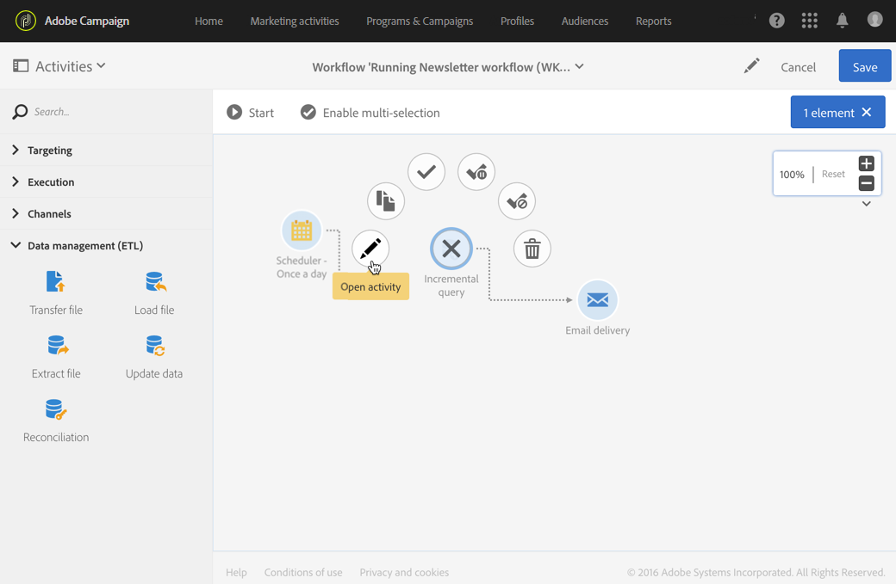

# Interface de fluxo de trabalho{#workflow-interface}

Você pode criar workflows para gerenciar processos inteiros em suas campanhas e programas.

A tela de edição do workflow é composta pelos seguintes elementos:

* A variável [Paleta](#palette), que faz referência às atividades disponíveis.
* A variável [Workspace](#workspace), no qual as atividades são configuradas e organizadas.
* A variável [Barra de ação](#action-bar), que é composto por botões que permitem a interação com o fluxo de trabalho e/ou seus componentes.
* A variável [Ações rápidas](#quick-actions), que aparecem ao redor de uma atividade selecionada, permitem que você interaja com ela.

## Paleta {#palette}

A paleta está no lado esquerdo da tela. Todas as atividades disponíveis são classificadas em várias categorias:

* [Direcionamento](../../automating/using/about-targeting-activities.md): atividades específicas para direcionamento, manipulação de dados de população e atividades de filtragem
* [Execução](../../automating/using/about-execution-activities.md): atividades específicas para organizar e executar workflows
* [Canais](../../automating/using/about-channel-activities.md): atividades que representam os diferentes canais de comunicação disponíveis
* [Gerenciamento de dados (ETL)](../../automating/using/about-data-management-activities.md): atividades específicas para manipulação de dados

Para usar uma atividade da paleta no seu fluxo de trabalho, arraste-a e solte-a no espaço de trabalho.

É necessário configurar cada atividade adicionada da paleta antes de iniciar o workflow.

## Workspace {#workspace}

O espaço de trabalho é a zona central no editor de fluxo de trabalho. É nessa zona que você pode descartar suas atividades, vinculá-las usando transições e configurá-las.

Para vincular duas atividades, mova o final da seta da primeira atividade para a atividade seguinte até que elas se conectem. Você também pode mover a atividade em direção ao ponto da seta atrás dela para vinculá-la à atividade anterior. Se você mover qualquer uma das atividades, elas permanecerão vinculadas.

As transições após atividades que processam dados contêm as populações intermediárias. Você pode acessá-las se marcar a opção **[!UICONTROL Keep interim results]** opção no **[!UICONTROL Execution]** das propriedades do workflow.

>[!CAUTION]
>
>Essa opção consome bastante espaço do disco e foi projetada para ajudar a criar um fluxo de trabalho e garantir a configuração e o comportamento adequados. Deixe-a desmarcada nas instâncias de produção.

Quando uma atividade é selecionada, ações rápidas aparecem ao redor da atividade, permitindo que você interaja com ela. Por exemplo, para configurar uma atividade, selecione-a e depois abra-a usando o  nas ações rápidas.

Determinadas funções só são ativadas no espaço de trabalho:

* Selecione várias atividades e transições desenhando uma zona ao redor delas.
* Pressione **Ctrl** + clique com o botão esquerdo para selecionar várias atividades e/ou transições.
* Pressione **Enter** para exibir os detalhes da atividade ou transição selecionada no momento.
* Pressione **Excluir** para excluir a atividade selecionada no momento.
* Pressione **Ctrl+C** para copiar as atividades selecionadas, e **Ctrl+V** para colá-los no espaço de trabalho.

## Barra de ação {#action-bar}

Dependendo dos elementos selecionados no espaço de trabalho ou no status de execução do fluxo de trabalho, os botões disponíveis na barra de ação podem variar.

 **[!UICONTROL Open activity]** Permite editar as propriedades do workflow.

 **[!UICONTROL Start]** Inicia o workflow.

 **[!UICONTROL Pause]** Pausa o workflow.

 **[!UICONTROL Stop]** Interrompe a execução do workflow. Não é possível retomar de onde parou.

 **[!UICONTROL Restart]** Reinicia o workflow.

 **[!UICONTROL Log and tasks]** Abre o log de execução do workflow.

 **[!UICONTROL Enable multi-selection]** Ativa o modo de seleção múltipla. O fluxo de trabalho deve ser composto de pelo menos duas atividades.

 **[!UICONTROL Disable multi-selection]** Desativa o modo de seleção múltipla. 

 **[!UICONTROL Open transition]** Abre a transição selecionada. 

  **[!UICONTROL Normal execution]** Reativa a seleção se ela tiver sido previamente desativada ou marcada como pausada. 

 **[!UICONTROL Execution suspended]** Pausa o fluxo de trabalho na atividade selecionada. 

 **[!UICONTROL No execution]** Desativa a atividade. 

 **[!UICONTROL Delete selection]** Exclui as atividades selecionadas. 

 **[!UICONTROL Copy selection]** Copia as atividades selecionadas.

 **[!UICONTROL Paste]** Cola as atividades copiadas.

## Ações rápidas {#quick-actions}

Quando uma atividade é selecionada, botões de ação rápida são exibidos ao redor dela, permitindo que você interaja com ela.

 **[!UICONTROL Open activity]** Abre a atividade selecionada.

 **[!UICONTROL Copy selection]** Copia a atividade selecionada.

 **[!UICONTROL Open the activity's advanced options]** Abre as opções avançadas da atividade Email ou SMS delivery selecionada.

 **[!UICONTROL Normal execution]** Reativa a seleção se ela tiver sido previamente desativada ou marcada como pausada.

 **[!UICONTROL Execution suspended]** Pausa o fluxo de trabalho na atividade selecionada.

 **[!UICONTROL No execution]** Desativa a atividade.

 **[!UICONTROL Immediate execution]** Força o processamento imediato da seleção. Esse botão só está disponível para o Scheduler e Aguardar atividades.

 **[!UICONTROL Delete selection]** Exclui as atividades selecionadas.

## Duplicação de atividades de workflow {#duplicating-workflow-activities}

O espaço de trabalho permite duplicar atividades de fluxo de trabalho, copiando-as no mesmo fluxo de trabalho ou em outro fluxo de trabalho da mesma instância do Campaign.

Depois que uma atividade é duplicada, toda a sua configuração é mantida. Para atividades de delivery (Email, SMS, Notificação por push...), o objeto de delivery anexado à atividade é duplicado.

>[!NOTE]
>
>As atividades de fluxo de trabalho não podem ser duplicadas de uma instância para outra. Atividades de workflows técnicos não podem ser duplicadas.

Para duplicar uma atividade, siga as etapas abaixo:

1. Selecione a atividade e clique no botão **[!UICONTROL Copy selection]** nas ações rápidas.

   Você também pode usar a variável **Ctrl+C** atalho de teclado.

   

1. Clique com o botão direito do mouse no espaço de trabalho do workflow desejado e clique no **[!UICONTROL Paste]** botão.

   Você também pode usar a variável **CTRL + V** atalho de teclado.

   

1. A atividade é duplicada, com todas as configurações definidas inicialmente.

Também é possível copiar e colar várias atividades, permitindo duplicar um fluxo de trabalho inteiro.

Para fazer isso, selecione as atividades desenhando uma zona ao redor delas. em seguida, clique no link **[!UICONTROL Copy selection]** na barra de ações (ou pressione **Ctrl+C**). É possível colá-los no local desejado.

