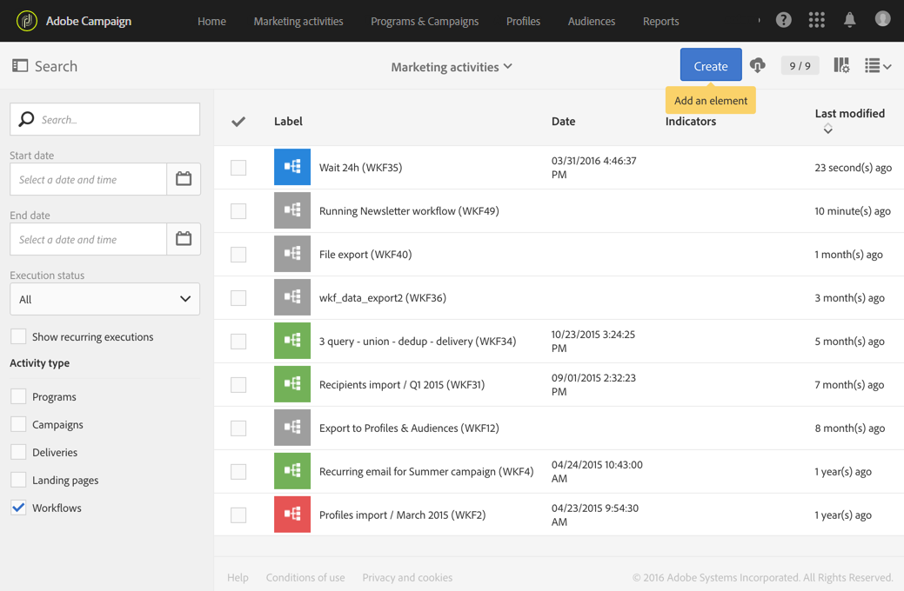

# Ciclo de vida do fluxo de trabalho {#life-cycle}

O ciclo de vida de um fluxo de trabalho inclui três etapas principais e cada etapa está vinculada a um status e uma cor:

* **Editando** (cinza)

  Esta é a fase inicial de design de um fluxo de trabalho (consulte [Criação de um fluxo de trabalho](../../automating/using/building-a-workflow.md#creating-a-workflow)). O workflow ainda não é manipulado pelo servidor e pode ser modificado sem nenhum risco.

* **Em andamento** (azul)

  Quando a fase inicial de design for concluída, o workflow poderá ser iniciado e será manipulado pelo servidor.

* **Concluído** (verde)

  Um workflow é concluído quando não há mais nenhuma tarefa em andamento ou quando um operador interrompeu explicitamente a instância.

Depois de iniciado, um workflow também pode ter dois outros status:

* **Aviso** (amarelo)

  O fluxo de trabalho não pôde ser concluído ou foi pausado usando os botões  ou .

* **Erro** (vermelho)

  Ocorreu um erro quando um fluxo de trabalho foi executado. O workflow foi interrompido e o usuário deve realizar uma ação. Para saber mais sobre este erro, use o botão  para acessar o log de fluxo de trabalho (consulte [Monitoramento](../../automating/using/monitoring-workflow-execution.md)).

A lista de atividades de marketing permite exibir todos os workflows, bem como seus status. Para obter mais informações, consulte [Gerenciamento de atividades de marketing](../../start/using/marketing-activities.md#about-marketing-activities).

