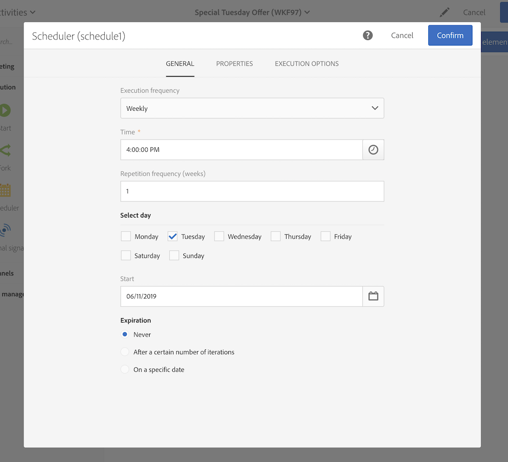

# Criação de um delivery de email todas as terças-feiras{#creating-email-every-tuesday}

Você pode enviar um email todas as terças-feiras a todos os clientes com ofertas especiais.

1. Em **[!UICONTROL Marketing Activities]**, clique em **[!UICONTROL Create]** e selecione **[!UICONTROL Workflow]**.
1. Selecione **[!UICONTROL New Workflow]** como tipo de fluxo de trabalho e clique em **[!UICONTROL Next]**.
1. Insira as propriedades do fluxo de trabalho e clique em **[!UICONTROL Create]**.

## Criação de uma atividade do Scheduler{#creating-a-scheduler-activity}

1. In **[!UICONTROL Activities]** > **[!UICONTROL Execution]**, drag and drop a [Scheduler](../../automating/using/scheduler.md) activity.
1. Clique duas vezes na atividade.
1. Configure a execução do delivery.
1. Em **[!UICONTROL Execution frequency]**, selecione **[!UICONTROL Weekly]**.
1. Selecione uma **[!UICONTROL Time]** e uma **[!UICONTROL Repetition frequency]** para seus deliveries.
1. Em **[!UICONTROL Days of the week]**, selecione **[!UICONTROL Tuesday]**.
1. Especifique um parâmetro **[!UICONTROL Start]** e **[!UICONTROL Expiration]** para o fluxo de trabalho.
1. Confirme sua atividade e salve o fluxo de trabalho.

>[!NOTE]
>
>Para iniciar o fluxo de trabalho em um **[!UICONTROL Time Zone]** específico, na guia **[!UICONTROL Execution options]**, configure o fuso horário para o scheduler no campo Time zone. Por padrão, o fuso horário selecionado é o definido nas propriedades do fluxo de trabalho (consulte [Criação de um fluxo de trabalho](../../automating/using/building-a-workflow.md)).

## Criação de uma atividade Query{#creating-a-query-activity}

1. In **[!UICONTROL Activities]** > **[!UICONTROL Targeting]**, to select recipients, drag and drop a [Query](../../automating/using/query.md) activity and double-click it.
1. Em **[!UICONTROL Shortcuts]** > **[!UICONTROL Profile]**, arraste e solte **[!UICONTROL Email]**.
1. Selecione **[!UICONTROL is not empty]** como operador.
1. Em **[!UICONTROL Shortcuts]** > **[!UICONTROL General]**, adicione perfis e selecione **[!UICONTROL no longer contact by email]** com o valor **[!UICONTROL No]**.
1. Clique em **[!UICONTROL Confirm]**.

## Criação de um delivery de email{#creating-an-email-delivery}

1. Em **[!UICONTROL Activities]** > **[!UICONTROL Channels]**, arraste e solte uma atividade de delivery [de e-](../../automating/using/email-delivery.md) mail.
1. Clique na atividade e selecione  para editar.
1. Selecione **[!UICONTROL Recurring email]** e clique em **[!UICONTROL Next]**.
1. Selecione um template de email e clique em **[!UICONTROL Next]**.
1. Insira as propriedades do email e clique em **[!UICONTROL Next]**.
1. Para criar o layout do email, clique em **[!UICONTROL Use Email Designer]**.
1. Insira elementos ou selecione um template.
1. Personalize o email usando campos e links.
1. Clique em **[!UICONTROL Save]**.

Para obter mais informações, consulte [Design de email](../../designing/using/designing-from-scratch.md#designing-an-email-content-from-scratch).

**Tópicos relacionados:**

* [Canal de email](../../channels/using/creating-an-email.md)
