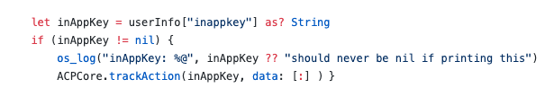

# Sobre mensagens no aplicativo{#about-in-app-messaging}

As mensagens no aplicativo são um canal por meio do qual é possível exibir uma mensagem quando o usuário está ativo no aplicativo para dispositivos móveis. Esse tipo de mensagem é gratuito para notificações por push enviadas ao centro de notificações do telefone dos usuários. Para mais informações sobre o canal de notificações por push, consulte esta [seção](../../channels/using/about-push-notifications.md).

Este canal exige que os aplicativos para dispositivos móveis sejam integrados ao SDK da Adobe Experience Platform. Esses aplicativos devem estar ativados no Adobe Experience Platform Launch antes de estarem disponíveis no Adobe Campaign para deliveries no aplicativo.

Para enviar mensagens no aplicativo para dispositivos móveis que utilizam o SDK da Experience Platform, é necessário atender aos seguintes pré-requisitos:

1. No Adobe Campaign, confirme se você pode acessar o canal **[!UICONTROL In-App]**. Se não conseguir acessar esses canais, entre em contato com sua equipe de conta.

1. Aproveite os casos de uso de publicação de conteúdo para dispositivos móveis no Adobe Campaign Standard com um aplicativo SDK da Experience Cloud. Para que isso seja possível, um aplicativo para dispositivos móveis deve ser criado no Adobe Experience Platform Launch e configurado no Adobe Campaign Standard. Para o guia passo a passo, consulte esta [página](https://helpx.adobe.com/br/campaign/kb/configuring-app-sdk.html).

1. Depois de configurada, você pode preparar sua mensagem no aplicativo. Para obter mais informações, consulte esta [página](../../channels/using/preparing-and-sending-an-in-app-message.md#preparing-your-in-app-message).

1. Em seguida, você pode decidir enviar uma [Mensagem no aplicativo](../../channels/using/customizing-an-in-app-message.md) ou uma [Personalização de um tipo de mensagem de notificação local](../../channels/using/customizing-an-in-app-message.md#customizing-a-local-notification-message-type).

1. O delivery está pronta para ser enviado. Para saber mais, consulte esta [página](../../channels/using/preparing-and-sending-an-in-app-message.md#sending-your-in-app-message).

**Conteúdo relacionado:**

* [Relatório no aplicativo](../../reporting/using/in-app-report.md)
* [Casos de uso de publicação de conteúdo para dispositivos móveis compatíveis com o Adobe Campaign Standard](https://helpx.adobe.com/br/campaign/kb/configure-launch-rules-acs-use-cases.html)
* [Guia para Aplicativos de dispositivos móveis no Campaign Standard](https://helpx.adobe.com/br/campaign/kb/acs-mobile.html)

## Perguntas frequentes no aplicativo {#in-app-faq}

### Quais seriam algumas recomendações de recursos úteis para saber mais sobre o canal no aplicativo no Adobe Campaign Standard? {#resources-inapp}

Confira os recursos abaixo:

* [Tutorials de vídeo](https://docs.adobe.com/content/help/en/campaign-standard-learn/tutorials/communication-channels/mobile/in-app/in-app-message-overview.html)
* [Postagem no blog](https://theblog.adobe.com/get-more-out-of-the-new-in-app-message-channel-from-adobe-campaign/)
* [Página da comunidade](https://experienceleaguecommunities.adobe.com/t5/adobe-campaign-standard/ct-p/adobe-campaign-standard-community)

### Qual é a finalidade das APIs de extensões de Campanha setLinkageField e resetLinkageField? {#extensions-apis}

Como as mensagens no aplicativo são extraídas pelo SDK da Campanha, queremos fornecer um mecanismo seguro para garantir que as mensagens no aplicativo que contêm dados de PII não caiam em mãos mal-intencionadas. Assim, temos o seguinte mecanismo em vigor para garantir o delivery seguro das mensagens ao dispositivo:

* Os clientes marcam campos de perfil móvel (tabela appSubscriberRcp) como Pessoal e Sensível se quiserem garantir que essas informações específicas sejam fornecidas com segurança.
* Os campos marcados como tal só podem ser usados no modelo de Perfil (não no modelo appSubscriber ou no modelo Broadcast) que tem mecanismo de segurança adicional integrado.
* As mensagens criadas usando o modelo de Perfil só podem ser enviadas quando o usuário tiver feito logon no aplicativo.
* Para facilitar esse handshake seguro, os desenvolvedores de aplicativos móveis devem passar detalhes adicionais de autenticação usando a API setLinkageField. Observe que os campos de vinculação são aqueles identificados como o link entre o Perfil do Mobile e o Perfil do CRM e, ao mesmo tempo, estendem a tabela appSubscriberRcp.
* Eles devem liberar as mensagens no aplicativo armazenadas no dispositivo e resetLinkagefields quando o usuário faz logout do aplicativo usando resetLinkageField. Isso garante que, se um usuário diferente fizer logon no aplicativo, ele não visualizará as mensagens destinadas ao usuário anterior.
* Consulte as APIs [do SDK do](https://aep-sdks.gitbook.io/docs/using-mobile-extensions/adobe-campaign-standard/adobe-campaign-standard-api-reference) Mobile para implementar este mecanismo de segurança do lado do cliente.

### O que devo fazer para ativar o relatórios no aplicativo na Campanha? {#enable-inapp-reporting}

É necessário configurar o postback de rastreamento no aplicativo. Instructions can be found [here](https://helpx.adobe.com/campaign/kb/config-app-in-launch.html#InApptrackingpostback).

Para implementar o rastreamento de notificação local, consulte esta [página](../../administration/using/local-tracking.md).

### Quais relatórios estão disponíveis para o canal no aplicativo? {#report-inapp}

Um relatório pronto para uso está disponível no Adobe Campaign para o canal no aplicativo. Refer to this [documentation](../../reporting/using/in-app-report.md).

Consulte esta [página](../../reporting/using/indicator-calculation.md#in-app-delivery) para entender como cada métrica no aplicativo é calculada.

### Você oferece suporte a variantes de conteúdo multilíngue para o In-App, semelhante ao Push? {#multilingual-inapp}

Não há modelos multilíngues disponíveis para mensagens no aplicativo agora.

Entretanto, se o objetivo for enviar uma mensagem no aplicativo em um idioma diferente do inglês, o conteúdo poderá ser colado diretamente nas caixas de texto disponíveis.

### campos de personalização de Campanha podem ser adicionados ao HTML personalizado? {#custom-html-inapp}

Não, isso ainda não é suportado.

### Configurei uma mensagem de alerta, mas ela não é exibida no dispositivo. {#alert-message}

Para mensagens de alerta, é necessário pelo menos um botão de rejeição (primário ou secundário deve ter ação de rejeição). Caso contrário, será possível salvar a mensagem, mas ela não será recebida.

### Se o som personalizado do iOS de notificações locais não for reproduzido; o som padrão será reproduzido? {#local-notification-sound}

Para obter um som personalizado no iOS, é necessário fornecer um nome de arquivo com extensão ao criar uma notificação local (por exemplo, sound.caf). Se essa extensão não for fornecida, o som padrão será usado.

### Os deep links são suportados em mensagens no aplicativo? {#inapp-deeplinks}

Sim, os deep links são suportados em mensagens no aplicativo. Os deep links devem incluir:

* idioma que declara que o rastreamento de delivery precisa ser desativado para que os deep links funcionem.
* Appsflyer com Branch como parceiros que podem fazer o rastreamento de deep link. Para obter mais informações sobre a integração entre o Branch e o Adobe Campaign Standard, consulte esta [página](https://help.branch.io/using-branch/docs/adobe-campaign-standard-1).

### Uma mensagem no aplicativo pode ser acionada quando o usuário inicia o aplicativo a partir de uma notificação por push? {#inapp-push-trigger}

Sim, essas mensagens são também chamadas de mensagens da cadeia de margarida. Siga o processo abaixo:

1. Criar uma mensagem no aplicativo.

1. Defina um evento personalizado e selecione-o como um acionador de evento para este IAM, por exemplo, &quot;Acionador da pré-visualização de outono&quot;.

1. Ao criar sua mensagem de push, defina uma variável personalizada cujo valor possa ser definido como um evento usado para acionar o IAM, por exemplo, Chave = &quot;inappkey&quot; e valor = &quot;Acionador de envio de pré-visualização de outono&quot;.

1. No código do aplicativo móvel, implemente o acionador de evento da seguinte maneira:

   
