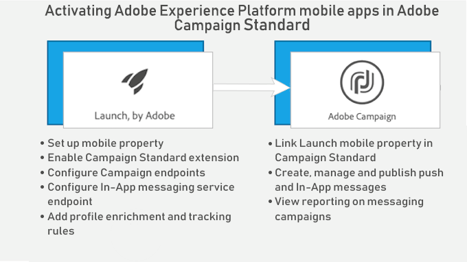
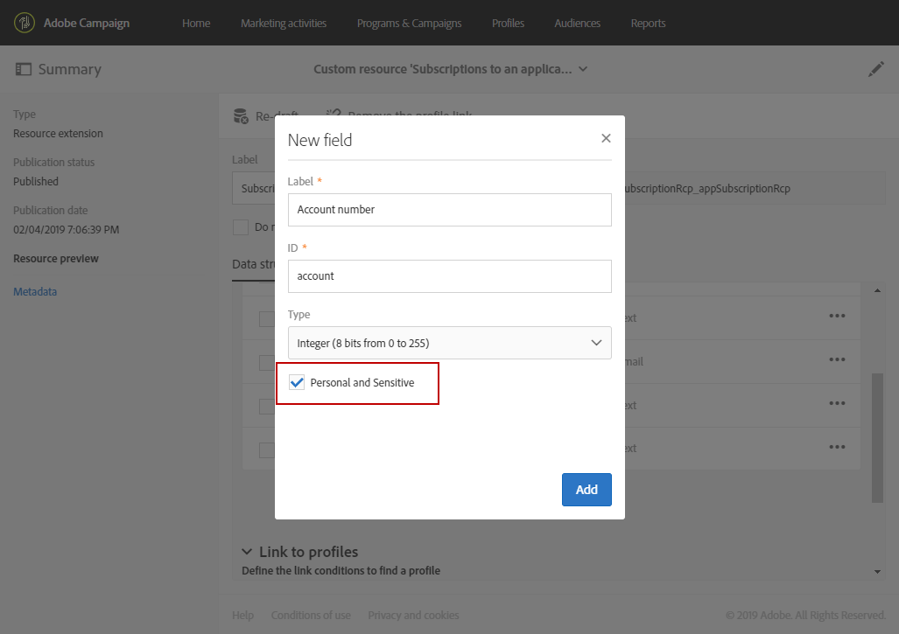

# Sobre mensagens no aplicativo{#about-in-app-messaging}

As mensagens no aplicativo são um canal por meio do qual é possível exibir uma mensagem quando o usuário está ativo no aplicativo para dispositivos móveis. Esse tipo de mensagem é gratuito para notificações por push enviadas ao centro de notificações do telefone dos usuários. Para mais informações sobre o canal de notificações por push, consulte esta [seção](../../channels/using/about-push-notifications.md).

Este canal exige que os aplicativos para dispositivos móveis sejam integrados ao SDK da Adobe Experience Platform. Esses aplicativos devem ser ativados na interface da Coleção de dados antes de serem disponibilizados no Adobe Campaign para deliveries no aplicativo.

Para enviar mensagens no aplicativo para dispositivos móveis que utilizam o SDK da Experience Platform, é necessário atender aos seguintes pré-requisitos:

1. No Adobe Campaign, confirme se você pode acessar o canal **[!UICONTROL In-App]**. Se não conseguir acessar esses canais, entre em contato com sua equipe de conta.

1. Para aproveitar os casos de uso de publicação de conteúdo para dispositivos móveis no Adobe Campaign Standard com um aplicativo Experience Cloud SDK, um aplicativo para dispositivos móveis deve ser criado na interface da Coleção de dados e configurado no Adobe Campaign Standard. Para o guia passo a passo, consulte esta [página](../../administration/using/configuring-a-mobile-application.md).

1. Depois de configurada, você pode preparar sua mensagem no aplicativo. Para obter mais informações, consulte esta [página](../../channels/using/preparing-and-sending-an-in-app-message.md#preparing-your-in-app-message).

1. Em seguida, você pode decidir enviar uma [Mensagem no aplicativo](../../channels/using/customizing-an-in-app-message.md) ou uma [Personalização de um tipo de mensagem de notificação local](../../channels/using/customizing-an-in-app-message.md#customizing-a-local-notification-message-type).

1. A entrega está pronta para ser enviada. Para saber mais, consulte esta [página](../../channels/using/preparing-and-sending-an-in-app-message.md#sending-your-in-app-message).

**Conteúdo relacionado:**

* [Relatório no aplicativo](../../reporting/using/in-app-report.md)
* [Casos de uso para dispositivos móveis compatíveis com o Adobe Campaign Standard](../../administration/using/configuring-rules-launch.md)
* [Guia do Campaign Standard Mobile](../../channels/using/get-started-communication-channels.md)

## Tratamento de campos de perfis móveis com dados pessoais e confidenciais {#handling-mobile-profile-fields-with-personal-and-sensitive-data}

No Adobe Campaign, os dados de atributos do perfil móvel enviados de dispositivo móvel são armazenados no recurso **[!UICONTROL Subscriptions to an application (appSubscriptionRcp)]**, que permite definir os dados que você deseja coletar dos assinantes de aplicativos.

Esse recurso precisa ser estendido para coletar os dados que você pretende enviar do dispositivo móvel para o Adobe Campaign. Para fazer isso, consulte esta [página](../../developing/using/extending-the-subscriptions-to-an-application-resource.md) para conhecer as etapas detalhadas.

Para permitir a personalização de suas mensagens no aplicativo com mais segurança, os campos do perfil móvel desse recurso precisam ser configurados adequadamente. Em **[!UICONTROL Subscriptions to an application (appSubscriptionRcp)]**, ao criar os novos campos de perfis móveis, marque a opção **[!UICONTROL Personal and Sensitive]** para deixá-los indisponíveis durante a personalização de mensagens no aplicativo.

>[!NOTE]
>
>Se você tiver uma implementação existente com extensão de recurso personalizada nesta tabela, recomendamos rotular os campos apropriadamente antes de aproveitá-los para personalização de mensagens no aplicativo.

Após a configuração e a publicação do recurso personalizado **[!UICONTROL Subscriptions to an application]**, você pode começar a preparar a entrega no aplicativo usando o modelo **[!UICONTROL Target users based on their Mobile profile (inApp)]**. Apenas campos não pessoais e não confidenciais estarão disponíveis no recurso **[!UICONTROL Subscriptions to an application (appSubscriptionRcp)]** para personalização.

Se você exigir personalização com campos **Personal and Sensitive**, recomendamos usar o modelo **[!UICONTROL Target users based on their Campaign profile (inAppProfile)]** que possui mecanismo de segurança adicional para garantir que os dados PII de seus usuários permaneçam seguros.
