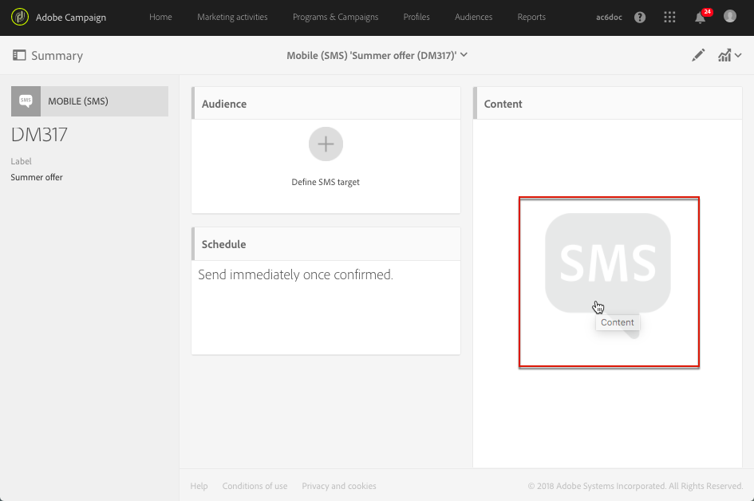
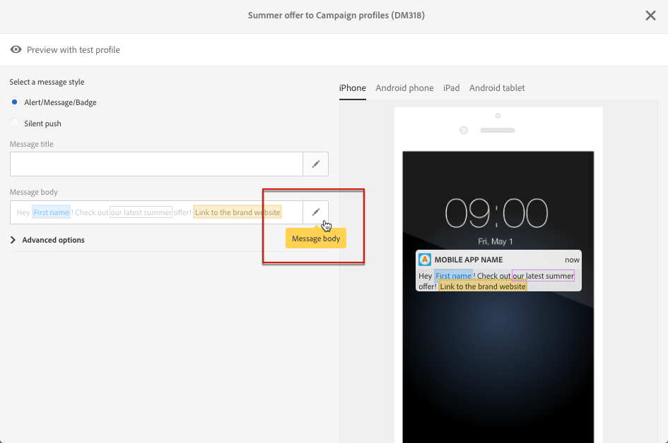

# Sobre design de conteúdo de SMS e notificações por push{#about-sms-and-push-content-design}

Use o editor de conteúdo para definir, modificar e personalizar o conteúdo de suas mensagens SMS e notificações por push no Adobe Campaign.

Esta seção descreve as especificidades do editor de conteúdo de SMS e de notificações por push, incluindo [a interface do editor de conteúdo de SMS e notificações por push](../../channels/using/sms-and-push-content-editor-interface.md).

As ações comuns a uma ou mais atividades de marketing são apresentadas nas seguintes seções:

* Para mais informações sobre a personalização de conteúdo de SMS ou notificação por push, consulte [Inserir um campo de personalização](../../designing/using/personalization.md#inserting-a-personalization-field) e [Adicionar um bloco de conteúdo](../../designing/using/personalization.md#adding-a-content-block).
* Para obter mais informações sobre definição de texto condicional em uma mensagem SMS ou notificação por push, consulte [Definição de texto dinâmico](../../channels/using/defining-dynamic-text.md).

Para acessar o editor de conteúdo de SMS e notificação por push:

* Clique no bloco **[!UICONTROL Content]**, em um painel SMS.

  

* Clique no lápis ao lado do campo **[!UICONTROL Message body]**, em um painel de notificação por push.

  

**Tópicos relacionados:**

* [Criação de uma mensagem SMS](../../channels/using/creating-an-sms-message.md)
* [Criação e envio de uma notificação por push](../../channels/using/preparing-and-sending-a-push-notification.md)
