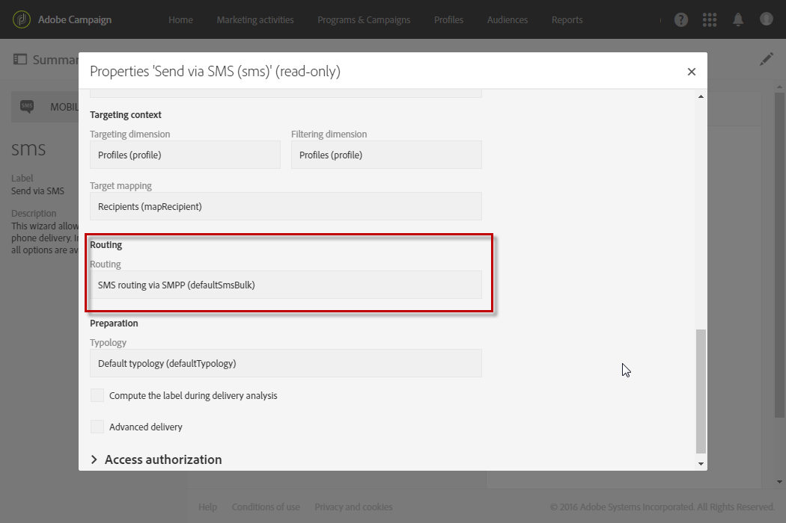

# Sobre mensagens SMS{#about-sms-messages}

A Adobe Campaign permite que você entregue mensagens SMS (Short Message Service).

>[!NOTE]
>
>O canal SMS é um suplemento. Verifique o contrato de licença.

Para mensagens SMS, você poderá criar, modificar e personalizar mensagens somente no formato de texto. Você também poderá visualizar suas mensagens SMS antes de enviá-las.

O comprimento de uma mensagem SMS é restrito a 160 caracteres se estiver na codificação GSM e somente a 70 caracteres se estiver em Unicode. No entanto, determinados caracteres especiais podem influenciar o comprimento da mensagem. Para obter mais informações, consulte a seção [codificação do SMS](../../administration/using/configuring-sms-channel.md#sms-encoding--length-and-transliteration).

As mensagens SMS podem ser criadas no menu **[!UICONTROL Marketing activities]**, em uma campanha ou em um fluxo de trabalho, consulte [Criação de uma mensagem SMS](../../channels/using/creating-an-sms-message.md).

Para enviar mensagens SMS para um telefone celular, é necessário:

* Uma conta externa de **[!UICONTROL Routing]** configurada no canal **[!UICONTROL Mobile (SMS)]** com o modo **[!UICONTROL Bulk delivery]**. Para mais informações, consulte a seção [Roteamento](../../administration/using/configuring-sms-channel.md#defining-an-sms-routing).
* Um template do delivery vinculado corretamente a essa conta externa.

**Tópicos relacionados:**

* [Gerenciamento de modelos](../../start/using/marketing-activity-templates.md)
* [Configuração SMS](../../administration/using/configuring-sms-channel.md#defining-an-sms-routing)
* [Relatório SMS](../../reporting/using/sms-report.md)
* [Guia para Aplicativos de dispositivos móveis no Campaign Standard](https://helpx.adobe.com/campaign/kb/acs-mobile.html)

## TEMPLATE DO DELIVERY SMS {#sms-delivery-template}

Adobe Campaign oferta um template do delivery para dispositivos móveis. Esse modelo deve estar vinculado corretamente à conta externa usada para o canal **[!UICONTROL Mobile (SMS)]**. Para acessá-lo e modificá-lo:

1. Selecione **[!UICONTROL Resources]** > **[!UICONTROL Templates]** > **[!UICONTROL Delivery templates]** no menu avançado.
1. Passe o mouse sobre o modelo **[!UICONTROL Send via SMS]** com o mouse e selecione a opção **elemento do Duplicado**.
1. Selecione o novo modelo.
1. Clique no botão **[!UICONTROL Edit properties]**.
1. Na seção **[!UICONTROL Advanced parameters]** das propriedades do modelo, verifique se o modelo está vinculado à conta externa a ser usada para fornecer SMS.

   

**Tópicos relacionados:**

* [Gerenciamento de modelos](../../start/using/marketing-activity-templates.md)
