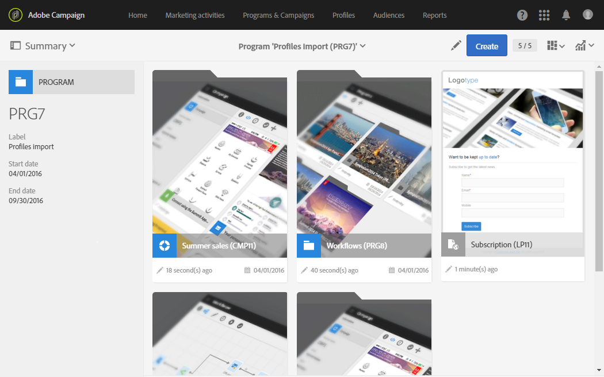
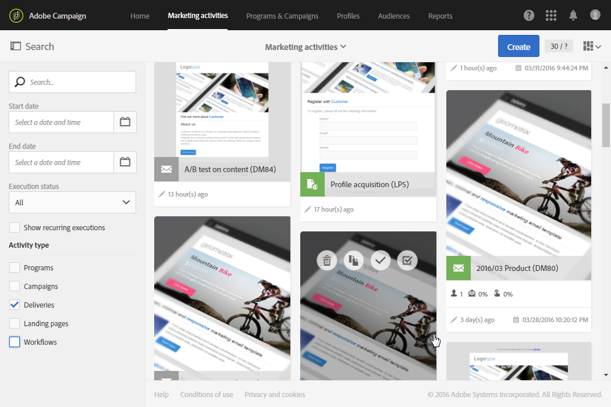

# Acessar mensagens{#accessing-messages}

Você pode acessar um conjunto de funcionalidades avançadas, desde o direcionamento, a criação e personalização de mensagens, a execução de comunicações até relatórios operacionais associados.

As mensagens podem ser acessadas:

* em uma campanha
* na página inicial do Adobe Campaign
* da lista de atividades de marketing

## Acessar mensagens em campanhas {#accessing-messages-in-campaigns}

Para acessar a lista de atividades de marketing de uma campanha:

1. Vá para **[!UICONTROL Marketing activities]** na barra de navegação superior.
1. Selecione **[!UICONTROL Marketing activities > Marketing plans > Programs & Campaigns]**.

   Você também pode clicar diretamente no cartão **[!UICONTROL Programs & Campaigns]** na home page. Para obter mais informações sobre campanhas, consulte a seção [Programas e campanhas](../../start/using/programs-and-campaigns.md).

1. Selecione um programa e depois uma campanha.

   

1. Clique na lista suspensa **[!UICONTROL Summary]**.
1. Clique em **[!UICONTROL Search]** para filtrar a forma como as mensagens são exibidas (por nome, data ou status).

   Para filtrar mensagens recorrentes, é possível marcar a caixa correspondente.

## Acesso à lista de mensagens {#accessing-the-message-list}

Para acessar a lista completa de atividades de marketing de todas as campanhas combinadas:

1. Selecione **[!UICONTROL Marketing activities]** na barra de navegação superior.

   Você também pode acessá-lo pelo cartão **[!UICONTROL Marketing activities]** na home page. Para obter mais informações sobre a lista de atividades de marketing, consulte a seção [Gerenciando atividades de marketing](../../start/using/marketing-activities.md#creating-a-marketing-activity).

1. Para filtrar as atividades de marketing (por nome, data, status ou tipo de atividade), use os campos **[!UICONTROL Search]** à esquerda da lista de atividades de marketing.

## Ciclo de vida da mensagem {#message-life-cycle}

O status de uma mensagem é representado por uma cor específica nas listas. Os status possíveis são:

* **[!UICONTROL Editing]** (cinza): a mensagem está sendo editada.
* **[!UICONTROL In progress]** (azul): a mensagem está sendo enviada.
* **[!UICONTROL Finished]** (verde): o envio foi concluído sem erros.
* **[!UICONTROL Erroneous]** (vermelho): o envio foi cancelado ou ocorreu um erro enquanto a mensagem estava sendo preparada ou enviada.

  >[!NOTE]
  >
  >Um banner de notificação amarelo pode aparecer acima do cartão quando uma ação é necessária, por exemplo, quando você precisa confirmar o envio de uma mensagem.
