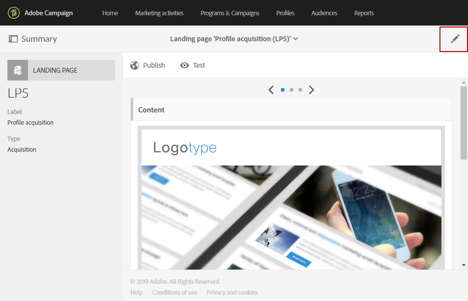

# Configuração de uma landing page {#configuring-landing-page}

## Confirmar o envio de uma landing page {#confirm-a-landing-page-submission}

Quando uma landing page é enviada por um visitante, você pode configurar as ações acionadas. Para fazer isso:

1. Edite as propriedades de landing page acessadas pelo ícone  no painel da landing page e exiba os parâmetros **[!UICONTROL Job]**.

   

1. Na seção **[!UICONTROL Specific actions]**, selecione **[!UICONTROL Start sending message]** para determinar o envio de uma mensagem automática, por exemplo, para confirmar a assinatura em um serviço. Em seguida, selecione um template do delivery de email.

   Observe que, se uma mensagem de confirmação já estiver configurada no nível de serviço, você não deverá selecionar nenhuma nessa tela para evitar o envio de várias mensagens de confirmação. Consulte [Configurar um serviço](../../audiences/using/creating-a-service.md).

1. Crie **[!UICONTROL Additional data]** para permitir o armazenamento de dados adicionais quando a landing page estiver sendo enviada. Esses dados não estão visíveis aos visitantes da página. Somente valores constantes são considerados.

   

## Vinculação de uma landing page a um serviço {#linking-a-landing-page-to-a-service}

Você pode vincular um formulário a um serviço para que os perfis possam assinar um serviço específico ao validar as landing pages.

Os parâmetros para a vinculação de uma landing page permitem definir o tipo de ação executada e se a landing page é especificamente vinculada a um único serviço ou se é genérica.

Para selecionar o serviço a ser vinculado, você precisa:

1. Edite as propriedades de landing page acessadas pelo ícone  no painel da landing page e exiba os parâmetros **[!UICONTROL Job]**.

   

1. Escolha **[!UICONTROL Subscription]** na lista suspensa **[!UICONTROL Specific actions]**.

   

1. Selecione **[!UICONTROL Specific service]** para vincular a landing page a um único serviço. Não selecione essa opção se quiser usar vários serviços com a landing page.

   Use a opção **[!UICONTROL Specified service in the URL]** para permitir que a landing page seja usada para vários serviços. Portanto, você deverá indicar a landing page ao configurar o serviço.

## Configuração de permissões e dados de pré-carregamento {#setting-permissions-and-pre-loading-data}

O acesso a uma landing page pode ser restrito aos visitantes identificados, que acessam um link em uma mensagem enviada pelo Campaign, por exemplo, ou a uma unidade organizacional específica.
No caso de visitantes identificados, você pode pré-carregar os dados deles na landing page. Para fazer isso:

1. Edite as propriedades de landing page acessadas pelo ícone  no painel da landing page e exiba os parâmetros **[!UICONTROL Access & loading]**.

   

1. Selecione **[!UICONTROL Preload visitor data]**.

   Se um visitante da página corresponder a um perfil no banco de dados, os dados dele serão exibidos nos campos do formulário mapeados com os dados do banco de dados e os elementos de personalização da landing page serão considerados.

   

Você também pode:

* Usar os parâmetros de URL para identificar os visitantes com a opção **[!UICONTROL Authorize visitor identification via URL parameters]**. Em seguida, você escolhe a chave de carregamento e mapeia os parâmetros de filtro com os parâmetros do URL correspondente.
* Autorize qualquer visitante a acessar a landing page, usando a opção **[!UICONTROL Authorize unidentified visitors]**.

As landing pages também podem ser vinculadas a uma unidade organizacional. Isso definirá o acesso dos usuários às diferentes landing pages. Para atribuir uma unidade organizacional:

1. Acesse as propriedades da sua landing page pelo ícone **[!UICONTROL Edit properties]**.

   

1. Expanda o **[!UICONTROL Access authorization]**.

1. Clique no menu suspenso e selecione sua unidade organizacional. Para saber mais sobre como criar uma unidade organizacional, consulte esta [página](../../administration/using/organizational-units.md).

   

1. Os campos **[!UICONTROL Created by]**, **[!UICONTROL Created]**, **[!UICONTROL Access authorization]** e **[!UICONTROL Last modified]** são automaticamente preenchidos.

1. Clique em **[!UICONTROL Confirm]** e em **[!UICONTROL Save]**.

Sua landing page agora só pode ser acessada e gerenciada pelos usuários na unidade organizacional escolhida.

## Configuração do Google reCAPTCHA {#setting-google-recaptcha}

Você pode configurar o Google reCAPTCHA V3 com sua landing page para protegê-la contra spam e abuso causado por bots. Para poder usá-lo com a landing page, você precisa primeiro criar uma conta externa. Para saber mais sobre como configurá-lo, consulte esta [seção](../../administration/using/external-accounts.md#google-recaptcha-external-account).

Depois que sua conta externa do Google reCAPTCHA V3 for configurada, você poderá adicioná-la à landing page:

1. Antes de publicar a landing page, acesse as propriedades da página pelo ícone  do painel da landing page.

   

1. Expanda o menu **[!UICONTROL Access & loading]**.
1. Marque a opção **[!UICONTROL Use reCAPTCHA to protect your site from spam and abuse]**.
1. Selecione a conta externa do Google reCAPTCHA criada anteriormente.

   

1. Clique em **[!UICONTROL Confirm]**.

Sua landing page agora está configurada com o Google reCAPTCHA, localizado na parte inferior da página.

O Google reCAPTCHA retornará uma pontuação com base nas interações dos usuários com sua página. Para verificar sua pontuação, conecte-se ao [Google Admin Console](https://g.co/recaptcha/admin).
