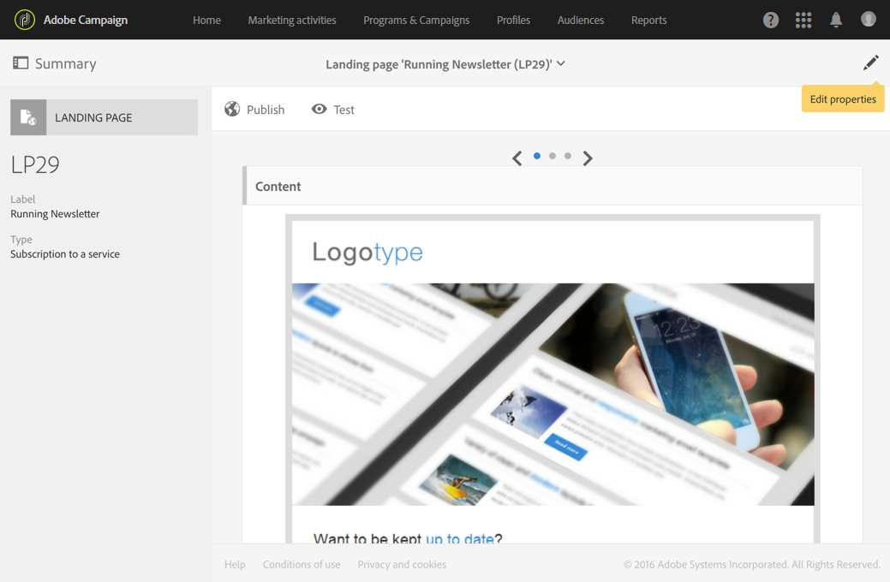
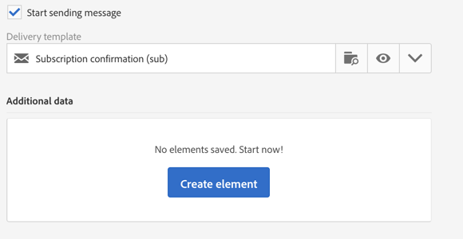
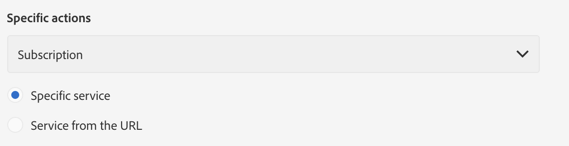
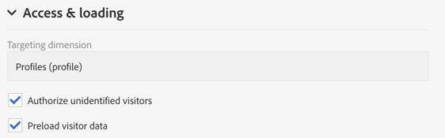
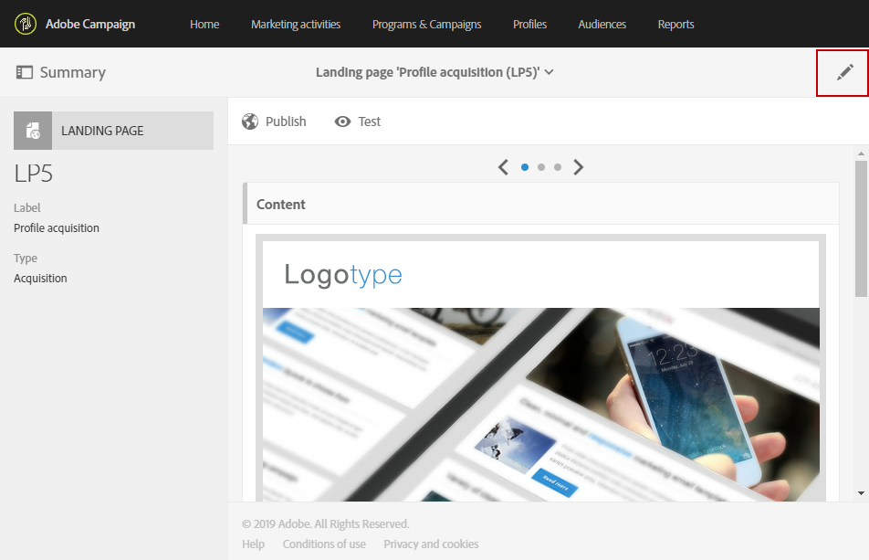
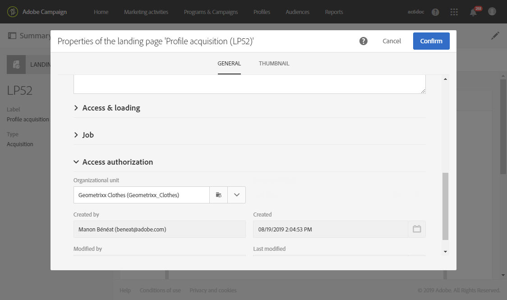
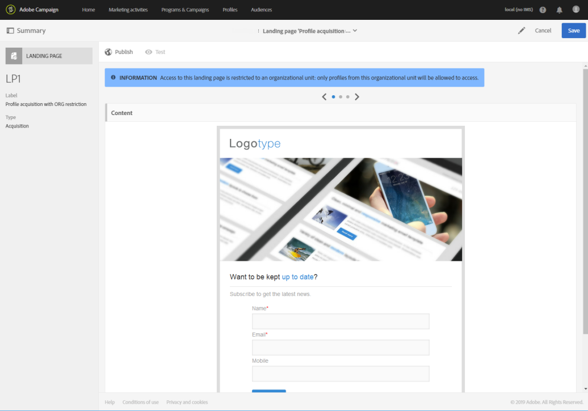
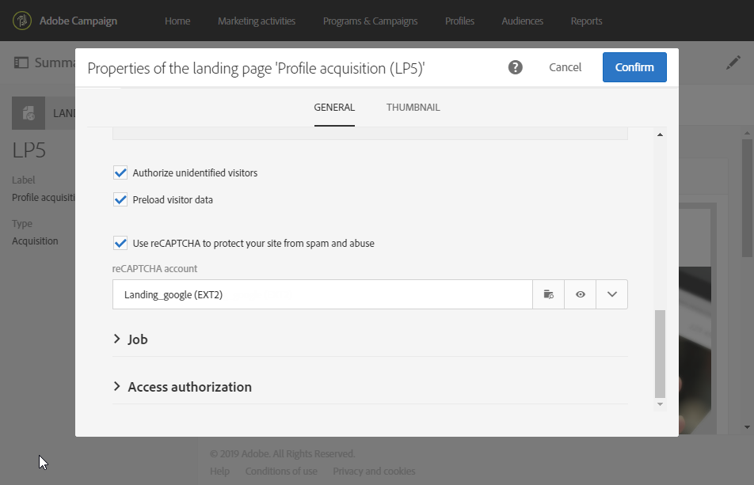
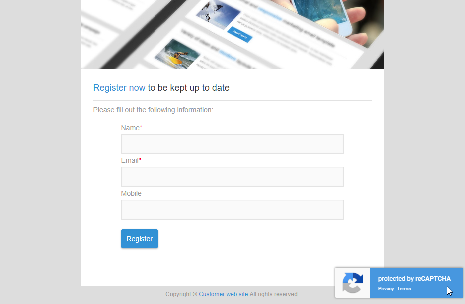

# Configuração de uma página de destino {#configuring-landing-page}

## Confirmar o envio de uma landing page {#confirm-a-landing-page-submission}

Quando uma página de destino é enviada por um visitante, você pode configurar as ações acionadas. Para fazer isso:

1. Edite as propriedades de página de destino acessadas pelo ícone  no painel da página de destino e exiba os parâmetros **[!UICONTROL Job]**.

   

1. Na seção **[!UICONTROL Specific actions]**, selecione **[!UICONTROL Start sending message]** para determinar o envio de uma mensagem automática, por exemplo, para confirmar a assinatura em um serviço. Em seguida, selecione um modelo da entrega de email.

   Observe que, se uma mensagem de confirmação já estiver configurada no nível de serviço, você não deverá selecionar nenhuma nessa tela para evitar o envio de várias mensagens de confirmação. Consulte [Configurar um serviço](../../audiences/using/creating-a-service.md).

1. Crie **[!UICONTROL Additional data]** para permitir o armazenamento de dados adicionais quando a página de destino estiver sendo enviada. Esses dados não estão visíveis aos visitantes da página. Somente valores constantes são considerados.

   

## Vinculação de uma landing page a um serviço {#linking-a-landing-page-to-a-service}

Você pode vincular um formulário a um serviço para que os perfis possam assinar um serviço específico ao validar as páginas de destino.

Os parâmetros para a vinculação de uma página de destino permitem definir o tipo de ação executada e se a página de destino é especificamente vinculada a um único serviço ou se é genérica.

Para selecionar o serviço a ser vinculado, você precisa:

1. Edite as propriedades de página de destino acessadas pelo ícone  no painel da página de destino e exiba os parâmetros **[!UICONTROL Job]**.

   

1. Escolha **[!UICONTROL Subscription]** na lista suspensa **[!UICONTROL Specific actions]**.

   

1. Selecione **[!UICONTROL Specific service]** para vincular a página de destino a um único serviço. Não selecione essa opção se quiser usar vários serviços com a página de destino.

   Use a opção **[!UICONTROL Specified service in the URL]** para permitir que a página de destino seja usada para vários serviços. Portanto, você deverá indicar a página de destino ao configurar o serviço.

## Configuração de permissões e dados de pré-carregamento {#setting-permissions-and-pre-loading-data}

O acesso a uma página de destino pode ser restrito aos visitantes identificados, que acessam um link em uma mensagem enviada pelo Campaign, por exemplo, ou a uma unidade organizacional específica.
No caso de visitantes identificados, você pode pré-carregar os dados deles na página de destino. Para fazer isso:

1. Edite as propriedades de página de destino acessadas pelo ícone  no painel da página de destino e exiba os parâmetros **[!UICONTROL Access & loading]**.

   

1. Selecione **[!UICONTROL Preload visitor data]**.

   Se um visitante da página corresponder a um perfil no banco de dados, os dados dele serão exibidos nos campos do formulário mapeados com os dados do banco de dados e os elementos de personalização da página de destino serão considerados.

   

Você também pode autorizar qualquer visitante a acessar a landing page, usando a opção **[!UICONTROL Authorize unidentified visitors]**.

<!--Use the URL parameters to identify the visitors, using the **[!UICONTROL Authorize visitor identification via URL parameters]** option: then you must choose the loading key and map the filter parameters with the parameters of the corresponding URL.-->

As páginas de destino também podem ser vinculadas a uma unidade organizacional. Isso definirá o acesso dos usuários às diferentes páginas de destino. Para atribuir uma unidade organizacional:

1. Acesse as propriedades da sua página de destino pelo ícone **[!UICONTROL Edit properties]**.

   

1. Expanda o **[!UICONTROL Access authorization]**.

1. Clique no menu suspenso e selecione sua unidade organizacional. Para saber mais sobre como criar uma unidade organizacional, consulte esta [página](../../administration/using/organizational-units.md).

   

1. Os campos **[!UICONTROL Created by]**, **[!UICONTROL Created]**, **[!UICONTROL Access authorization]** e **[!UICONTROL Last modified]** são automaticamente preenchidos.

1. Clique em **[!UICONTROL Confirm]** e em **[!UICONTROL Save]**.

Sua página de destino agora só pode ser acessada e gerenciada pelos usuários na unidade organizacional escolhida.

## Configuração do Google reCAPTCHA {#setting-google-recaptcha}

Você pode configurar o Google reCAPTCHA V3 com sua página de destino para protegê-la contra spam e abuso causado por bots. Para poder usá-lo com a página de destino, você precisa primeiro criar uma conta externa. Para saber mais sobre como configurá-lo, consulte esta [seção](../../administration/using/external-accounts.md#google-recaptcha-external-account).

Depois que sua conta externa do Google reCAPTCHA V3 for configurada, você poderá adicioná-la à página de destino:

1. Antes de publicar a página de destino, acesse as propriedades da página pelo ícone  do painel da página de destino.

   

1. Expanda o menu **[!UICONTROL Access & loading]**.
1. Marque a opção **[!UICONTROL Use reCAPTCHA to protect your site from spam and abuse]**.
1. Selecione a conta externa do Google reCAPTCHA criada anteriormente.

   

1. Clique em **[!UICONTROL Confirm]**.

Sua página de destino agora está configurada com o Google reCAPTCHA, localizado na parte inferior da página.

O Google reCAPTCHA retornará uma pontuação com base nas interações dos usuários com sua página. Para verificar sua pontuação, conecte-se ao Admin Console do Google.
