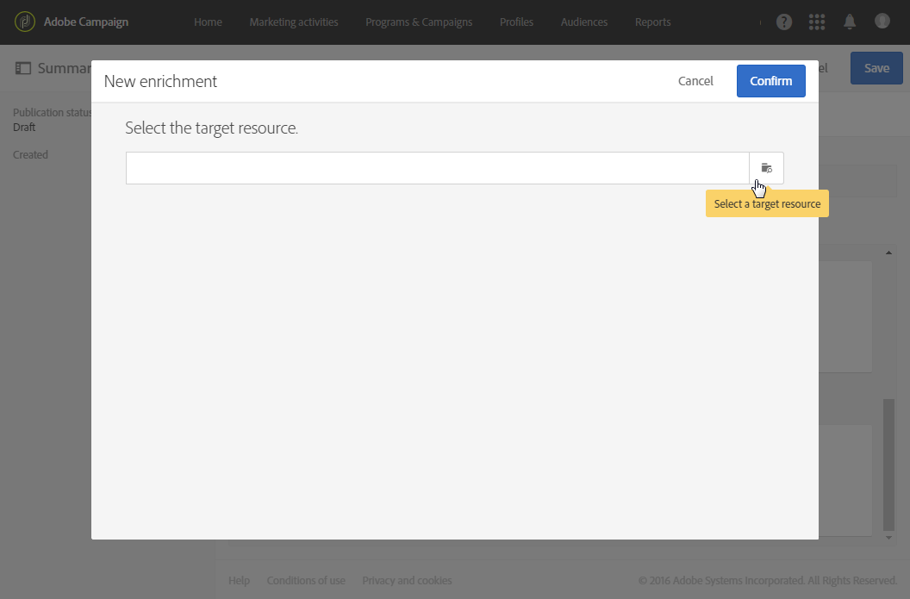

# Configurando um evento transacional {#configuring-transactional-event}

Para enviar um mensagen transacional com a Adobe Campaign, primeiro é necessário descrever a estrutura dos dados do evento criando e configurando um evento.

>[!IMPORTANT]
>
>Somente [Administradores funcionais](../../administration/using/users-management.md#functional-administrators) <!--being part of the **[!UICONTROL All]** [organizational unit](../../administration/using/organizational-units.md) -->têm os direitos apropriados para criar e editar configurações de eventos.

A configuração varia dependendo do tipo [de mensagen transacional](../../channels/using/getting-started-with-transactional-msg.md#transactional-message-types) que você deseja enviar e do canal que será usado. Para obter mais informações, consulte [Configurações específicas](#transactional-event-specific-configurations).

Quando a configuração for concluída, o evento deverá ser publicado. Consulte [Publicar um evento transacional](../../channels/using/publishing-transactional-event.md).

## Criação de um evento {#creating-an-event}

Para começar, crie o evento correspondente às suas necessidades.

1. Clique no logotipo **[!UICONTROL Adobe Campaign]**, no canto superior esquerdo, em seguida selecione **[!UICONTROL Marketing plans]** > **[!UICONTROL Transactional messages]** > **[!UICONTROL Event configuration]**.
1. Clique no botão **[!UICONTROL Create]**.
1. Digite um **[!UICONTROL Label]** e um **[!UICONTROL ID]** para o evento. O campo **[!UICONTROL ID]** é obrigatório e deve começar com o prefixo &quot;EVT&quot;. Se você não usar esse prefixo, ele será adicionado automaticamente quando você clicar em **[!UICONTROL Create]**.

   

   >[!IMPORTANT]
   >
   >A ID não deve exceder 64 caracteres, incluindo o prefixo EVT.

1. Selecione o canal que será usado para enviar seus mensagens transacionais **[!UICONTROL Email]**, **[!UICONTROL Mobile (SMS)]** ou **[!UICONTROL Push notification]**. Somente um canal pode ser usado para cada evento e não pode ser alterado posteriormente.

1. Selecione o targeting dimension correspondente à configuração de evento desejada e clique em **[!UICONTROL Create]**.

   Dados de público alvo baseados em mensagens transacionais contidos no próprio evento, enquanto dados de público alvo baseados em perfis contidos no banco de dados Adobe Campaign. Para obter mais informações, consulte [Configurações específicas](#transactional-event-specific-configurations).

>[!NOTE]
>
>O número de eventos em tempo real pode afetar sua plataforma. Para garantir o desempenho ideal, exclua eventos em tempo real não utilizados. Consulte [Excluindo um evento](../../channels/using/publishing-transactional-event.md#deleting-an-event).

## Definição dos atributos do evento {#defining-the-event-attributes}

Na seção **[!UICONTROL Fields]**, defina os atributos que serão integrados ao conteúdo do evento e poderão ser usados para personalizar o mensagen transacional.

As etapas para adicionar e modificar campos são as mesmas que para [recursos personalizados](../../developing/using/configuring-the-resource-s-data-structure.md#adding-fields-to-a-resource).

>[!NOTE]
>
>Se quiser criar um mensagen transacional multilíngue, defina um atributo de evento adicional com a ID **[!UICONTROL AC_language]**. Isso se aplica somente aos mensagens transacionais eventos. Depois que o evento é publicado, as etapas para editar o conteúdo de um mensagen transacional multilíngue são as mesmas de um email multilíngue padrão. Consulte [Criação de um email multilíngue](../../channels/using/creating-a-multilingual-email.md).

## Definindo coleções de dados {#defining-data-collections}

Você pode adicionar ao conteúdo do evento uma coleção de elementos, cada elemento incluindo vários atributos.

Essa coleção pode ser usada em um email transacional para adicionar [listas de produtos](../../channels/using/editing-transactional-message.md#using-product-listings-in-a-transactional-message) ao conteúdo da mensagem, por exemplo, uma lista de produtos - com o preço, o número de referência, a quantidade etc. para cada produto da lista.

1. Na seção **[!UICONTROL Collections]**, clique no botão **[!UICONTROL Create element]**.

   

1. Adicione um rótulo e uma ID para sua coleção.
1. Adicione todos os campos que deseja exibir no mensagen transacional para cada produto da lista.

   Neste exemplo, adicionamos os seguintes campos:

   

1. A guia **[!UICONTROL Enrichment]** permite enriquecer cada item da coleção. Isso permitirá que você personalize os elementos da lista de produtos correspondente com informações do banco de dados da Adobe Campaign ou de outros recursos criados.

>[!NOTE]
>
>As etapas para enriquecer os elementos de uma coleção são as mesmas descritas na seção [Enriquecendo o evento](#enriching-the-transactional-message-content). Observe que enriquecer o evento não permitirá enriquecer uma coleção: é necessário adicionar um enriquecimento à própria coleção na seção **[!UICONTROL Collections]**.

Depois que o evento e a mensagem forem publicados, você poderá usar essa coleção no mensagen transacional.

Esta é a pré-visualização de API para este exemplo:

**Tópicos relacionados:**

* [Visualização e publicação do evento](../../channels/using/publishing-transactional-event.md#previewing-and-publishing-the-event)
* [Uso de listas de produtos em uma mensagem transacional](../../channels/using/editing-transactional-message.md#using-product-listings-in-a-transactional-message)
* [Publicação de mensagem transacional](../../channels/using/publishing-transactional-message.md#publishing-a-transactional-message)

## Enriquecendo o evento {#enriching-the-transactional-message-content}

Você pode enriquecer o conteúdo do mensagen transacional com informações do banco de dados Adobe Campaign para personalizar suas mensagens. A partir do sobrenome ou da ID do CRM de cada um dos recipient, por exemplo, você pode recuperar dados como o endereço ou a data de nascimento ou qualquer outro campo personalizado adicionado na tabela Perfil, para personalizar as informações enviadas a eles.

É possível aprimorar o conteúdo do mensagen transacional com informações de **[!UICONTROL Profile and services Ext API]** estendido. Para obter mais informações, consulte [Extensão da API: Publicar a extensão](../../developing/using/step-2--publish-the-extension.md)

Essas informações também podem ser armazenadas em novos recursos. Nesse caso, o recurso deve estar vinculado aos recursos **[!UICONTROL Profile]** ou **[!UICONTROL Service]** diretamente ou por meio de outra tabela. Por exemplo, na configuração abaixo, é possível aprimorar o conteúdo do mensagen transacional com informações do recurso **[!UICONTROL Product]** como a categoria ou ID do produto, se o recurso **[!UICONTROL Product]** estiver vinculado ao recurso **[!UICONTROL Profile]**.

Para obter mais informações sobre como criar e publicar recursos, consulte [esta seção](../../developing/using/key-steps-to-add-a-resource.md).

1. Na seção **[!UICONTROL Enrichment]**, clique no botão **[!UICONTROL Create element]**.

   

1. Selecione o recurso com o qual deseja vincular sua mensagem. Nesse caso, escolha o recurso **[!UICONTROL Profile]**.

   

1. Use o botão **[!UICONTROL Create element]** para vincular um campo do recurso selecionado a um dos campos adicionados anteriormente ao evento (consulte [Definição dos atributos do evento](#defining-the-event-attributes)).

   

1. Neste exemplo, reconciliamos os campos **[!UICONTROL Last name]** e **[!UICONTROL First name]** com os campos correspondentes no recurso **[!UICONTROL Profile]**.

   

   Você também pode enriquecer o conteúdo do mensagen transacional usando o recurso **[!UICONTROL Service]**. Para obter mais informações sobre serviços, consulte [esta seção](../../audiences/using/creating-a-service.md).

1. Se você estiver criando ou editando um evento [baseado em perfil](#profile-based-transactional-messages), na seção **[!UICONTROL Targeting enrichment]**, selecione o enriquecimento que será usado como público alvo de mensagem durante a execução do delivery.

   

   >[!NOTE]
   >
   >Criar um enriquecimento e selecionar um enriquecimento de definição de metas com base no recurso **[!UICONTROL Profile]** são obrigatórios para eventos baseados em perfis.

Assim que o evento e a mensagem forem publicados, esse link permitirá que você aprimore o conteúdo do mensagen transacional.

**Tópicos relacionados:**

* [Visualização e publicação do evento](../../channels/using/publishing-transactional-event.md#previewing-and-publishing-the-event)
* [Personalização de uma mensagem transacional](../../channels/using/editing-transactional-message.md#personalizing-a-transactional-message)
* [Publicação de mensagem transacional](../../channels/using/publishing-transactional-message.md#publishing-a-transactional-message)

## Pesquisando eventos transacionais {#searching-transactional-events}

Para acessar e pesquisar os eventos transacionais já criados, siga as etapas abaixo.

1. Clique no logotipo **[!UICONTROL Adobe Campaign]**, no canto superior esquerdo, em seguida selecione **[!UICONTROL Marketing plans]** > **[!UICONTROL Transactional messages]** > **[!UICONTROL Event configuration]**.
1. Clique no botão **[!UICONTROL Show search]**.

   

1. Você pode filtrar no **[!UICONTROL Publication status]**. Isso permite que você exiba somente os eventos publicados, por exemplo.
1. Você também pode filtrar os eventos usando **[!UICONTROL Last event received]**. Por exemplo, se você digitar 10, somente as configurações de evento com o último evento recebido há 10 dias ou mais serão exibidas. Isso permite que você exiba quais eventos estiveram inativos por um determinado período.

   

   >[!NOTE]
   >
   >O valor padrão é 0. Todos os eventos são exibidos.

## Configurações específicas {#transactional-event-specific-configurations}

A configuração do evento transacional pode variar dependendo do [tipo de mensagen transacional](../../channels/using/getting-started-with-transactional-msg.md#transactional-message-types) que você deseja enviar (evento ou perfil) e do canal que será usado.

As seções a seguir detalham qual configuração específica deve ser definida de acordo com o mensagen transacional desejado. Para obter mais informações sobre as etapas gerais para configurar um evento, consulte [Criação de um evento](#creating-an-event).

### Mensagens transacionais baseadas em evento {#event-based-transactional-messages}

Você pode enviar mensagens transacionais de eventos direcionadas a um evento. Esse tipo de mensagem transacional não contém informações de perfil: o público-alvo do delivery é definido pelos dados contidos no próprio evento.

Para enviar um mensagen transacional baseado em eventos, primeiro é necessário criar e configurar um evento direcionando os **dados contidos no próprio evento**.

1. Ao criar a configuração do evento, selecione o targeting dimension **[!UICONTROL Real-time event]** (consulte [Criação de um evento](#creating-an-event)).
1. Adicione campos ao evento para personalizar o mensagen transacional (consulte [Definição dos atributos do evento](#defining-the-event-attributes)).
1. As mensagens transacionais baseadas em evento só devem usar os dados contidos no evento enviado para definir o recipient e a personalização do conteúdo da mensagem.

   No entanto, se quiser usar informações adicionais do banco de dados da Adobe Campaign, você pode enriquecer o conteúdo do mensagen transacional (consulte [Enriquecendo o conteúdo do mensagen transacional](#enriching-the-transactional-message-content)).

1. Pré-visualização e publicação do evento (consulte [Visualizar e publicar o evento](../../channels/using/publishing-transactional-event.md#previewing-and-publishing-the-event)).

   Ao visualizar o evento, a REST API contém um atributo que especifica o endereço de email, o telefone celular ou os atributos específicos da notificação por push, de acordo com o canal selecionado.

   Depois que o evento é publicado, um mensagen transacional vinculado ao novo evento é criado automaticamente. Para que o evento acione o envio de um mensagen transacional, você deve [modificar](../../channels/using/editing-transactional-message.md) e [publicar](../../channels/using/publishing-transactional-message.md) a mensagem que acabou de ser criada.

1. Integre o evento ao seu site (consulte [Integrar o evento que aciona](../../channels/using/getting-started-with-transactional-msg.md#integrate-event-trigger)).

### Mensagens transacionais baseadas em perfil {#profile-based-transactional-messages}

Você pode enviar mensagens transacionais com base em perfis do cliente, o que permite aplicar regras de tipologia de marketing, incluir o link para cancelar a inscrição, adicionar a mensagem ao relatórios global do delivery e aproveitá-la na jornada do cliente.

Para enviar um mensagen transacional baseado em perfis, primeiro é necessário criar e configurar um evento direcionando **dados do banco de dados da Adobe Campaign**.

1. Ao criar a configuração do evento, selecione o targeting dimension **[!UICONTROL Profile event]** (consulte [Criação de um evento](#creating-an-event)).
1. Adicione campos ao evento para personalizar o mensagen transacional (consulte [Definição dos atributos do evento](#defining-the-event-attributes)). É necessário adicionar pelo menos um campo para criar um enriquecimento. Não é necessário criar outros campos, como **Nome** e **Sobrenome**, pois você poderá usar campos de personalização do banco de dados Adobe Campaign.
1. Crie um enriquecimento para vincular o evento ao recurso **[!UICONTROL Profile]** (consulte [Enriquecendo o evento](#enriching-the-transactional-message-content)) e selecione esse enriquecimento como **[!UICONTROL Targeting enrichment]**.

   >[!IMPORTANT]
   >
   >Esta etapa é obrigatória para eventos baseados em perfis.

1. Pré-visualização e publicação do evento (consulte [Visualizar e publicar o evento](../../channels/using/publishing-transactional-event.md#previewing-and-publishing-the-event)).

   Ao visualizar o evento, a REST API não contém um atributo que especifique o endereço de email, o telefone celular ou os atributos específicos da notificação por push, como será recuperado do recurso **[!UICONTROL Profile]**.

   Depois que o evento é publicado, um mensagen transacional vinculado ao novo evento é criado automaticamente. Para que o evento acione o envio de um mensagen transacional, você deve [modificar](../../channels/using/editing-transactional-message.md) e [publicar](../../channels/using/publishing-transactional-message.md) a mensagem que acabou de ser criada.

1. Integre o evento ao seu site (consulte [Integrar o evento que aciona](../../channels/using/getting-started-with-transactional-msg.md#integrate-event-trigger)).

<!--### Transactional SMS messages {#transactional-sms}

The steps to configure an  event to send an SMS transactional message are the same as for the email channel. The only differences are as follows:

* When creating the corresponding event, you need to select the **[!UICONTROL Mobile (SMS)]** channel.

* When previewing the event corresponding to an event-based transactional SMS, the REST API contains an attribute specifying the mobile phone instead of the email address.

* The specificities to edit the content of an SMS transactional message are the same as for a [standard SMS](../../channels/using/about-sms-and-push-content-design.md).-->

### Notificações por push transacionais {#transactional-push-notifications}

Você pode enviar dois tipos de notificações por push transacionais:
* Uma notificação por push transacional anônima para todos os usuários que opt in receber notificações de seu aplicativo móvel. Consulte [Configurando notificações por push transacionais baseadas em eventos](../../channels/using/transactional-push-notifications.md#event-based-transactional-push-notifications).
* Uma notificação por push transacional para os perfis Adobe Campaign que assinaram seu aplicativo móvel. Consulte [Configurando notificações por push transacionais baseadas em perfis](../../channels/using/transactional-push-notifications.md#profile-based-transactional-push-notifications).

>[!IMPORTANT]
>
>Para poder enviar notificações por push transacionais, é necessário configurar o Adobe Campaign de acordo. Consulte [Configurar um aplicativo móvel](../../administration/using/configuring-a-mobile-application.md).

### Mensagens de acompanhamento {#follow-up-messages}

Você pode enviar uma mensagem de acompanhamento aos clientes que receberam um mensagen transacional específico.

As etapas para configurar um evento que permite enviar uma mensagem de acompanhamento são detalhadas em [esta seção](../../channels/using/follow-up-messages.md#configuring-an-event-to-send-a-follow-up-message).
