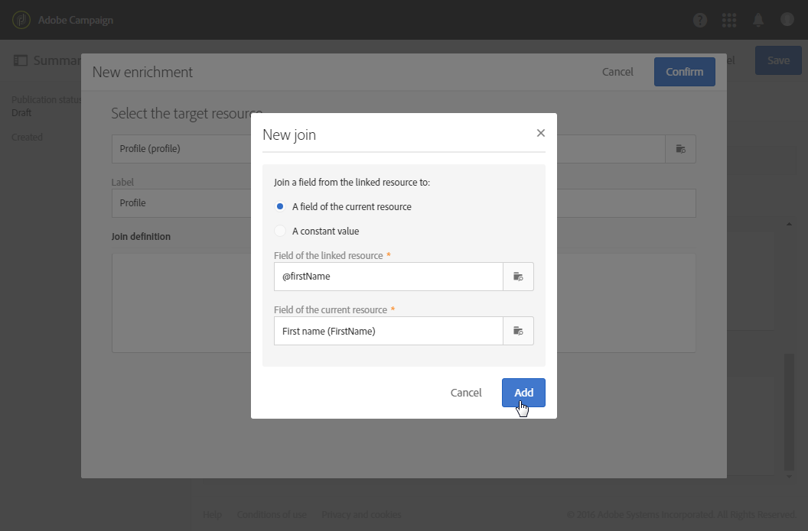

# Configuração de um evento transacional {#configuring-transactional-event}

Para enviar uma mensagem transacional com o Adobe Campaign, primeiro é necessário descrever a estrutura dos dados do evento criando e configurando um evento.

>[!IMPORTANT]
>
>Somente [Administradores funcionais](../../administration/using/users-management.md#functional-administrators) <!--being part of the **[!UICONTROL All]** [organizational unit](../../administration/using/organizational-units.md) -->Ter os direitos apropriados para criar e editar configurações de eventos.

A configuração varia dependendo da configuração [tipo de mensagem transacional](../../channels/using/getting-started-with-transactional-msg.md#transactional-message-types) que deseja enviar e no canal que será usado. Para obter mais informações, consulte [Configurações específicas](#transactional-event-specific-configurations).

Quando a configuração for concluída, o evento deverá ser publicado. Consulte [Publicação de um evento transacional](../../channels/using/publishing-transactional-event.md).

## Criação de um evento {#creating-an-event}

Para começar, crie o evento de acordo com suas necessidades.

1. Clique em **Adobe** no canto superior esquerdo e selecione **[!UICONTROL Marketing plans]** > **[!UICONTROL Transactional messages]** > **[!UICONTROL Event configuration]**.
1. Clique no botão **[!UICONTROL Create]**.
1. Insira um **[!UICONTROL Label]** e uma **[!UICONTROL ID]** para o evento. A variável **[!UICONTROL ID]** é obrigatório e deve começar com o prefixo &quot;EVT&quot;. Se você não usar esse prefixo, ele será adicionado automaticamente depois de clicar em **[!UICONTROL Create]**.

   

   >[!IMPORTANT]
   >
   >A ID não deve exceder 64 caracteres, incluindo o prefixo do EVT.

1. Selecione o canal que será usado para enviar mensagens transacionais **[!UICONTROL Email]**, **[!UICONTROL Mobile (SMS)]** ou **[!UICONTROL Push notification]**. Somente um canal pode ser usado para cada evento e não pode ser alterado posteriormente.

1. Selecione o targeting dimension correspondente à configuração de evento desejada e clique em **[!UICONTROL Create]**.

   As mensagens transacionais baseadas em eventos direcionam os dados contidos no próprio evento, enquanto as mensagens transacionais baseadas em perfil direcionam os dados contidos no banco de dados do Adobe Campaign. Para obter mais informações, consulte [Configurações específicas](#transactional-event-specific-configurations).

>[!NOTE]
>
>O número de eventos transacionais pode ter um impacto na sua plataforma. Para garantir um desempenho ideal, exclua os eventos não utilizados. Consulte [Excluir um evento](../../channels/using/publishing-transactional-event.md#deleting-an-event).

## Definir os atributos do evento {#defining-the-event-attributes}

No **[!UICONTROL Fields]** defina os atributos que serão integrados ao conteúdo do evento e poderão ser usados para personalizar a mensagem transacional.

As etapas para adicionar e modificar campos são as mesmas para [recursos personalizados](../../developing/using/configuring-the-resource-s-data-structure.md#adding-fields-to-a-resource).

>[!NOTE]
>
>Se quiser criar uma mensagem transacional multilíngue, defina um atributo de evento adicional com o **[!UICONTROL AC_language]** ID. Isso se aplica somente a mensagens transacionais de evento. Depois que o evento for publicado, as etapas para editar o conteúdo de uma mensagem transacional multilíngue serão as mesmas de um email padrão multilíngue. Consulte [Criação de um email multilíngue](../../channels/using/creating-a-multilingual-email.md).

## Definição de coleções de dados {#defining-data-collections}

Você pode adicionar ao conteúdo do evento uma coleção de elementos, cada elemento em si, incluindo vários atributos.

Essa coleção pode ser usada em um email transacional para adicionar [listagens de produtos](../../designing/using/using-product-listings.md) ao conteúdo da mensagem, por exemplo, uma lista de produtos - com o preço, número de referência, quantidade etc. para cada produto da lista.

1. No **[!UICONTROL Collections]** clique na guia **[!UICONTROL Create element]** botão.

   

1. Adicione um rótulo e uma ID para a sua coleção.
1. Adicione todos os campos que deseja exibir na mensagem transacional para cada produto da lista.

   Neste exemplo, adicionamos os seguintes campos:

   

1. A variável **[!UICONTROL Enrichment]** permite enriquecer cada item da coleção. Isso permitirá personalizar os elementos da lista de produtos correspondente com informações do banco de dados do Adobe Campaign ou de outros recursos criados.

>[!NOTE]
>
>As etapas para enriquecer os elementos de uma coleção são as mesmas descritas em [Enriquecimento do evento](#enriching-the-transactional-message-content) seção. Observe que o enriquecimento do evento não permitirá enriquecer uma coleção: é necessário adicionar um enriquecimento à própria coleção no **[!UICONTROL Collections]** seção.

Depois que o evento e a mensagem forem publicados, você poderá usar essa coleção na mensagem transacional.

Esta é a visualização da API para este exemplo:

**Tópicos relacionados:**

* [Pré-visualizar e publicar o evento](../../channels/using/publishing-transactional-event.md#previewing-and-publishing-the-event)
* [Uso de listas de produtos em uma mensagem transacional](../../designing/using/using-product-listings.md)
* [Publicação de mensagem transacional](../../channels/using/publishing-transactional-message.md#publishing-a-transactional-message)

## Enriquecimento do evento {#enriching-the-transactional-message-content}

Você pode enriquecer o conteúdo da mensagem transacional com informações do banco de dados do Adobe Campaign para personalizar suas mensagens. A partir do sobrenome ou da ID do CRM de cada um dos recipients, por exemplo, é possível recuperar dados como endereço ou data de nascimento, ou qualquer outro campo personalizado adicionado à tabela de Perfil para personalizar as informações enviadas a eles.

É possível enriquecer o conteúdo da mensagem transacional com informações do **[!UICONTROL Profile and services Ext API]**. Para obter mais informações, consulte [Extensão da API: publicação da extensão](../../developing/using/step-2--publish-the-extension.md)

Essas informações também podem ser armazenadas em novos recursos. Nesse caso, o recurso deve estar vinculado à variável **[!UICONTROL Profile]** ou **[!UICONTROL Service]** recursos diretamente ou por outra tabela. Por exemplo, na configuração abaixo, é possível enriquecer o conteúdo da mensagem transacional com informações do **[!UICONTROL Product]** como a categoria ou ID do produto, se a variável **[!UICONTROL Product]** O recurso está vinculado à variável **[!UICONTROL Profile]** recurso.

Para obter mais informações sobre criação e publicação de recursos, consulte [nesta seção](../../developing/using/key-steps-to-add-a-resource.md).

1. No **[!UICONTROL Enrichment]** clique na guia **[!UICONTROL Create element]** botão.

   

1. Selecione o recurso com o qual deseja vincular a mensagem. Nesse caso, escolha a variável **[!UICONTROL Profile]** recurso.

   

1. Use o **[!UICONTROL Create element]** para vincular um campo do recurso selecionado a um dos campos adicionados anteriormente ao evento (consulte [Definir os atributos do evento](#defining-the-event-attributes)).

   

   >[!NOTE]
   >
   >Se você definir uma condição que permita selecionar vários recipients (como um campo que pode ter o mesmo valor para vários perfis), não mais de um perfil será direcionado.

1. Neste exemplo, reconciliamos o **[!UICONTROL Last name]** e a variável **[!UICONTROL First name]** campos com os campos correspondentes na variável **[!UICONTROL Profile]** recurso.

   

   Também é possível enriquecer o conteúdo da mensagem transacional usando o **[!UICONTROL Service]** recurso. Para obter mais informações sobre serviços, consulte [nesta seção](../../audiences/using/creating-a-service.md).

1. Se você estiver criando ou editando um [evento baseado em perfil](#profile-based-transactional-messages), no **[!UICONTROL Targeting enrichment]** selecione o enriquecimento que será usado como o target da mensagem durante a execução do delivery.

   

   >[!NOTE]
   >
   >Criação de um enriquecimento e seleção de um enriquecimento para construção do target com base no **[!UICONTROL Profile]** recursos são obrigatórios para eventos baseados em perfil.

Quando o evento e a mensagem forem publicados, esse link permitirá enriquecer o conteúdo da mensagem transacional.

**Tópicos relacionados:**

* [Pré-visualizar e publicar o evento](../../channels/using/publishing-transactional-event.md#previewing-and-publishing-the-event)
* [Personalização de uma mensagem transacional](../../channels/using/editing-transactional-message.md#personalizing-a-transactional-message)
* [Publicação de mensagem transacional](../../channels/using/publishing-transactional-message.md#publishing-a-transactional-message)

## Pesquisar eventos transacionais {#searching-transactional-events}

Para acessar e pesquisar os eventos transacionais já criados, siga as etapas abaixo.

1. Clique em **Adobe** no canto superior esquerdo e selecione **[!UICONTROL Marketing plans]** > **[!UICONTROL Transactional messages]** > **[!UICONTROL Event configuration]**.
1. Clique no botão **[!UICONTROL Show search]**.

   

1. Você pode filtrar no campo **[!UICONTROL Publication status]**. Isso permite exibir somente os eventos publicados, por exemplo.
1. Também é possível filtrar os eventos usando a variável **[!UICONTROL Last event received]**. Por exemplo, se você inserir 10, somente as configurações de evento com o último evento recebido há 10 dias ou mais serão exibidas. Isso permite exibir quais eventos ficaram inativos por um determinado período.

   

   >[!NOTE]
   >
   >O valor padrão é 0. Todos os eventos são exibidos.

## Configurações específicas {#transactional-event-specific-configurations}

A configuração do evento transacional pode variar dependendo das [tipo de mensagem transacional](../../channels/using/getting-started-with-transactional-msg.md#transactional-message-types) você deseja enviar (evento ou perfil) e no canal que será usado.

As seções a seguir detalham qual configuração específica deve ser definida de acordo com a mensagem transacional desejada. Para obter mais informações sobre as etapas gerais para configurar um evento, consulte [Criação de um evento](#creating-an-event).

### Mensagens transacionais baseadas em evento {#event-based-transactional-messages}

Você pode enviar mensagens transacionais de eventos direcionadas a um evento. Esse tipo de mensagem transacional não contém informações de perfil: o público-alvo do delivery é definido pelos dados contidos no próprio evento.

Para enviar uma mensagem transacional baseada em eventos, primeiro é necessário criar e configurar um evento direcionado ao **dados contidos no próprio evento**.

1. Ao criar a configuração do evento, selecione a variável **[!UICONTROL Real-time event]** targeting dimension (consulte [Criação de um evento](#creating-an-event)).
1. Adicione campos ao evento para poder personalizar a mensagem transacional (consulte [Definir os atributos do evento](#defining-the-event-attributes)).
1. As mensagens transacionais baseadas em evento só devem usar os dados contidos no evento enviado para definir o recipient e a personalização do conteúdo da mensagem.

   No entanto, se quiser usar informações adicionais do banco de dados do Adobe Campaign, você poderá enriquecer o conteúdo da mensagem transacional (consulte [Enriquecimento do conteúdo da mensagem transacional](#enriching-the-transactional-message-content)).

1. Pré-visualizar e publicar o evento (consulte [Pré-visualizar e publicar o evento](../../channels/using/publishing-transactional-event.md#previewing-and-publishing-the-event)).

   Ao pré-visualizar o evento, a API REST contém um atributo que especifica os atributos específicos do endereço de email, telefone celular ou notificação por push, de acordo com o canal selecionado.

   Depois que o evento for publicado, uma mensagem transacional vinculada ao novo evento será criada automaticamente. Para que o evento acione o envio de uma mensagem transacional, é necessário [modificar](../../channels/using/editing-transactional-message.md) e [publicar](../../channels/using/publishing-transactional-message.md) a mensagem que acabou de ser criada.

1. Integre o evento ao seu site (consulte [Integrar o acionamento de eventos](../../channels/using/getting-started-with-transactional-msg.md#integrate-event-trigger)).

### Mensagens transacionais baseadas em perfil {#profile-based-transactional-messages}

É possível enviar mensagens transacionais com base nos perfis do cliente, o que permite aplicar regras de tipologia de marketing, incluir o link de cancelamento de inscrição, adicionar a mensagem aos relatórios do delivery global e aproveitá-la na jornada do cliente.

Para enviar uma mensagem transacional baseada em perfil, primeiro é necessário criar e configurar um direcionamento de evento **dados do banco de dados do Adobe Campaign**.

1. Ao criar a configuração do evento, selecione a variável **[!UICONTROL Profile event]** targeting dimension (consulte [Criação de um evento](#creating-an-event)).
1. Adicione campos ao evento para poder personalizar a mensagem transacional (consulte [Definir os atributos do evento](#defining-the-event-attributes)). É necessário adicionar pelo menos um campo para criar um enriquecimento. Não é necessário criar outros campos, como **Nome** e **Sobrenome** como você poderá usar campos de personalização do banco de dados do Adobe Campaign.
1. Crie um enriquecimento para vincular o evento à variável **[!UICONTROL Profile]** recurso (consulte [Enriquecimento do evento](#enriching-the-transactional-message-content)) e selecione esse enriquecimento como a opção **[!UICONTROL Targeting enrichment]**.

   >[!IMPORTANT]
   >
   >Esta etapa é obrigatória para eventos baseados em perfil.

1. Pré-visualizar e publicar o evento (consulte [Pré-visualizar e publicar o evento](../../channels/using/publishing-transactional-event.md#previewing-and-publishing-the-event)).

   Ao visualizar o evento, a API REST não contém um atributo que especifique os atributos específicos do endereço de email, telefone celular ou notificação por push, pois será recuperada do **[!UICONTROL Profile]** recurso.

   Depois que o evento for publicado, uma mensagem transacional vinculada ao novo evento será criada automaticamente. Para que o evento acione o envio de uma mensagem transacional, é necessário [modificar](../../channels/using/editing-transactional-message.md) e [publicar](../../channels/using/publishing-transactional-message.md) a mensagem que acabou de ser criada.

1. Integre o evento ao seu site (consulte [Integrar o acionamento de eventos](../../channels/using/getting-started-with-transactional-msg.md#integrate-event-trigger)).

<!--### Transactional SMS messages {#transactional-sms}

The steps to configure an  event to send an SMS transactional message are the same as for the email channel. The only differences are as follows:

* When creating the corresponding event, you need to select the **[!UICONTROL Mobile (SMS)]** channel.

* When previewing the event corresponding to an event-based transactional SMS, the REST API contains an attribute specifying the mobile phone instead of the email address.

* The specificities to edit the content of an SMS transactional message are the same as for a [standard SMS](../../channels/using/about-sms-and-push-content-design.md).-->

### Notificações por push transacionais {#transactional-push-notifications}

Você pode enviar dois tipos de notificações transacionais por push:
* Uma notificação por push transacional anônima para todos os usuários que optaram por receber notificações de seu aplicativo móvel. Consulte [Configuração de notificações por push transacionais baseadas em eventos](../../channels/using/transactional-push-notifications.md#event-based-transactional-push-notifications).
* Uma notificação por push transacional para os perfis do Adobe Campaign que assinaram seu aplicativo para dispositivos móveis. Consulte [Configuração de notificações por push transacionais baseadas em perfil](../../channels/using/transactional-push-notifications.md#profile-based-transactional-push-notifications).

>[!IMPORTANT]
>
>Para enviar notificações por push transacionais, é necessário configurar o Adobe Campaign adequadamente. Consulte [Configurar um aplicativo para dispositivos móveis](../../administration/using/configuring-a-mobile-application.md).

### Mensagens de acompanhamento {#follow-up-messages}

Você pode enviar uma mensagem de acompanhamento aos clientes que receberam uma mensagem transacional específica.

As etapas para configurar um evento que permite enviar uma mensagem de acompanhamento estão detalhadas em [nesta seção](../../channels/using/follow-up-messages.md#configuring-an-event-to-send-a-follow-up-message).
