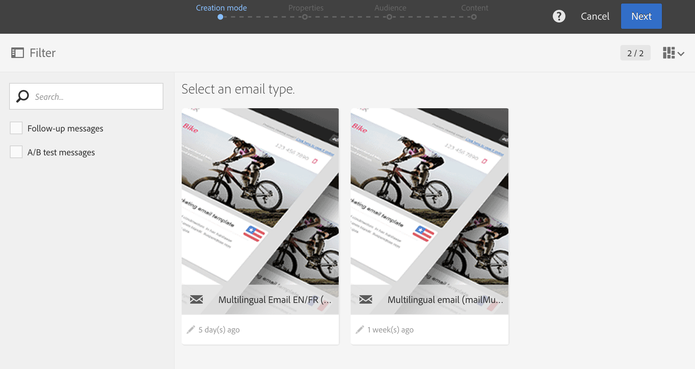
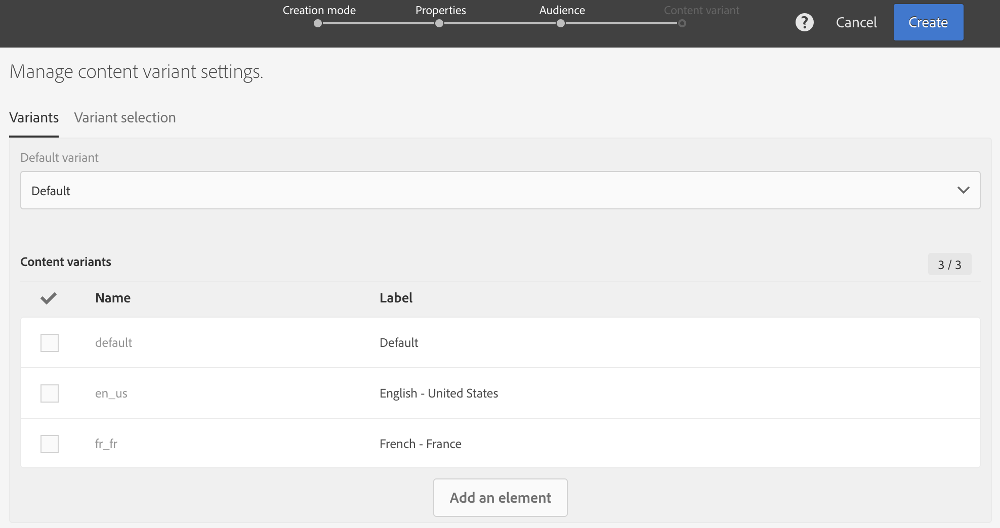
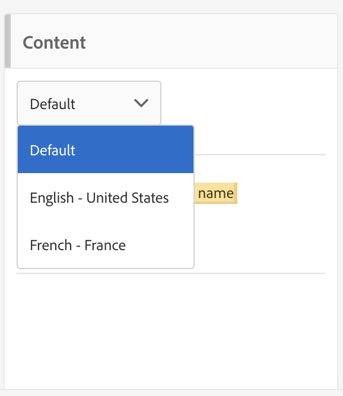

# Criação de um email multilíngue{#creating-a-multilingual-email}

É possível enviar um email multilíngue para perfis com diferentes idiomas preferenciais: cada perfil receberá uma variante do email em seu idioma preferencial.

Para fazer isso, verifique se você tem um template de email multilíngue disponível. Caso contrário, saiba como criar um em [esta seção](../../channels/using/multilingual-messages-template.md).

O público-alvo é baseado em perfis com informações de idioma preferencial preenchidas.

1. Crie um novo email com base em um [modelo multilíngue](../../channels/using/multilingual-messages-template.md).

   

1. Defina as propriedades gerais e o público-alvo do email, assim como para um email padrão. Consulte a seção [Criação de públicos-alvos](../../audiences/using/creating-audiences.md).

1. Na quarta etapa do assistente de criação, defina as opções de variante. Se o [modelo multilíngue](../../channels/using/multilingual-messages-template.md) já contiver todos os parâmetros corretos, clique diretamente no botão **[!UICONTROL Create]**.

   

   Se necessário, adicione variantes usando o botão **[!UICONTROL Add an element]**. A variante **[!UICONTROL Default]** não deve ser excluída. Quando definido como **[!UICONTROL default]**, [o idioma preferencial do perfil](../../audiences/using/creating-profiles.md) é usado para escolher a variante. Você também pode definir a variante **[!UICONTROL Default]** para qualquer outro idioma.

1. Confirme a criação do email: o painel de email será exibido.
1. Defina o conteúdo do email para cada variante. Dependendo do modelo escolhido, é possível definir vários assuntos, vários nomes de remetentes ou vários conteúdos diferentes. Use o menu suspenso para navegar entre as diferentes variantes do elemento. Para obter mais informações, consulte a seção [Editor de conteúdo](../../designing/using/designing-content-in-adobe-campaign.md).

   

1. Teste e valide a mensagem. Consulte a seção [Enviando prova](../../sending/using/sending-proofs.md).
1. Agende o envio com o **[!UICONTROL Send after confirmation option]**.
1. Depois que o email é enviado, você pode acessar os logs e relatórios para medir o sucesso da campanha. Para obter mais informações sobre relatórios, consulte [esta seção](../../reporting/using/about-dynamic-reports.md).

