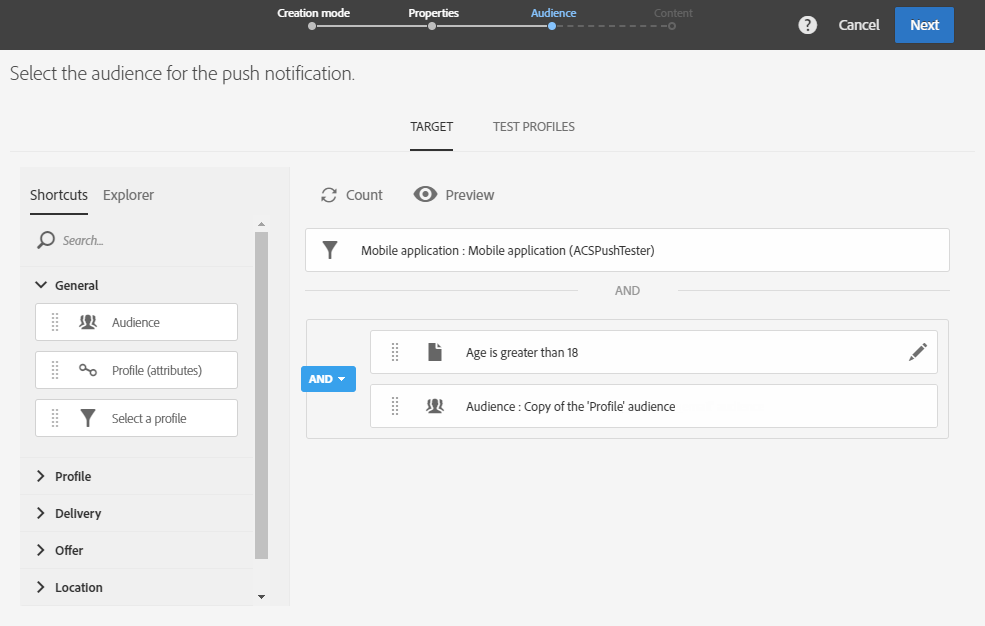

# Criação de uma notificação por push multilíngue{#creating-a-multilingual-push-notification}

## Sobre a notificação por push multilíngue {#about-multilingual-push-notification}

Personalize seu conteúdo de notificação por push enviando mensagens com base nos idiomas e regiões preferidos de seus usuários. Você pode importar diretamente variantes de conteúdo de notificações por push multilíngues no editor de conteúdo e enviar uma notificação por push multilíngue em um único delivery.

Esse recurso utiliza os idiomas preferenciais especificados nos perfis dos destinatários ou na preferência de idioma do sistema para Assinantes de aplicativos móveis, dependendo do modelo de entrega usado para notificação por push. Se a preferência de idioma não for preenchida para um usuário específico, o sistema usará a variante padrão que é definida ao criar uma notificação por push multilíngue. Para obter mais informações sobre como gerenciar seus perfis e assinantes, consulte este [guia](../../audiences/using/get-started-profiles-and-audiences.md).

Para usar variantes de conteúdo multilíngues para o delivery de notificação por push, siga estas etapas:

* [Etapa 1: Fazer upload de variante de conteúdo multilíngue](#step-1--upload-multilingual-content-variant)
* [Etapa 2: Visualizar e finalizar uma notificação por push usando variantes de conteúdo multilíngues](#step-2--preview-and-finalize-a-push-notification-using-multilingual-content-variants)
* [Etapa 3: Enviar e analisar o delivery de notificação por push multilíngue](#step-3--send-and-analyze-multilingual-push-notification-delivery)

## Etapa 1: Fazer upload de variante de conteúdo multilíngue {#step-1--upload-multilingual-content-variant}

Antes de personalizar sua notificação por push multilíngue, primeiro precisamos carregar as variantes de conteúdo em um template de delivery multilíngue e criar o delivery.

>[!NOTE]
>
>Também é possível ignorar essa etapa se quiser criar uma variante manualmente para cada variante de idioma.

1. No **[!UICONTROL Marketing activities]**, clique no botão **[!UICONTROL Create]** e selecione **[!UICONTROL Push notification]**.
1. Selecione o modelo **[!UICONTROL Send multilingual push to Campaign profiles]** se desejar direcionar os perfis do Adobe Campaign que assinaram seu aplicativo móvel ou o modelo **[!UICONTROL Send multilingual push to app subscriber]** para enviar uma notificação por push a todos os usuários que aceitaram receber notificações de seu aplicativo móvel.

   

1. Insira as propriedades da notificação por push e selecione o aplicativo móvel no campo **[!UICONTROL Associate a Mobile App to a delivery]** .

   Observe que a lista suspensa exibirá os aplicativos SDK V4 e SDKs do Adobe Experience Platform.

1. Nas janelas **[!UICONTROL Audiences]**, arraste e solte queries para ajustar o público-alvo.

   As consultas adicionadas dependem do template escolhido: se você escolher o modelo **[!UICONTROL Send multilingual push to Campaign profiles]** , poderá consultar recipients conhecidos do seu aplicativo móvel. Enquanto que, se você escolher o modelo **[!UICONTROL Send multilingual push to app subscriber]** , poderá consultar todos os assinantes de um aplicativo específico que optaram por participar.
   >[!NOTE]
   >
   >Se você direcionar públicos-alvo com idiomas específicos, será necessário listar cada idioma direcionado no arquivo CSV.

   

1. Na janela **[!UICONTROL Manage Content Variants]**, arraste e solte o arquivo ou selecione um arquivo de seu computador.

   O arquivo deve ser codificado em UTF8 e ter um layout específico que pode ser encontrado clicando na opção **[!UICONTROL Download the sample file]**. Você também deve usar a sintaxe apropriada para valores de localidade. Para obter mais informações sobre o formato de arquivo e as localidades compatíveis, consulte esta [technote](https://helpx.adobe.com/br/campaign/kb/acs-generate-csv-multilingual-push.html).

   

1. Após o upload do arquivo, as variantes de idioma são automaticamente preenchidas na guia **[!UICONTROL Variants]** . Observe que você pode fornecer um **[!UICONTROL Default variant]** no arquivo, que será sua variante de conteúdo padrão se nenhum idioma preferencial for especificado para o usuário direcionado.

   

1. A guia **[!UICONTROL Variant selection]** fornecerá um script para determinar qual preferência de idioma será considerada, dependendo do template do delivery. Este é um script pronto para uso que não requer alterações.
1. Se quiser adicionar mais variantes não presentes no arquivo importado, faça isso clicando no botão **[!UICONTROL Add an element]** e adicione quantas novas variantes de idioma forem necessárias.

   Ao adicionar variantes diferentes das carregadas do arquivo, nenhum conteúdo será vinculado a esse idioma. Você terá que editar o conteúdo diretamente no painel do delivery.

   

1. Clique em **[!UICONTROL Create]** quando a configuração for concluída. Você sempre pode voltar à janela **[!UICONTROL Content variant]** e fazer algumas alterações no painel de delivery.

   

Agora é possível começar a personalizar a notificação por push multilíngue.

## Etapa 2: Visualizar e finalizar uma notificação por push usando variantes de conteúdo multilíngues {#step-2--preview-and-finalize-a-push-notification-using-multilingual-content-variants}

Após carregar o arquivo que contém as variantes de conteúdo, você pode visualizar as diferentes variantes do delivery de notificação por push.

Também é possível criar e editar mais variantes além das que foram carregadas do arquivo.

1. Na janela **[!UICONTROL Content]** do painel do delivery, o menu suspenso permite visualizar o conteúdo da notificação por push, dependendo do idioma escolhido.

   

1. Se uma variante de conteúdo não for especificada para um idioma específico, clique no ícone de sino abaixo da visualização para começar a adicionar conteúdo a essa variante de idioma.

   Ao clicar na janela **[!UICONTROL Content]**, a notificação por push representa o conteúdo do idioma selecionado no menu suspenso. As alterações feitas nessa janela afetarão apenas um idioma.

1. Você também pode clicar em uma variante de conteúdo para personalizá-la ainda mais, por exemplo, com campos de personalização.

   Para obter mais informações sobre como personalizar a notificação por push, consulte esta [seção](../../channels/using/customizing-a-push-notification.md).

   

1. Clique na janela **[!UICONTROL Content variant]** se desejar adicionar ou excluir variantes de idioma.

   Observe que, ao adicionar um novo idioma, é necessário adicionar manualmente o conteúdo à notificação por push vinculada ao idioma adicionado.

   

O delivery de notificação por push multilíngue agora está pronto para ser enviado.

## Etapa 3: Enviar e analisar o delivery de notificação por push multilíngue {#step-3--send-and-analyze-multilingual-push-notification-delivery}

Suas notificações por push de variante de conteúdo multilíngue agora estão prontas para serem enviadas aos usuários.

1. Para começar a preparar o envio, clique no botão **[!UICONTROL Prepare]**.
1. Quando a preparação estiver concluída sem avisos, você pode clicar no botão **[!UICONTROL Confirm]** para começar a enviar o push multilíngue.

   

1. Depois de enviar sua notificação por push com êxito, clique no ícone **[!UICONTROL Reports]** e em **[!UICONTROL Dynamic reports]** para analisar o sucesso do delivery.

   

1. Selecione **[!UICONTROL Push notification report]**.
1. Arraste e solte a dimensão **[!UICONTROL Variant]** no painel para começar a filtrar os dados.

   

Agora é possível medir o impacto do delivery de notificação por push multilíngue nos recipients.

**Tópicos relacionados:**

* [Relatório de notificação por push](../../reporting/using/push-notification-report.md)
* [Enviar uma notificação por push em um workflow](../../automating/using/push-notification-delivery.md)
* [Alcance de públicos-alvo multilíngues usando um fluxo de trabalho](https://helpx.adobe.com/br/campaign/kb/simplify-campaign-management.html#Engageyourcustomersateverystep)
