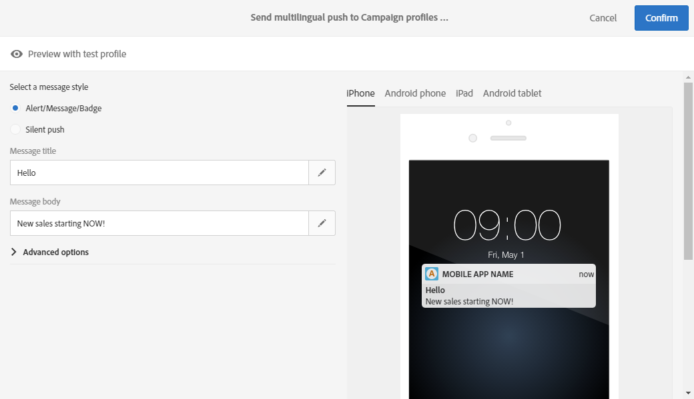

# Creating a multilingual push notification{#creating-a-multilingual-push-notification}

## About multilingual push notification {#about-multilingual-push-notification}

Personalize o conteúdo de notificação por push enviando mensagens com base em idiomas e regiões preferenciais de seus usuários. Você pode importar diretamente variáveis de conteúdo de notificação por push multilíngues no editor de conteúdo e enviar uma notificação por push multilíngue em uma única entrega.

Esse recurso aproveita os idiomas preferidos especificados nos perfis dos destinatários ou na preferência idioma do sistema para Assinantes do aplicativo móvel, dependendo do modelo de entrega usado para a notificação por push. Se a preferência de idioma não for preenchida para um usuário específico, o sistema usará a variante padrão definida durante a criação de uma notificação por push multilíngue. For more information on how to manage your profiles and subscribers, refer to this [guide](../../audiences/using/about-profiles-and-audiences.md).

Para usar variantes de conteúdo multilíngue para a entrega de notificações por push, siga estas etapas:

* [Etapa 1: Carregar variante de conteúdo multilíngue](../../channels/using/creating-a-multilingual-push-notification.md#step-1--upload-multilingual-content-variant)
* [Etapa 2: Visualizar e finalizar uma notificação por push usando variantes de conteúdo multilíngue](../../channels/using/creating-a-multilingual-push-notification.md#step-2--preview-and-finalize-a-push-notification-using-multilingual-content-variants)
* [Etapa 3: Enviar e analisar a entrega de notificação por push multilíngue](../../channels/using/creating-a-multilingual-push-notification.md#step-3--send-and-analyze-multilingual-push-notification-delivery)

## Step 1: Upload multilingual content variant {#step-1--upload-multilingual-content-variant}

Antes de personalizar a notificação por push multilíngue, primeiro carregue as variantes de conteúdo em um modelo de entrega multilíngue e crie a entrega.

>[!NOTE]
>
>Você também pode ignorar esta etapa se quiser criar uma variante manualmente para cada variante de idioma.

1. In the **[!UICONTROL Marketing activities]**, click the **[!UICONTROL Create]** button then select **[!UICONTROL Push notification]**.
1. Select the template **[!UICONTROL Send multilingual push to Campaign profiles]** if you want to target the Adobe Campaign profiles who have subscribed to your mobile application or the template **[!UICONTROL Send multilingual push to app subscriber]** to send a push notification to all users who have opted in to receive notifications from your mobile application.

   

1. Enter your push notification properties and select your mobile app in the **[!UICONTROL Associate a Mobile App to a delivery]** field.

   Observe que a lista suspensa exibirá aplicativos SDK V 4 e Adobe Experience Platform sdks.

1. In the **[!UICONTROL Audiences]** windows, drag and drop queries to fine tune your audience.

   The queries added depend on the chosen template: if you chose the **[!UICONTROL Send multilingual push to Campaign profiles]** template you can query known recipients of your mobile application. Whereas if you chose the **[!UICONTROL Send multilingual push to app subscriber]** template, you can query all subscribers of a particular app who have opted in.

   

1. In the **[!UICONTROL Manage Content Variants]** window, drag and drop your file or select a file from your computer.

   The file has to be UTF8 encoded and must have a specific layout which can be found by clicking the **[!UICONTROL Download the sample file]** option. Você também deve usar a sintaxe apropriada para valores de localidade. For more information regarding the file format and the supported locales, refer to this [technote](http://helpx.adobe.com/campaign/kb/acs-generate-csv-multilingual-push.html).

   

1. After uploading your file, the language variants are automatically populated in the **[!UICONTROL Variants]** tab. Note that you can provide a **[!UICONTROL Default variant]** in the file which will be your default content variant if no preferred language is specified for the targeted user.

   

1. The **[!UICONTROL Variant selection]** tab will provide a script to determine which language preference to take into account depending on the delivery template. Esse script não requer alterações.
1. If you want to add more variants not present in the imported file, you can do so by clicking the **[!UICONTROL Add an element]** button and add as many new language variants as needed.

   Ao adicionar variantes diferentes daqueles carregados do arquivo, nenhum conteúdo será vinculado a esse idioma. Você precisará editar o conteúdo diretamente no painel de entrega.

   

1. Click **[!UICONTROL Create]** when the configuration is done. You can always come back to the **[!UICONTROL Content variant]** window and make some changes from your delivery dashboard.

   

Agora você pode começar a personalizar a notificação por push multilíngue.

## Step 2: Preview and finalize a push notification using multilingual content variants {#step-2--preview-and-finalize-a-push-notification-using-multilingual-content-variants}

Após carregar o arquivo que contém variantes de conteúdo, agora é possível visualizar as diferentes variantes da entrega de notificações por push.

Também é possível criar e editar mais variantes além das carregadas do arquivo.

1. In the **[!UICONTROL Content]** window from the delivery dashboard, the drop-down allows you to preview your push notification content depending on the chosen language.

   

1. Se uma variante de conteúdo não for especificada para um idioma específico, clique no ícone de sintoma abaixo da visualização para começar a adicionar o conteúdo a essa variante de idioma.

   By clicking the **[!UICONTROL Content]** window, the push notification represents the content from the language selected in the drop down. As alterações feitas nesta janela afetarão apenas um idioma.

1. Você também pode clicar em uma variante de conteúdo para personalizá-la ainda mais, por exemplo, com campos de personalização.

   For more information on how to customize your push notification, refer to this [section](../../channels/using/customizing-a-push-notification.md).

   

1. Click the **[!UICONTROL Content variant]** window if you want to add or delete language variants.

   Observe que ao adicionar um novo idioma, é necessário adicionar manualmente o conteúdo à notificação por push vinculada ao idioma adicionado.

   

Sua entrega de notificação por push multilíngue está pronta para ser enviada.

## Step 3: Send and analyze multilingual push notification delivery {#step-3--send-and-analyze-multilingual-push-notification-delivery}

Suas notificações por push de variante multilíngues estão prontas para serem enviadas aos usuários.

1. To start preparing the send, click the **[!UICONTROL Prepare]** button.
1. When the preparation is finished with no warnings, you can click the **[!UICONTROL Confirm]** button to start sending your multilingual push.

   

1. After successfully sending your push notification, click the **[!UICONTROL Reports]** icon then **[!UICONTROL Dynamic reports]** to analyze the success of your delivery.

   

1. Select **[!UICONTROL Push notification report]**.
1. Drag and drop the **[!UICONTROL Variant]** dimension to your panel to start filtering your data.

   

Agora você pode medir o impacto da entrega de notificação por push multilíngue nos seus destinatários.

**Tópicos relacionados:**

* [Relatório de notificação por push](../../reporting/using/push-notification-report.md)
* [Envio de uma notificação por push em um fluxo de trabalho](../../automating/using/push-notification-delivery.md)

