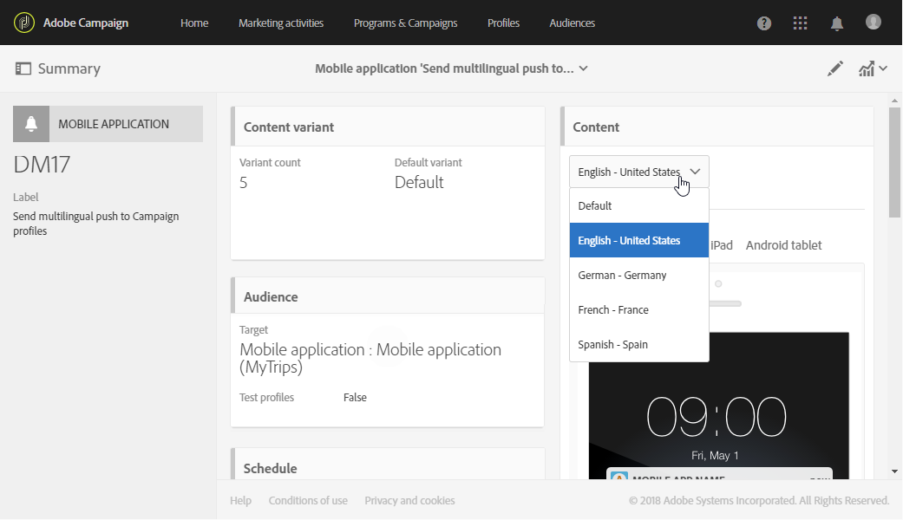

# Criação de uma notificação por push multilíngue{#creating-a-multilingual-push-notification}

## Sobre a notificação por push multilíngue {#about-multilingual-push-notification}

Personalize o conteúdo da notificação por push enviando mensagens com base nos idiomas e regiões de preferência dos usuários. Você pode importar diretamente variantes de conteúdo de notificações por push multilíngues no editor de conteúdo e enviar uma notificação por push multilíngue em uma única entrega.

Esse recurso aproveita os idiomas preferenciais especificados nos perfis dos destinatários ou a preferência de idioma do sistema para Assinantes de aplicativos móveis, dependendo do modelo de entrega usado para notificação por push. Se a preferência de idioma não for preenchida para um usuário específico, o sistema usará a variante padrão definida ao criar uma notificação por push multilíngue. Para obter mais informações sobre como gerenciar perfis e assinantes, consulte este [guia](../../audiences/using/get-started-profiles-and-audiences.md).

Para usar variantes de conteúdo multilíngue no delivery de notificação por push, siga estas etapas:

* [Etapa 1: carregar variante de conteúdo multilíngue](#step-1--upload-multilingual-content-variant)
* [Etapa 2: Visualizar e finalizar uma notificação por push usando variantes de conteúdo multilíngues](#step-2--preview-and-finalize-a-push-notification-using-multilingual-content-variants)
* [Etapa 3: enviar e analisar a entrega de notificação por push multilíngue](#step-3--send-and-analyze-multilingual-push-notification-delivery)

## Etapa 1: carregar variante de conteúdo multilíngue {#step-1--upload-multilingual-content-variant}

Antes de personalizar sua notificação por push multilíngue, primeiro precisamos fazer upload das variantes de conteúdo em um template do delivery multilíngue e criar o delivery.

>[!NOTE]
>
>Você também pode ignorar esta etapa se quiser criar uma variante manualmente para cada variante de idioma.

1. No **[!UICONTROL Marketing activities]**, clique no botão **[!UICONTROL Create]** e selecione **[!UICONTROL Push notification]**.
1. Selecione o modelo **[!UICONTROL Send multilingual push to Campaign profiles]** se quiser direcionar os perfis do Adobe Campaign que assinaram seu aplicativo para dispositivos móveis ou o modelo **[!UICONTROL Send multilingual push to app subscriber]** para enviar uma notificação por push a todos os usuários que optaram por receber notificações de seu aplicativo para dispositivos móveis.

   

1. Insira suas propriedades de notificação por push e selecione seu aplicativo móvel no campo **[!UICONTROL Associate a Mobile App to a delivery]**.

   Observe que a lista suspensa exibirá os aplicativos SDK V4 e SDKs da Adobe Experience Platform.

1. Nas janelas do **[!UICONTROL Audiences]**, arraste e solte consultas para ajustar o público.

   As consultas adicionadas dependem do modelo escolhido: se você escolher o modelo **[!UICONTROL Send multilingual push to Campaign profiles]**, poderá consultar recipients conhecidos do seu aplicativo móvel. Ao passo que se você escolher o modelo **[!UICONTROL Send multilingual push to app subscriber]**, poderá consultar todos os assinantes de um aplicativo específico que aceitaram.
   >[!NOTE]
   >
   >Se você direcionar públicos-alvo com idiomas específicos, será necessário listar cada idioma direcionado no arquivo CSV.

   

1. Na janela **[!UICONTROL Manage Content Variants]**, arraste e solte seu arquivo ou selecione um arquivo do seu computador.

   O arquivo deve ser codificado em UTF8 e deve ter um layout específico que pode ser encontrado clicando na opção **[!UICONTROL Download the sample file]**. Você também deve usar a sintaxe apropriada para valores de local. Para obter mais informações sobre o formato de arquivo e as localidades com suporte, consulte esta [página](../../channels/using/generating-csv-multilingual-push.md).

   

1. Depois de carregar o arquivo, as variantes de idioma são preenchidas automaticamente na guia **[!UICONTROL Variants]**. Observe que você pode fornecer um **[!UICONTROL Default variant]** no arquivo, que será a sua variante de conteúdo padrão se nenhum idioma preferencial for especificado para o usuário direcionado.

   

1. A guia **[!UICONTROL Variant selection]** fornecerá um script para determinar qual preferência de idioma deve ser considerada, dependendo do modelo de entrega. Este é um script pronto para uso que não requer que você faça alterações.
1. Se desejar adicionar mais variantes não presentes no arquivo importado, clique no botão **[!UICONTROL Add an element]** e adicione quantas variantes de idioma novas forem necessárias.

   Ao adicionar variantes diferentes daquelas carregadas do arquivo, nenhum conteúdo será vinculado a esse idioma. Será necessário editar o conteúdo diretamente no painel do delivery.

   

1. Clique em **[!UICONTROL Create]** quando a configuração estiver concluída. Você sempre pode voltar à janela **[!UICONTROL Content variant]** e fazer algumas alterações no painel de entrega.

   

Agora você pode começar a personalizar a notificação por push multilíngue.

## Etapa 2: Visualizar e finalizar uma notificação por push usando variantes de conteúdo multilíngues {#step-2--preview-and-finalize-a-push-notification-using-multilingual-content-variants}

Depois de fazer upload do arquivo com variantes de conteúdo, você pode visualizar as diferentes variantes do delivery de notificação por push.

Também é possível criar e editar mais variantes, além daquelas carregadas do arquivo.

1. Na janela **[!UICONTROL Content]** do painel de entrega, o menu suspenso permite visualizar o conteúdo da notificação por push, dependendo do idioma escolhido.

   

1. Se uma variante de conteúdo não for especificada para um idioma específico, clique no ícone de sino abaixo da visualização para começar a adicionar conteúdo a essa variante de idioma.

   Ao clicar na janela **[!UICONTROL Content]**, a notificação por push representa o conteúdo do idioma selecionado na lista suspensa. As alterações feitas nessa janela afetarão somente um idioma.

1. Você também pode clicar em uma variante de conteúdo para personalizá-la ainda mais, por exemplo, com campos de personalização.

   Para obter mais informações sobre como personalizar sua notificação por push, consulte esta [seção](../../channels/using/customizing-a-push-notification.md).

   

1. Clique na janela **[!UICONTROL Content variant]** se desejar adicionar ou excluir variantes de idioma.

   Observe que ao adicionar um novo idioma, será necessário adicionar manualmente o conteúdo à notificação por push vinculada ao idioma adicionado.

   

Seu delivery de notificação por push multilíngue agora está pronto para ser enviado.

## Etapa 3: enviar e analisar a entrega de notificação por push multilíngue {#step-3--send-and-analyze-multilingual-push-notification-delivery}

Suas notificações por push de variante de conteúdo multilíngue agora estão prontas para serem enviadas aos usuários.

1. Para começar a preparar o envio, clique no botão **[!UICONTROL Prepare]**.
1. Quando a preparação for concluída sem avisos, você poderá clicar no botão **[!UICONTROL Confirm]** para começar a enviar o push multilíngue.

   

1. Após enviar sua notificação por push com êxito, clique no ícone **[!UICONTROL Reports]** e depois em **[!UICONTROL Dynamic reports]** para analisar o sucesso de sua entrega.

   

1. Selecione **[!UICONTROL Push notification report]**.
1. Arraste e solte a dimensão **[!UICONTROL Variant]** no seu painel para começar a filtrar seus dados.

   

Agora você pode medir o impacto do delivery de notificações por push multilíngues nos recipients.

**Tópicos relacionados:**

* [Relatório de notificação por push](../../reporting/using/push-notification-report.md)
* [Envio de uma notificação por push em um workflow](../../automating/using/push-notification-delivery.md)
