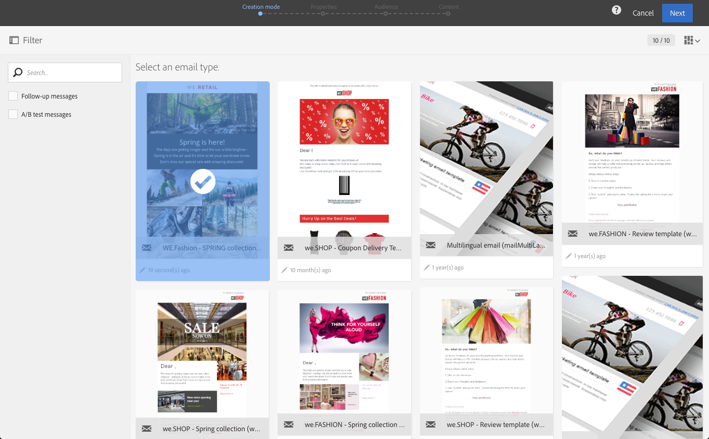
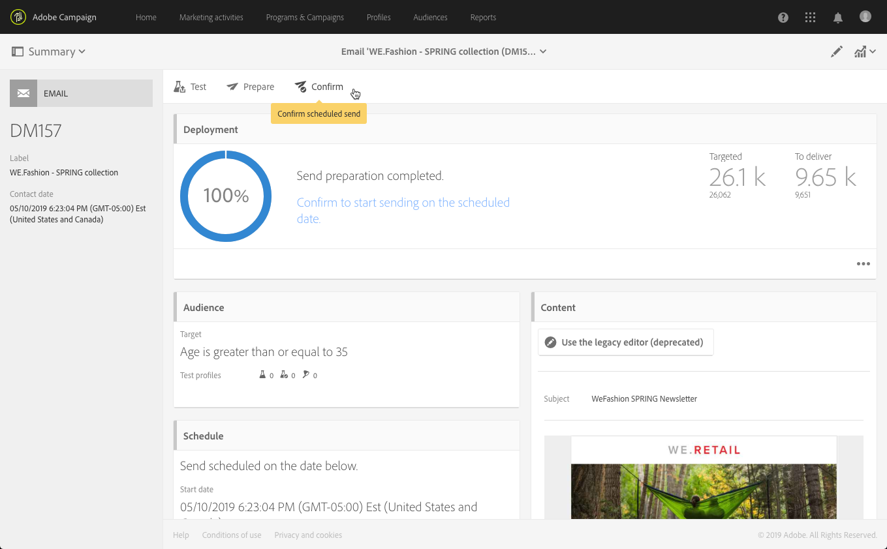

# Criação de um de email{#creating-an-email}

Você pode criar um email de uma [campanha](../../start/using/marketing-activities.md#creating-a-marketing-activity), do [home page](../../start/using/interface-description.md#home-page)ou da lista [de](../../start/using/marketing-activities.md#about-marketing-activities)atividade de marketing. Também é possível criar emails recorrentes e de envio único a partir de um fluxo de trabalho.

1. Depois de começar a criar uma atividade de marketing por email, selecione o modelo que deseja usar.

   Por padrão, você pode escolher entre vários modelos para cada atividade de marketing. Isso permite pré-configurar certos parâmetros de acordo com suas necessidades e também atribuir uma marca ao seu delivery. Para obter mais informações, consulte [Gerenciamento de modelos](../../start/using/marketing-activity-templates.md).

   

   >[!NOTE]
   >
   >Os modelos de teste A/B e de acompanhamento estão ocultos por padrão. Marque as caixas no lado esquerdo (painel **[!UICONTROL Filter]** lateral) se quiser exibi-las.

1. Insira as propriedades gerais do email. Você pode inserir um nome no campo **Rótulo** e editar a ID. O nome da atividade e sua ID são exibidos na interface, mas não são visíveis para os recipient de mensagem.

   Você pode adicionar uma descrição que o usuário pode ver no conteúdo da campanha.

   

   >[!NOTE]
   >
   >Você pode criar seu email em uma campanha pai a partir do home page ou da lista das atividades de marketing. Selecione-o nas campanhas que já foram criadas.

1. Defina o público alvo de sua mensagem com base nos critérios de sua empresa. Consulte [Gerenciamento de perfis](../../audiences/using/about-profiles.md).

   Você também pode definir os perfis de teste que validarão a mensagem. Consulte [Gerenciamento de perfis](../../audiences/using/managing-test-profiles.md)de teste.

   

1. Defina e personalize o conteúdo da mensagem, o nome do remetente e o assunto usando o [Email Designer](../../designing/using/designing-content-in-adobe-campaign.md). For more on this, see [About email content design](../../designing/using/designing-content-in-adobe-campaign.md).

   

   Você pode projetar sua mensagem diretamente usando um modelo de conteúdo predefinido ou usando o Dreamweaver ou o Adobe Experience Manager. Se você não se sentir um designer, também poderá carregar um conteúdo que foi preparado para você ou importar um conteúdo existente de um URL. Consulte [Seleção de um conteúdo](../../designing/using/using-existing-content.md)existente.

1. Visualizar sua mensagem. Consulte [Visualizar mensagens](../../sending/using/previewing-messages.md).
1. Confirme a criação do email.

   >[!NOTE]
   >
   >Para salvar seu email, é necessário primeiro fazer algumas edições no conteúdo. Se você clicar **[!UICONTROL Cancel]** nesse ponto, não concluirá o assistente e seu email não será criado.

   O painel de email é exibido. Permite que você verifique sua mensagem e [prepare o envio](../../sending/using/preparing-the-send.md).

   O **[!UICONTROL Edit properties]** botão no canto superior direito permite que você edite as propriedades do email. Você pode, por exemplo, configurar o email para que seu rótulo seja calculado no momento da preparação do delivery.  Available parameters are listed in [this section](../../administration/using/configuring-email-channel.md#list-of-email-properties).

   

1. Agende o envio. Consulte [Agendamento de mensagens](../../sending/using/about-scheduling-messages.md).

   

1. Prepare sua mensagem para analisar seu público alvo. See [Preparing the send](../../sending/using/confirming-the-send.md).

   

   >[!NOTE]
   >
   >Você pode definir regras de fadiga globais entre canais que excluirão automaticamente perfis supersolacionados do campanha. Para obter mais informações, consulte Regras [de](../../sending/using/fatigue-rules.md)fadiga.

1. Envie provas para verificar e validar a mensagem e monitorar a renderização da caixa de entrada. Consulte [Enviando prova](../../sending/using/sending-proofs.md).

   

1. Envie a mensagem e verifique seu delivery através do painel e dos registros da mensagem. Consulte [Envio de mensagens](../../sending/using/confirming-the-send.md).

   

1. Meça o impacto de sua mensagem com relatórios do delivery. For more on reporting, see [this section](../../reporting/using/about-dynamic-reports.md).

**Tópicos relacionados**:

* [Criação de um vídeo de email](https://docs.adobe.com/content/help/en/campaign-learn/campaign-standard-tutorials/getting-started/create-email-from-homepage.html)
* [Criação de um guia passo a passo de email](https://helpx.adobe.com/campaign/kb/acs-get-started-with-emails.html) personalizado
* [Vídeo de integração](https://docs.adobe.com/content/help/en/campaign-learn/campaign-standard-tutorials/designing-content/email-designer/dreamweaver-integration.html) do Adobe Campaign e do Dreamweaver
* [Integração com o Adobe Experience Manager](../../integrating/using/integrating-with-experience-manager.md)
