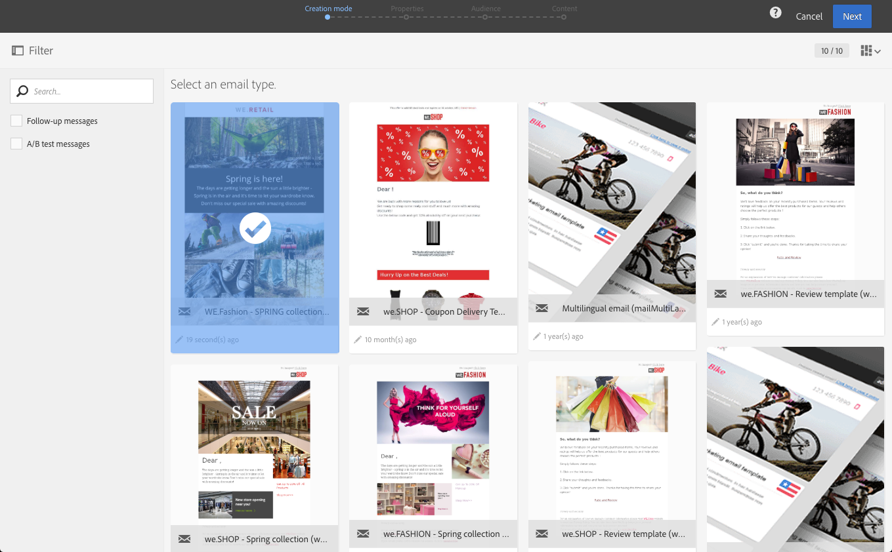
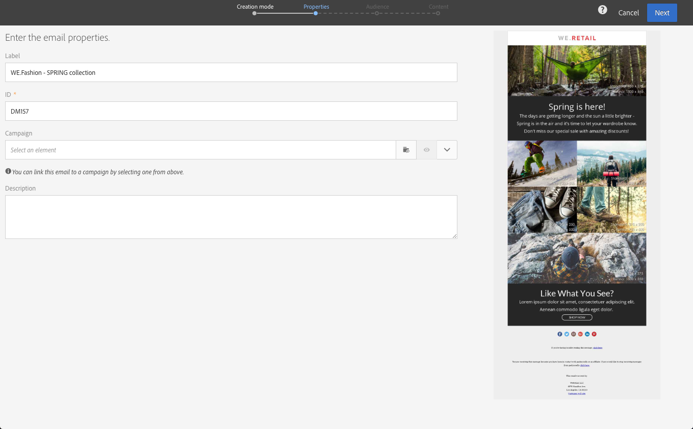
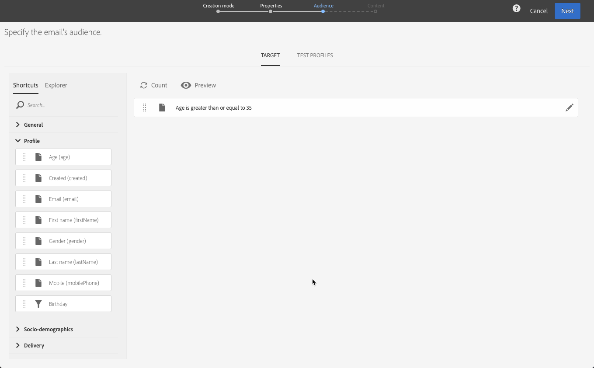
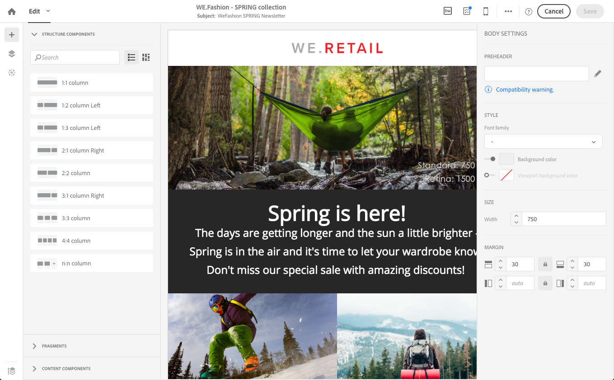
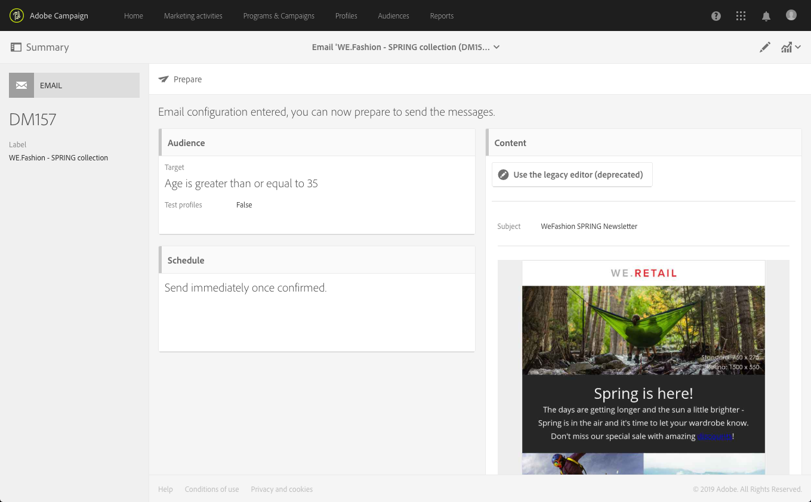
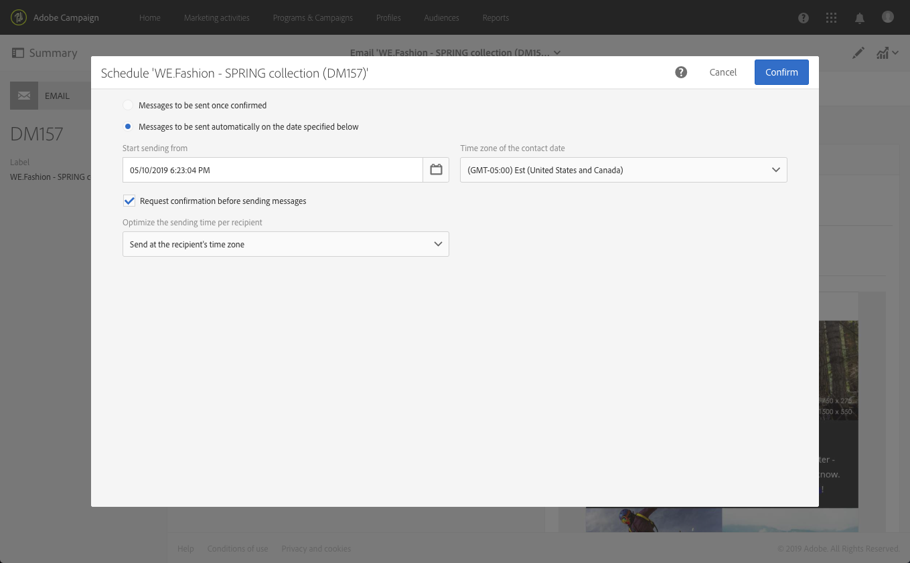
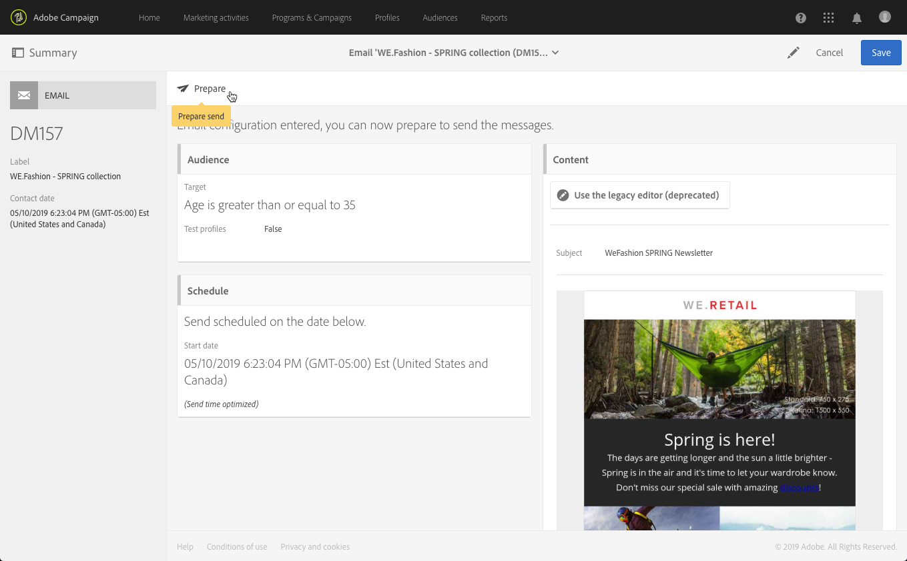
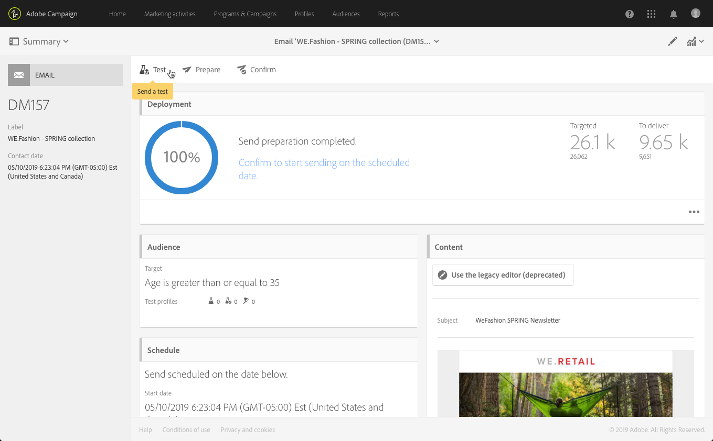
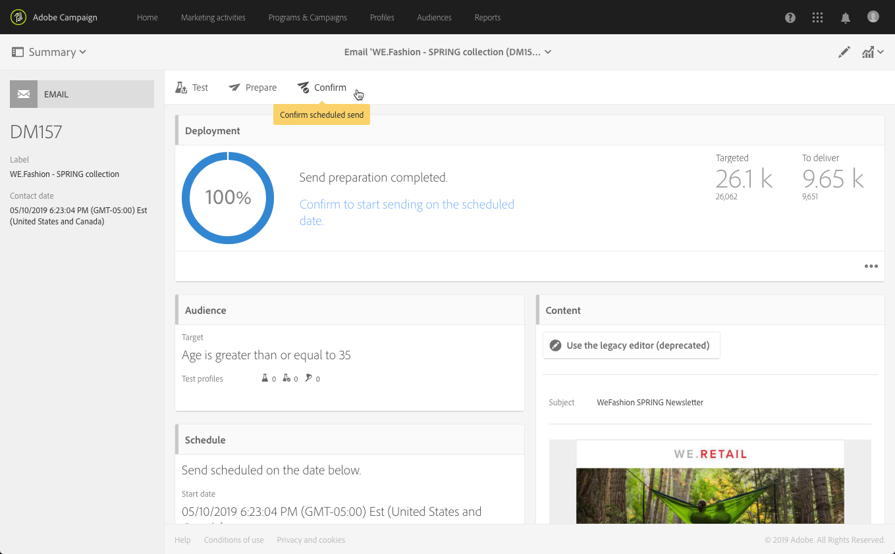

# Criação de um email{#creating-an-email}

Você pode criar um email a partir de uma [campanha](../../start/using/marketing-activities.md#creating-a-marketing-activity), da [home page](../../start/using/interface-description.md#home-page) do Adobe Campaign ou da [lista de atividades de marketing](../../start/using/marketing-activities.md#about-marketing-activities). Também é possível criar emails recorrentes e de envio único a partir de um fluxo de trabalho.

 [Conheça este recurso no vídeo](#video)

1. Depois de começar a criar uma atividade de marketing por email, selecione o template que deseja usar.

   Por padrão, você pode escolher entre vários modelos para cada atividade de marketing. Isso permite pré-configurar determinados parâmetros de acordo com suas necessidades e também atribuir uma marca ao seu delivery. Para obter mais informações, consulte [Gerenciamento de modelos](../../start/using/marketing-activity-templates.md).

   

   >[!NOTE]
   >
   >Os modelos de teste A/B e de acompanhamento estão ocultos por padrão. Marque as caixas no lado esquerdo ( **[!UICONTROL Filter]** painel lateral) se desejar exibi-las.

1. Insira as propriedades gerais do email. Você pode inserir um nome no campo **Rótulo** e editar a ID.

   >[!NOTE]
   >
   >O nome da atividade e sua ID aparecem na interface, mas não são visíveis para os recipients da mensagem.
   >
   >Verifique se o campo de ID não contém nenhum espaço em branco para evitar discrepâncias, por exemplo, ao integrar com o Adobe Analytics.

   É possível adicionar uma descrição que o usuário pode ver no conteúdo da campanha.

   

   >[!NOTE]
   >
   >Você pode criar seu email em uma campanha pai a partir da página inicial ou da lista de atividades de marketing. Selecione-a nas campanhas que já foram criadas.

1. Defina o público-alvo da mensagem com base nos critérios comerciais. Consulte [Sobre perfis](../../audiences/using/about-profiles.md).

   Você também pode definir os perfis de teste que validarão a mensagem. Consulte [Gerenciamento de perfis de teste](../../audiences/using/managing-test-profiles.md).

   

1. Defina e personalize o conteúdo da mensagem, o nome do remetente e o assunto usando o [Designer de email](../../designing/using/designing-content-in-adobe-campaign.md). Para obter mais informações, consulte [Sobre design de conteúdo de email](../../designing/using/designing-content-in-adobe-campaign.md).

   

   Você pode projetar sua mensagem diretamente usando um modelo de conteúdo predefinido ou usando o Dreamweaver ou o Adobe Experience Manager. Se você não se sentir como um designer, também poderá carregar um conteúdo que foi preparado para você ou importar um conteúdo existente de um URL. Consulte [Seleção de conteúdo existente](../../designing/using/using-existing-content.md).

1. Pré-visualize a mensagem. Consulte [Pré-visualização de mensagens](../../sending/using/previewing-messages.md).
1. Confirme a criação do email.

   >[!NOTE]
   >
   >Para salvar seu email, primeiro é necessário fazer algumas edições no conteúdo. Se você clicar em **[!UICONTROL Cancel]** neste ponto, não concluirá o assistente e seu email não será criado.

   O painel de email é exibido. Ela permite verificar sua mensagem e [preparar o envio](../../sending/using/preparing-the-send.md).

   O botão **[!UICONTROL Edit properties]** no canto superior direito permite editar as propriedades do email. Você pode, por exemplo, configurar o email para que seu rótulo seja calculado no momento da preparação do delivery.  Os parâmetros disponíveis estão listados em [esta seção](../../administration/using/configuring-email-channel.md#list-of-email-properties).

   

1. Programe o envio. Consulte [Agendamento de mensagens](../../sending/using/about-scheduling-messages.md).

   

1. Prepare sua mensagem para analisar seu público-alvo. Consulte [Preparando o envio](../../sending/using/confirming-the-send.md).

   

   >[!NOTE]
   >
   >Você pode definir regras de fadiga globais entre canais que excluirão automaticamente das campanhas os perfis com excesso de pedidos. Para obter mais informações, consulte [Regras de fadiga](../../sending/using/fatigue-rules.md).

1. Envie provas para verificar e validar a mensagem e monitorar a renderização da caixa de entrada. Consulte [Enviando prova](../../sending/using/sending-proofs.md).

   

1. Envie a mensagem e verifique o delivery pelo painel de mensagens e logs. Consulte [Enviando mensagens](../../sending/using/confirming-the-send.md).

   

1. Meça o impacto da mensagem com relatórios do delivery. Para obter mais informações sobre relatórios, consulte [esta seção](../../reporting/using/about-dynamic-reports.md).

**Tópicos relacionados**:

* [Guia passo a passo para criar um email personalizado](../../channels/using/key-steps-to-send-a-message.md)
* [Integração do Adobe Campaign e do Dreamweaver](../../designing/using/using-integrations.md#editing-content-in-dreamweaver)
* [Integração com o Adobe Experience Manager](../../integrating/using/integrating-with-experience-manager.md)

## Tutorial em vídeo {#video}

Este vídeo mostra como criar um email.

>[!VIDEO](https://video.tv.adobe.com/v/23721?quality=12)

Vídeos extras explicativos do Campaign Standard estão disponíveis [aqui](https://experienceleague.adobe.com/docs/campaign-standard-learn/tutorials/overview.html?lang=pt-BR).
