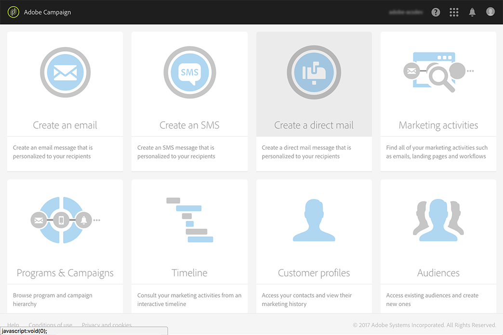

# Criação de correspondência direta{#creating-the-direct-mail}

A criação de um delivery de correspondência direta é muito semelhante à criação de um email comum. As etapas a seguir descrevem a configuração específica para esse canal. Consulte [Criar um email](../../channels/using/creating-an-email.md) para obter mais informações sobre outras opções.

>[!NOTE]
>
>Você também pode adicionar uma atividade de correspondência direta em um workflow. Para mais informações, consulte o Guia [Fluxos de trabalho](../../automating/using/direct-mail-delivery.md).

1. Crie um novo delivery de correspondência direta. Você pode criar um na [home page](../../start/using/interface-description.md#home-page)do Adobe Campaign, em uma [campanha](../../start/using/marketing-activities.md#creating-a-marketing-activity) ou em uma [lista de atividades de marketing](../../start/using/programs-and-campaigns.md#creating-a-campaign).

   

1. Escolha o template pronto para uso **[!UICONTROL Direct mail]** ou um dos seus próprios templates. Para obter mais informações sobre templates, consulte a seção [Gerenciar templates](../../start/using/marketing-activity-templates.md).

   

1. Insira as propriedades gerais do delivery.

   

1. Defina o público-alvo que você deseja incluir no arquivo de extração, bem como os perfis de teste e trap. Consulte [Definição do público-alvo de mala direto](../../channels/using/defining-the-direct-mail-audience.md).

   

   >[!NOTE]
   >
   >A definição do público-alvo é muito semelhante à definição de um público-alvo de email comum. Consulte [Criação de públicos-alvo](../../audiences/using/creating-audiences.md).

1. Edite o conteúdo do seu arquivo: colunas que serão incluídas para cada perfil, estrutura de arquivos, cabeçalho e rodapé. Consulte [Definir a correspondência direta](../../channels/using/defining-the-direct-mail-content.md).

   

1. Clique na seção **[!UICONTROL Schedule]** do painel de delivery para definir a data de contato. Para correspondência direta, a data de contato é obrigatória. Para obter mais informações, consulte [Agendar o envio](../../sending/using/about-scheduling-messages.md).

   

1. Se você tiver adicionado perfis de teste (consulte [Adicionar perfis de teste e trap](../../channels/using/defining-the-direct-mail-audience.md#adding-test-and-trap-profiles)), será possível testar o delivery antes de preparar o arquivo final. O teste permite criar um arquivo de amostra contendo apenas os perfis de teste selecionados.

   Clique em **[!UICONTROL Test]** para gerar o arquivo de amostra. Clique em **[!UICONTROL Summary]**, no canto superior esquerdo e selecione **[!UICONTROL Proofs]**. Na parte esquerda da tela, selecione a prova e clique em **[!UICONTROL Download file]**.

   >[!NOTE]
   >
   >A função **[!UICONTROL Export]** é necessária para permitir que o Adobe Campaign exporte o arquivo e o disponibilize para download. Entre em contato com o administrador.

   

1. Depois de definir o conteúdo do delivery, o público-alvo e a data de contato, clique no botão **[!UICONTROL Prepare]** no painel do delivery.

   

   Regras de tipologia são aplicadas. Por exemplo, todos os endereços postais não especificados são excluídos do destino. É por isso que você precisa verificar se marcou a caixa **[!UICONTROL Address specified]** nas informações dos seus perfis (consulte [Recomendações](../../channels/using/about-direct-mail.md#recommendations)). Se você tiver definido uma **[!UICONTROL Maximum volume of message]** nas propriedades da correspondência direta ou no nível do template, ela também será aplicada aqui.

   

   >[!NOTE]
   >
   >Você pode definir regras de fadiga globais entre canais que excluirão automaticamente das campanhas os perfis com excesso de pedidos. Consulte [Regras de fadiga](../../sending/using/fatigue-rules.md).

1. Clique em **[!UICONTROL Explore file]** para pré-visualizar as primeiras 100 linhas do arquivo.

   

   O arquivo completo está acessível para download local na parte esquerda da tela. Baixar o arquivo gera uma entrada de log no menu **[!UICONTROL Export audits]**. Para obter mais informações sobre auditorias de exportação, consulte a seção [Auditar exportações](../../administration/using/auditing-export-logs.md).

   >[!NOTE]
   >
   >A função **[!UICONTROL Export]** é necessária para permitir que o Adobe Campaign exporte o arquivo e o disponibilize para download. Entre em contato com o administrador.

   Se precisar alterar o conteúdo do delivery, basta clicar no botão **[!UICONTROL Regenerate file]** para levar a alteração em consideração. Não há necessidade de passar pela preparação novamente.

   

1. Para confirmar que o arquivo é final, clique em **[!UICONTROL Confirm]** no painel do delivery.

   

Agora, você está pronto para enviar o arquivo de extração ao seu provedor de correspondência direta. Para isso, existem várias opções:

* Enviá-lo por email normal, com o arquivo anexado
* Enviá-l-o pelo Campaign: faça sua correspondência direta dentro de um [workflow](../../automating/using/direct-mail-delivery.md) de campanha e adicione um **[!UICONTROL Transfer file]** para enviar o arquivo via FTP, por exemplo. Consulte [Transferir arquivo](../../automating/using/transfer-file.md).

O provedor recupera a lista de endereços incorretos e envia essas informações para a Adobe Campaign, que lista de bloqueios automaticamente os endereços incorretos. Consulte [Retornar ao remetente](../../channels/using/return-to-sender.md) .
