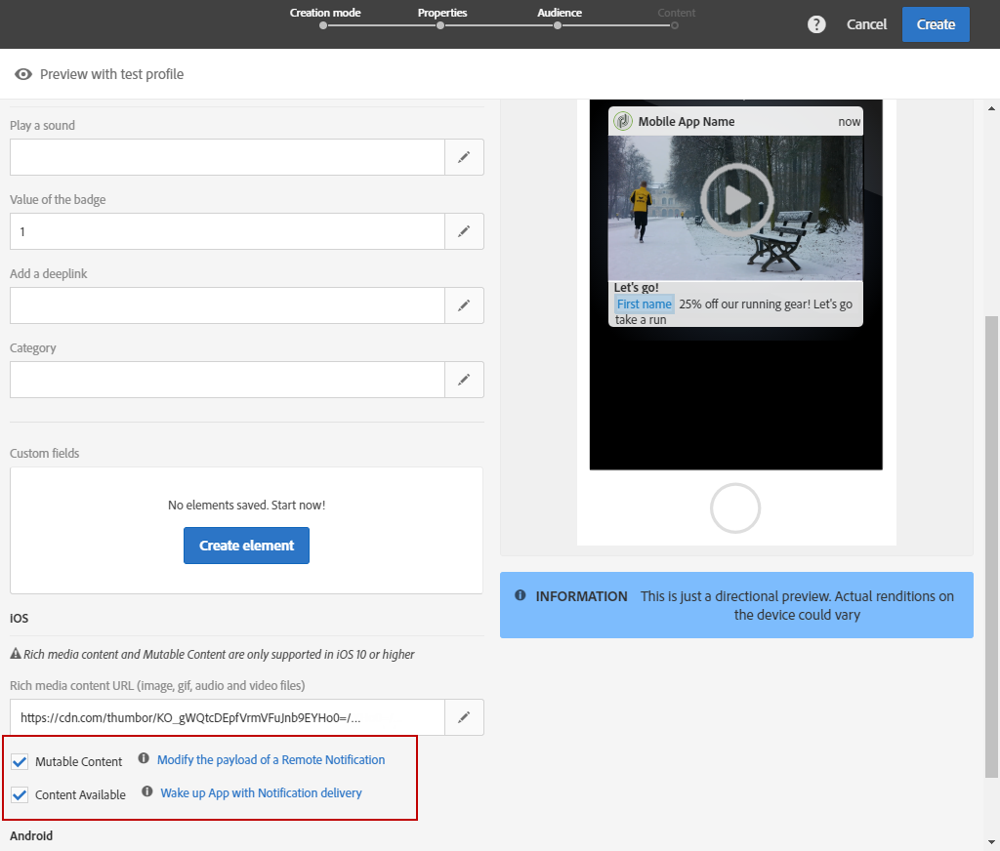

# Customizing a push notification{#customizing-a-push-notification}

Para ajustar a notificação por push, o Adobe Campaign permite acessar um conjunto de opções avançadas ao criar uma notificação por push.

As an expert user, to configure mobile applications in Adobe Campaign, refer to the following technote [Understanding Campaign Standard Push Notifications Payload Structure](https://helpx.adobe.com/campaign/kb/understanding-campaign-standard-push-notifications-payload-struc.html).

**Conteúdo relacionado:**

* [Relatório de notificação por push](../../reporting/using/push-notification-report.md)
* [Envio de uma notificação por push em um fluxo de trabalho](../../automating/using/push-notification-delivery.md)

## Play a sound {#play-a-sound}

The function **[!UICONTROL Play a sound]** gives the application the ability to play sounds on your device with the delivery of a push notification, when the app isn't running.

Um som alertará os usuários de uma notificação por push, fornecendo a eles mais visibilidade. Para incluir um som no aplicativo móvel:

1. Open the push notification and access the **[!UICONTROL Advanced options]** section.
1. In the **[!UICONTROL Play a sound]** field, enter the filename of the sound file, without the extension, to be played by the mobile device when the notification is received.

   For more information on supported media formats, refer to [Apple](https://support.apple.com/kb/PH16864?locale=en_US) and [Android](https://developer.android.com/guide/topics/media/media-formats.html) documentations.

   

1. O arquivo de som é reproduzido ao entregar a notificação se o arquivo estiver definido no pacote do aplicativo móvel. Caso contrário, o som padrão do dispositivo será reproduzido.

O usuário receberá a notificação por push e o som somente se o telefone não estiver silenciado.

## Refresh the badge value {#refresh-the-badge-value}

Um selo é usado para exibir diretamente no ícone do aplicativo o número de novas informações não lidas. O valor do selo desaparecerá assim que o usuário abrir ou ler o novo conteúdo do aplicativo.

Quando uma notificação é recebida em um dispositivo, ela pode atualizar ou adicionar um valor de selo para o aplicativo relacionado. Para enviar um valor de selo a partir do servidor:

1. Open the push notification and access the **[!UICONTROL Advanced options]** section.
1. O valor do selo deve ser um número inteiro e pode ser atualizado de maneiras diferentes:

   * To refresh the badge, enter 0 in the **[!UICONTROL Value of the badge]** field. Isso removerá o selo do ícone do aplicativo.
   * To add a badge value, enter any number in the **[!UICONTROL Value of the badge]** field. Esse número aparecerá automaticamente no selo assim que o usuário receber a notificação por push.
   * Se o campo estiver vazio ou não contiver um número inteiro, o valor do selo não mudará.
   Here, we entered 1 in the **[!UICONTROL Value of the badge]** field to let the users know that they have a new information in their application.

   

1. Após enviar a mensagem, os usuários receberão a notificação por push e seus aplicativos exibirão automaticamente o novo valor de selo.

   

## Add a deeplink {#add-a-deeplink}

Um deep link permite trazer os usuários diretamente para o conteúdo localizado dentro do aplicativo (em vez de abrir uma página do navegador da Web).

Um deep link pode incluir dados de personalização para uma experiência personalizada no aplicativo. Por exemplo, os nomes dos destinatários são automaticamente preenchidos na página para a qual o aplicativo os direciona.

Para adicionar um deep link em uma notificação por push:

1. Open the push notification and access the **[!UICONTROL Advanced options]** section.
1. Enter the link in the **[!UICONTROL Add a deeplink]** field.

   

1. Após enviar a mensagem, os usuários receberão a notificação por push e acessarão a página específica no aplicativo interagindo com a notificação, por exemplo, tocando ou clicando no botão de ação.

   

## Define an action {#define-an-action}

Você pode adicionar uma ID de categoria se disponível no aplicativo móvel e, em seguida, exibir botões de ação. Essas notificações fornecem ao usuário uma maneira mais rápida de executar tarefas diferentes em resposta a uma notificação sem abrir ou navegar no aplicativo.

A caixa de diálogo exibida no telefone do usuário requer uma decisão de continuar. Quando o usuário seleciona uma das ações, o sistema notifica o aplicativo para que ele possa executar quaisquer tarefas associadas.

Para adicionar uma categoria em uma notificação por push:

1. Open the push notification and access the **[!UICONTROL Advanced options]** section.
1. Enter a predefined category name in the **[!UICONTROL Category]** field to display actionable buttons when the push notification is received.

   O desenvolvedor de aplicativos móveis deve definir a ID da categoria e o comportamento esperado dos botões no aplicativo. For more on this, refer to the [Apple Developer documentation](https://developer.apple.com/library/content/documentation/NetworkingInternet/Conceptual/RemoteNotificationsPG/SupportingNotificationsinYourApp.html) (**Configuring Categories and Actionable Notifications** section) or the [Android Developer documentation](https://developer.android.com/guide/topics/ui/notifiers/notifications.html).

   

1. Após enviar sua notificação por push, os usuários o recebem e devem executar ações com os botões acionáveis anteriormente configurados.

   

Dependendo da ação do usuário, o aplicativo será notificado para que possa executar quaisquer tarefas associadas.

## Add custom fields {#add-custom-fields}

Campos personalizados permitem transmitir dados personalizados na carga na forma de um par de valor chave. Essa opção pode ser usada para passar dados adicionais para o aplicativo além das teclas predefinidas.

Para fazer isso:

1. Open the push notification and access the **[!UICONTROL Advanced options]** section.
1. In the **[!UICONTROL Custom fields]** category, click the **[!UICONTROL Add an element]** button.
1. Enter your **[!UICONTROL Keys]** then the **[!UICONTROL Values]** associated with each key.

   

1. A manipulação e a finalidade dos campos personalizados fica totalmente no aplicativo móvel. Na notificação por push abaixo, os campos personalizados foram usados pelo aplicativo para exibir rótulos de botões para a notificação por push.

   

## Add rich media content {#add-rich-media-content}

O conteúdo de mídia avançada permite ter um melhor envolvimento de usuário, significando que o usuário ficará mais inclinado a abrir sua notificação por push.

Você pode incluir um arquivo de imagem, gif, áudio ou vídeo que será reproduzido ou exibido na própria notificação. Os usuários do aplicativo não precisarão abrir o aplicativo para vê-lo.

Para incluir mídias avançadas na notificação por push:

1. Open the push notification and access the **[!UICONTROL Advanced options]** section.
1. Enter the URL of your file in the **[!UICONTROL Rich media content URL]** field for each format: iOS and Android.

   Para o iOS 10 ou superior, você pode inserir arquivos de imagem, gif, áudio e vídeo. Para versões anteriores do iOS, a notificação por push será exibida sem conteúdo avançado. For detailed steps on how to display an image from an Adobe Campaign push notification on an iOS device, refer to this [page](https://helpx.adobe.com/campaign/kb/display-image-push.html).

   Para Android, você pode incluir apenas imagens.

   

1. Após enviar a mensagem, o usuário receberá sua notificação por push e poderá exibir o conteúdo de mídia avançada.

   

## Change the notification behavior for iOS {#change-the-notification-behavior-for-ios}

For iOS 10 or higher, two additional options are available in the **[!UICONTROL Advanced options]** section of push notifications: **[!UICONTROL Mutable content]** and **[!UICONTROL Content available]**.

When the **[!UICONTROL Mutable content]** option is checked and/or a Rich media content URL is added, the mutable-content flag will be sent in the push payload and will allow the push notification content to be modified by a notification service application extension provided in iOS SDK. For more on this, refer to [Apple developer documentation](https://developer.apple.com/library/content/documentation/NetworkingInternet/Conceptual/RemoteNotificationsPG/ModifyingNotifications.html).

Em seguida, você pode aproveitar as extensões de aplicativos móveis para modificar ainda mais o conteúdo ou a apresentação de notificações de mensagens de push enviadas pelo Adobe Campaign. Por exemplo, os usuários podem aproveitar essa opção para:

* Decodificar dados que foram entregues em um formato criptografado
* Baixar imagens ou outros arquivos de mídia e adicioná-los como anexos a uma notificação
* Alterar o texto de corpo ou título de uma notificação
* Adicionar um identificador de encadeamento a uma notificação

When **[!UICONTROL Content available]** is checked, the content available flag will be sent in the push payload to ensure that the app is woken up as soon as it receives the push notification, meaning that the app will be able to access the payload data. Isso funciona mesmo se o aplicativo estiver sendo executado em segundo plano e sem qualquer interação do usuário (por exemplo, tocar na notificação por push), mas isso não se aplica se o aplicativo não estiver em execução. For more on this, refer to the [Apple developer documentation](https://developer.apple.com/library/content/documentation/NetworkingInternet/Conceptual/RemoteNotificationsPG/CreatingtheNotificationPayload.html).

## Change the notification behavior for Android {#change-the-notification-behavior-for-android}

For Android, you can enter the URL of your file in the **Rich media content URL** field. Enquanto com a versão iOS, para Android, é possível incluir apenas imagens e não arquivos de gif, áudio ou vídeo.

The **[!UICONTROL High priority]** checkbox allows you to set up a high or normal priority for your push notifications. For more information on message priority, refer to the [Google developer documentation](https://firebase.google.com/docs/cloud-messaging/concept-options#setting-the-priority-of-a-message).

