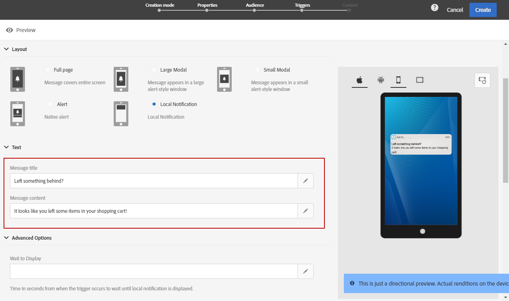

# Personalizar uma mensagem no aplicativo{#customizing-an-in-app-message}

Para ajustar sua mensagem no aplicativo, o Adobe Campaign permite que você acesse um conjunto de opções avançadas ao criar um aplicativo.

O editor de conteúdo no aplicativo permite escolher entre dois modos de mensagem no aplicativo:

* [Modelo](#customizing-with-a-message-template)de mensagem: esse modelo permite personalizar totalmente o aplicativo no aplicativo com imagens ou vídeos e botões de ação.
* [Mensagem](#customizing-with-a-custom-html-message)personalizada: esse modelo permite importar HTML personalizado.

>[!NOTE]
>
> A renderização de mensagens no aplicativo só é compatível com a API 19 e versões posteriores do Android.

**Tópicos relacionados:**

* [Envio da mensagem no aplicativo](../../channels/using/preparing-and-sending-an-in-app-message.md#sending-your-in-app-message)
* [relatórios no aplicativo](../../reporting/using/in-app-report.md)
* [Implementação do rastreamento de notificação local](../../administration/using/local-tracking.md)

## Personalização com um modelo de mensagem {#customizing-with-a-message-template}

### Layout {#layout}

O menu suspenso **[!UICONTROL Layout]** fornece quatro opções diferentes para escolher, dependendo de suas necessidades de mensagens:

* **[!UICONTROL Full page]**: Esse tipo de layout cobre a tela inteira de seus dispositivos de audiência.

   Ele oferece suporte a mídia (imagem, vídeo), texto e componentes de botão.

* **[!UICONTROL Large modal]**: Esse layout aparece em uma janela grande com estilo de alerta, seu aplicativo ainda está visível em segundo plano.

   Ele oferece suporte a mídia (imagem, vídeo), texto e componentes de botão.

* **[!UICONTROL Small modal]**: Este layout aparece como uma pequena janela de tipo de alerta, seu aplicativo ainda está visível em segundo plano.

   Ele oferece suporte a mídia (imagem, vídeo), texto e componentes de botão.

* **[!UICONTROL Alert]**: Esse tipo de layout é exibido como uma mensagem de alerta de SO nativo.

   Ele só pode suportar componentes de texto e botão.

* **[!UICONTROL Local notification]**: Esse tipo de layout é exibido como uma mensagem de banner.

   Ele só pode suportar som, texto e destino. Para obter mais informações sobre a notificação local, consulte [Personalizando um tipo](#customizing-a-local-notification-message-type)de mensagem de notificação local.

Cada tipo de layout pode ser visualizado em diferentes dispositivos, como telefone, tablet, plataforma, por exemplo, Android ou iOS, e a orientação, por exemplo, paisagem ou retrato na janela direita do editor de conteúdo.

### Media {#media}

O **[!UICONTROL Media]** menu suspenso permite adicionar mídia à sua mensagem no aplicativo para criar uma experiência atraente para o usuário final.

1. Selecione sua imagem **[!UICONTROL Media Type]** entre a imagem e o vídeo.
1. Para o tipo de **[!UICONTROL Image]** mídia, insira seu URL no **[!UICONTROL Media URL]** campo com base nos formatos suportados.

   Se necessário, você também pode digitar o caminho para um **[!UICONTROL Bundled image]** que pode ser usado se o dispositivo estiver offline.

   

1. Para o tipo de **[!UICONTROL Video]** mídia, insira seu URL no **[!UICONTROL Media URL]** campo.

   Em seguida, insira seu arquivo **[!UICONTROL Video poster]** a ser usado durante o download do vídeo nos dispositivos de audiência ou até que os usuários toquem no botão Reproduzir.

   

### Texto {#text}

Se necessário, você também pode adicionar um título de mensagem e conteúdo à sua mensagem no aplicativo. Para personalizar melhor sua mensagem no aplicativo, você pode adicionar diferentes campos de personalização, blocos de conteúdo e texto dinâmico ao seu conteúdo.

1. Na **[!UICONTROL Text]** lista suspensa, adicione um título ao **[!UICONTROL Message title]** campo.

   

1. Adicione seu conteúdo ao **[!UICONTROL Message content]** campo.
1. Para personalizar ainda mais seu texto, clique no  ícone para adicionar campos de personalização.

   

1. Digite o conteúdo da sua mensagem e adicione seus campos de personalização, se necessário.

   For more information on personalization field, refer to this [section](../../designing/using/personalization.md#inserting-a-personalization-field).

   

1. Verifique o conteúdo da sua mensagem na janela pré-visualização.

   

### Botões {#buttons}

Você pode adicionar até dois botões à sua mensagem no aplicativo.

1. Na **[!UICONTROL Buttons]** lista suspensa, digite o texto do primeiro botão na **[!UICONTROL Primary]** categoria.

   

1. Escolha qual das duas ações **[!UICONTROL Dismiss]** e **[!UICONTROL Redirect]** será atribuída ao seu botão principal.
1. Na **[!UICONTROL Secondary]** categoria, adicione um segundo botão ao seu In-App, se necessário, inserindo seu texto.
1. Selecione a ação associada ao seu segundo botão.
1. Se você escolher a **[!UICONTROL Redirect]** ação, insira o URL da Web ou insira o deep link no **[!UICONTROL Destination URL]** campo.

   

1. Insira o URL da Web ou deep link no **[!UICONTROL Destination URL]** **[!UICONTROL Redirect]** campo, se você escolher a ação,
1. Verifique o conteúdo da sua mensagem na janela pré-visualização ou clicando no botão Pré-visualização.

   Consulte a página [Visualizar mensagens](#previewing-the-in-app-message) no aplicativo.

   

### Configurações {#settings}

1. Na **[!UICONTROL Settings]** categoria, selecione a cor do plano de fundo entre claro e escuro.
1. Opte por exibir ou não um botão Fechar com a **[!UICONTROL Show close button]** opção de fornecer aos usuários uma maneira de descartar a mensagem no aplicativo.
1. Selecione se o alinhamento do botão será horizontal ou vertical com a **[!UICONTROL Button alignment]** opção.
1. Escolha se sua mensagem no aplicativo pode ser fechada automaticamente ou não após alguns segundos.

   

## Personalização de um tipo de mensagem de notificação local {#customizing-a-local-notification-message-type}

As notificações locais só podem ser acionadas por um aplicativo em um horário específico e dependendo de um evento. Eles alertarão os usuários de que algo está acontecendo em seus aplicativos mesmo sem ter acesso à Internet.
Para saber como rastrear a notificação local, consulte esta [página](../../administration/using/local-tracking.md).

Para personalizar uma notificação local:

1. Na sua **[!UICONTROL Content]** página, selecione **[!UICONTROL Local notification]** a **[!UICONTROL Layout]** categoria

   

1. Sob a **[!UICONTROL Text]** categoria, digite seus **[!UICONTROL Message title]** e **[!UICONTROL Message content]**.

   

1. Sob a **[!UICONTROL Advanced option]** categoria, no **[!UICONTROL Wait to display]** campo, escolha quanto tempo, em segundos, sua notificação local será exibida na tela assim que seu evento for acionado.
1. No **[!UICONTROL Sound]** campo, digite o nome do arquivo de som, com a extensão, a ser reproduzido pelo dispositivo móvel quando a notificação local for recebida.

   O arquivo de som é reproduzido ao fornecer a notificação se o arquivo estiver definido no pacote do aplicativo móvel. Caso contrário, o som padrão do dispositivo será reproduzido.

   

1. Especifique um destino para redirecionar seus usuários quando eles interagirem com sua notificação local no **[!UICONTROL Deeplink URL]** campo.
1. Para passar dados personalizados na carga em forma de um par de valores chave, é possível adicionar campos personalizados à notificação local. Na **[!UICONTROL Custom fields]** categoria, clique no **[!UICONTROL Create an element]** botão.
1. Insira **[!UICONTROL Keys]** e depois o **[!UICONTROL Values]** associado a cada chave.

   Observe que o manuseio e a finalidade dos campos personalizados são totalmente compatíveis com o aplicativo móvel.

1. Na **[!UICONTROL Apple options]** categoria, preencha os **[!UICONTROL Category]** campos para adicionar uma ID de categoria para ações personalizadas, se disponível no aplicativo móvel da Apple.

## Personalização com uma mensagem HTML personalizada {#customizing-with-a-custom-html-message}

>[!NOTE]
>
>A mensagem HTML personalizada não oferece suporte à personalização do conteúdo.

O **[!UICONTROL Custom message]** modo permite importar diretamente uma de suas mensagens HTML pré-configuradas.

Para fazer isso, basta arrastar e soltar ou selecionar o arquivo do computador.

Seu arquivo deve ter um layout específico que pode ser encontrado clicando na opção **Baixar o arquivo** de amostra.

Você também pode encontrar uma lista de requisitos HTML personalizados para uma importação bem-sucedida no Adobe Campaign.

Depois que o HTML for importado, você poderá encontrar uma pré-visualização do seu arquivo em diferentes dispositivos na janela de pré-visualização.

## Previewing the In-App message {#previewing-the-in-app-message}

Antes de enviar sua mensagem no aplicativo, você pode testar com seus perfis de teste para verificar o que sua audiência direcionada verá quando receber seu delivery.

1. Clique no botão **[!UICONTROL Preview]**.

   

1. Clique no **[!UICONTROL Select a test profile]** botão e selecione um dos perfis de teste para start da visualização do delivery. For more information on test profiles, refer to this [section](../../audiences/using/managing-test-profiles.md).
1. Verifique sua mensagem em diferentes dispositivos, como Android, iPhone Phone ou até mesmo tablets. Você também pode verificar se seus campos de personalização estão recuperando os dados corretos.

   

1. Agora você pode enviar sua mensagem e medir seu impacto com relatórios do delivery. For more on reporting, refer to [this section](../../reporting/using/in-app-report.md).

