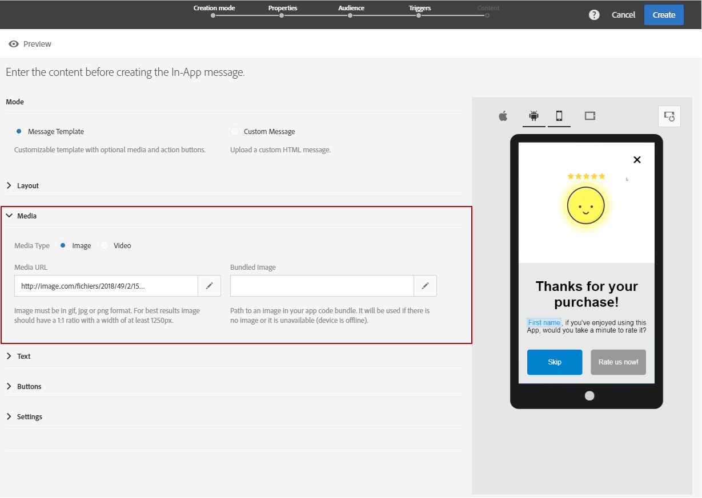

# Personalização de mensagem no aplicativo{#customizing-an-in-app-message}

Para ajustar a mensagem no aplicativo, o Adobe Campaign permite acessar um conjunto de opções avançadas ao criar uma mensagem no aplicativo.

Com o editor de conteúdo de mensagens no aplicativo é possível escolher entre dois modos de mensagens no aplicativo:

* [Modelo de mensagem](#customizing-with-a-message-template): esse modelo possibilita personalizar totalmente a mensagem no aplicativo com imagens ou vídeos e botões de ação.
* [Mensagem personalizada](#customizing-with-a-custom-html-message): esse modelo possibilita importar HTML personalizado.

>[!NOTE]
>
> A renderização de mensagens no aplicativo só é compatível com a API 19 e versões posteriores do Android.

**Tópicos relacionados:**

* [Envio de mensagens no aplicativo](../../channels/using/preparing-and-sending-an-in-app-message.md#sending-your-in-app-message)
* [Relatório de mensagens no aplicativo](../../reporting/using/in-app-report.md)
* [Implementação do rastreamento de notificação local](../../administration/using/local-tracking.md)

## Personalização com um modelo de mensagem {#customizing-with-a-message-template}

### Layout {#layout}

O menu suspenso **[!UICONTROL Layout]** fornece quatro opções diferentes para escolher, dependendo das suas necessidades:

* **[!UICONTROL Full page]**: esse tipo de layout cobre a tela inteira do dispositivo do público-alvo.

   É compatível com mídias (imagem, vídeo), texto e componentes de botão.

* **[!UICONTROL Large modal]**: esse layout aparece em uma janela grande com estilo de alerta. O aplicativo ainda fica visível em segundo plano.

   É compatível com mídias (imagem, vídeo), texto e componentes de botão.

* **[!UICONTROL Small modal]**: esse layout aparece como uma pequena janela de tipo de alerta. O aplicativo ainda fica visível em segundo plano.

   É compatível com mídias (imagem, vídeo), texto e componentes de botão.

* **[!UICONTROL Alert]**: esse tipo de layout é exibido como uma mensagem de alerta de SO nativo.

   Só é compatível com componentes de texto e botão.

* **[!UICONTROL Local notification]**: esse tipo de layout é exibido como uma mensagem de banner.

   Só é compatível com som, texto e destino. Para obter mais informações sobre notificação local, consulte [Personalização de tipos de mensagens de notificação local](#customizing-a-local-notification-message-type).

Cada tipo de layout pode ser visualizado em diferentes dispositivos, como celular, tablet, plataforma (por exemplo, Android ou iOS). A orientação (por exemplo, paisagem ou retrato) pode ser escolhida na janela direita do editor de conteúdo.

### Mídia {#media}

Com o menu suspenso **[!UICONTROL Media]** é possível adicionar mídia à mensagem no aplicativo para criar uma experiência atraente para o usuário final.

1. Selecione o **[!UICONTROL Media Type]** entre imagem e vídeo.
1. Para o tipo de mídia **[!UICONTROL Image]**, insira o URL no campo **[!UICONTROL Media URL]** com base nos formatos compatíveis.

   Se necessário, você também pode digitar o caminho para um **[!UICONTROL Bundled image]**, que pode ser usado se o dispositivo estiver offline.

   

1. Para o tipo de mídia **[!UICONTROL Video]**, insira o URL no campo **[!UICONTROL Media URL]**.

   Em seguida, insira o **[!UICONTROL Video poster]** que será usado durante o download do vídeo nos dispositivos do público-alvo ou até que os usuários toquem no botão Reproduzir.

   

### Texto {#text}

Se necessário, você também pode adicionar um título e um conteúdo à mensagem no aplicativo. Para personalizar melhor a mensagem no aplicativo, adicione diferentes campos de personalização, blocos de conteúdo e texto dinâmico ao conteúdo.

1. No menu suspenso **[!UICONTROL Text]**, adicione um título ao campo **[!UICONTROL Message title]**.

   

1. Adicione conteúdo ao campo **[!UICONTROL Message content]**.
1. Para personalizar ainda mais o texto, clique no ícone  para adicionar campos de personalização.

   

1. Digite o conteúdo da mensagem e adicione campos de personalização, se necessário.

   Para obter mais informações sobre campos de personalização, consulte esta [seção](../../designing/using/personalization.md#inserting-a-personalization-field).

   

1. Verifique o conteúdo da mensagem na janela pré-visualização.

   

### Botões {#buttons}

Você pode adicionar até dois botões à mensagem no aplicativo.

1. No menu suspenso **[!UICONTROL Buttons]**, digite o texto do primeiro botão na categoria **[!UICONTROL Primary]**.

   

1. Escolha qual das duas ações, **[!UICONTROL Dismiss]** e **[!UICONTROL Redirect]**, será atribuída ao botão principal.
1. Na categoria **[!UICONTROL Secondary]**, adicione um segundo botão à mensagem no aplicativo, se necessário, inserindo o texto.
1. Selecione a ação associada ao segundo botão.
1. Se você escolher a ação **[!UICONTROL Redirect]**, insira o URL da Web ou o deep link no campo **[!UICONTROL Destination URL]**.

   

1. Insira o URL da Web ou deep link no campo **[!UICONTROL Destination URL]**, se você escolher a ação **[!UICONTROL Redirect]**.
1. Verifique o conteúdo da mensagem na janela de pré-visualização ou clicando no botão Preview.

   Consulte a página [Visualização de mensagens no aplicativo](../../channels/using/preparing-and-sending-an-in-app-message.md#previewing-the-in-app-message).

   

### Configurações {#settings}

1. Na categoria **[!UICONTROL Settings]**, selecione a cor do plano de fundo entre claro e escuro.
1. Opte por exibir ou não um botão Fechar com a opção **[!UICONTROL Show close button]**, para fornecer aos usuários uma maneira de descartar a mensagem no aplicativo.
1. Selecione se o alinhamento do botão será horizontal ou vertical com a opção **[!UICONTROL Button alignment]**.
1. Escolha se a mensagem no aplicativo pode ser descartada automaticamente ou não após alguns segundos.

   

## Personalização de tipos de mensagens de notificação local {#customizing-a-local-notification-message-type}

As notificações locais só podem ser acionadas por um aplicativo em um horário específico e dependendo de um evento. Eles alertarão os usuários de que algo está acontecendo em seu aplicativo mesmo sem acesso à Internet.
Para saber como rastrear a notificação local, consulte esta [página](../../administration/using/local-tracking.md).

Para personalizar uma notificação local:

1. Na sua página **[!UICONTROL Content]**, selecione **[!UICONTROL Local notification]** na categoria **[!UICONTROL Layout]**.

   

1. Na categoria **[!UICONTROL Text]**, digite o **[!UICONTROL Message title]** e **[!UICONTROL Message content]**.

   

1. Na categoria **[!UICONTROL Advanced option]**, no campo **[!UICONTROL Wait to display]**, escolha quanto tempo, em segundos, a notificação local será exibida na tela assim que o evento for acionado.
1. No campo **[!UICONTROL Sound]**, digite o nome do arquivo de som, com a extensão, a ser reproduzido pelo dispositivo móvel quando a notificação local for recebida.

   O arquivo de som será reproduzido ao fornecer a notificação se estiver definido no pacote desse aplicativo móvel. Caso contrário, o som padrão do dispositivo será reproduzido.

   

1. Especifique um destino para redirecionar os usuários quando eles interagirem com a notificação local no campo **[!UICONTROL Deeplink URL]**.
1. Para passar dados personalizados no payload em forma de um par de valores chave, é possível adicionar campos personalizados à notificação local. Na categoria **[!UICONTROL Custom fields]**, clique no botão **[!UICONTROL Create an element]**.
1. Insira **[!UICONTROL Keys]** e depois o **[!UICONTROL Values]** associado a cada chave.

   Observe que o manuseio e a finalidade dos campos personalizados são totalmente compatíveis com o aplicativo para dispositivos móveis.

1. Na categoria **[!UICONTROL Apple options]**, preencha os campos **[!UICONTROL Category]** para adicionar uma ID de categoria para ações personalizadas, se disponível no aplicativo para dispositivos móveis da Apple.

## Personalização com uma mensagem HTML personalizada {#customizing-with-a-custom-html-message}

>[!NOTE]
>
>A mensagem HTML personalizada não é compatível com a personalização do conteúdo.

O modo **[!UICONTROL Custom message]** permite importar diretamente uma de suas mensagens HTML pré-configuradas.

Para fazer isso, basta arrastar e soltar ou selecionar o arquivo do computador.

O arquivo deve ter um layout específico que pode ser encontrado clicando na opção **Baixar o arquivo de amostra**.

Você também pode encontrar uma lista de requisitos de HTML personalizados para uma importação bem-sucedida no Adobe Campaign.

Depois que o HTML for importado, você poderá encontrar uma pré-visualização do seu arquivo em diferentes dispositivos na janela de pré-visualização.
