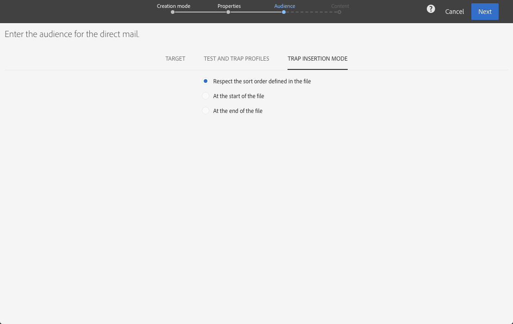

# Definição do público-alvo do correio direto{#defining-the-direct-mail-audience}

Você pode definir o público-alvo no assistente de criação ou clicando na seção **Público-alvo** do painel de entrega.

## Definição da meta principal {#defining-the-main-target}

Para mala direta, os perfis direcionados são aqueles que serão incluídos no arquivo de extração que você enviará ao seu provedor de mala direta.

Para cada perfil direcionado, uma nova linha é adicionada ao arquivo de extração. A quantidade de informações de perfil que serão incluídas para cada destinatário é definida na tela [Definindo a extração](#defining-the-extraction) .

>[!CAUTION]
>
>Certifique-se de que seus perfis incluam um endereço postal, pois essas informações são essenciais para o provedor de mala direta. Verifique também se você marcou a **[!UICONTROL Address specified]** caixa nas informações de seus perfis. Consulte [Recomendações](../../channels/using/about-direct-mail.md#recommendations).

## Adicionar perfis de teste e trapping {#adding-test-and-trap-profiles}

Adicione perfis de teste para que você possa testar seu arquivo com um pequeno número de perfis. Permite criar rapidamente uma amostra de arquivo para testar e validar a estrutura antes de preparar o arquivo real. See [Managing test profiles and sending proofs](../../sending/using/managing-test-profiles-and-sending-proofs.md).

A utilização de armadilhas é essencial para a entrega direta de correio. Eles permitem que você verifique se seu provedor de mala direta está realmente enviando a comunicação e se eles não estão enviando sua lista de clientes para outro provedor. Consulte [Uso de armadilhas](../../sending/using/managing-test-profiles-and-sending-proofs.md#using-traps).

Para entregas por mala direta, as armadilhas são adicionadas durante a extração e misturadas no documento de saída. Por padrão, eles são inseridos na ordem de classificação do arquivo de saída, mas você pode optar por inseri-los no final ou no início do arquivo. Ao definir o público-alvo, selecione a opção desejada na **[!UICONTROL Trap insertion mode]** guia.

