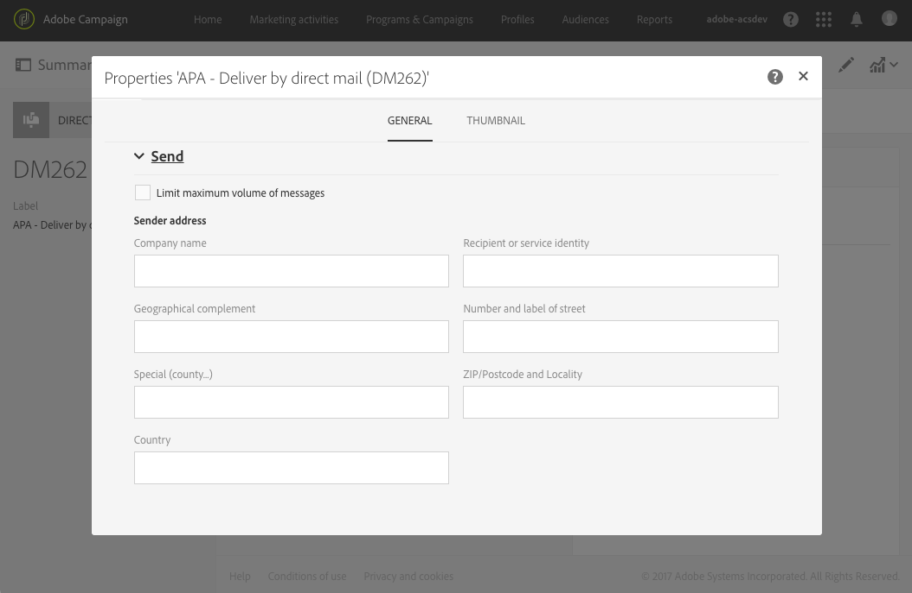

# Definição do conteúdo da correspondência direta{#defining-the-direct-mail-content}

Você pode definir o conteúdo na última tela do assistente de criação ou clicando na seção **Content** do painel do delivery.

A tela de definição **[!UICONTROL Content]** é específica do canal de correspondência direta. Ela é dividido em quatro guias: **[!UICONTROL Extraction]**, **[!UICONTROL File structure]**, **[!UICONTROL Header]** e **[!UICONTROL Footer]**.

## Definição da extração {#defining-the-extraction}

1. Comece definindo o nome do arquivo de extração. Clique no botão à direita do campo **[!UICONTROL Output file]** e insira o rótulo desejado. Você pode usar campos de personalização, blocos de conteúdo e texto dinâmico (consulte [Definição de conteúdo](../../designing/using/personalization.md#example-email-personalization)). Por exemplo, você pode preencher o rótulo com a ID do delivery ou a data da extração.

   

1. Clique no botão **[!UICONTROL +]** ou **[!UICONTROL Add an element]** para adicionar uma coluna de saída. As **[!UICONTROL Output columns]** permitem que você defina as informações (colunas) do perfil a serem exportadas para o arquivo de saída.

   >[!IMPORTANT]
   >
   >Verifique se os perfis incluem o CEP, pois essa informação é essencial para o provedor de correspondência direta. Verifique também se você marcou a caixa **[!UICONTROL Address specified]** nas informações dos perfis. Consulte [Recomendações](../../channels/using/about-direct-mail.md#recommendations).

   

1. Crie quantas colunas forem necessárias. Você pode editar as colunas clicando nas expressões e nos rótulos.

>[!NOTE]
>
>Para saber mais sobre a definição da coluna de saída, consulte a seção da atividade [Extract file](../../automating/using/extract-file.md) do fluxo de trabalho.

## Definição da estrutura de arquivo {#defining-the-file-structure}

A guia **File structure** permite configurar os formatos de saída, data e número do arquivo que será exportado.

>[!NOTE]
>
>As opções disponíveis são detalhadas nas seções da atividade [Extract file](../../automating/using/extract-file.md) do fluxo de trabalho.

## Definição do cabeçalho e rodapé {#defining-the-header-and-footer}

Às vezes, pode ser necessário adicionar informações ao início ou final do arquivo de extração. Para isso, use as guias **[!UICONTROL Header]** e **[!UICONTROL Footer]** da tela de configuração **[!UICONTROL Content]**.

Por exemplo, você talvez queira incluir as informações do remetente no cabeçalho do arquivo para o provedor de correspondência direta. É possível personalizar o rodapé e o cabeçalho com as informações disponíveis no contexto do delivery. Consulte [Definição de conteúdo](../../designing/using/personalization.md#example-email-personalization).

O endereço do remetente é definido na seção **[!UICONTROL Send]** das propriedades de correspondência direta ou no nível do template.

