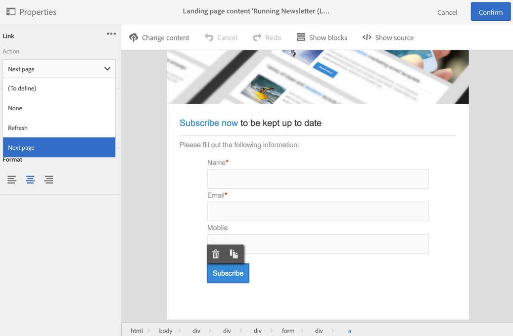
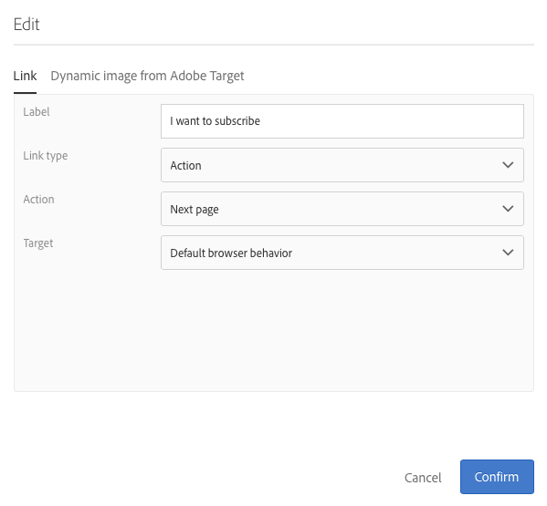

# Criação de uma página de aterrissagem{#designing-a-landing-page}

## Sobre o design de conteúdo {#about-content-design}

As páginas de aterrissagem são criadas como qualquer atividade [de marketing](../../start/using/marketing-activities.md#about-marketing-activities).

Ao projetar uma página de aterrissagem, é necessário definir o conteúdo de:

* a própria página,
* a página de confirmação,
* a página de erro.

Use o alternador na barra de ações para exibir e configurar cada uma dessas páginas.

O conteúdo dessas páginas foi projetado pelo editor de conteúdo do Campaign. Consulte [Design de conteúdo](../../channels/using/about-landing-page-content-design.md).

## Mapeamento de campos de formulário {#mapping-form-fields}

Os campos de entrada são usados para armazenar ou atualizar dados no banco de dados do Campaign. Para isso, é necessário vincular campos do banco de dados a blocos de zona de entrada, botão de opção ou tipo de caixa de seleção. Para fazer isso:

1. Selecione um bloco na página de aterrissagem.
1. Complete a **[!UICONTROL Form data]** parte da paleta.

   

1. Escolha um campo de banco de dados para vincular ao campo de formulário na zona de **[!UICONTROL Field]** seleção.

   Quando a **[!UICONTROL Mandatory]** opção está marcada, a página só pode ser enviada se o usuário tiver completado esse campo. Se um campo obrigatório não for concluído, uma mensagem de erro será exibida quando o usuário validar a página.

   >[!NOTE]
   >
   >As páginas iniciais só podem ser mapeadas com **Perfis**.

1. Defina o tipo de campo escolhendo, por exemplo **[!UICONTROL Text]**, **[!UICONTROL Number]** ou **[!UICONTROL Date]** na área de **[!UICONTROL HTML type of the field]** seleção.

>[!NOTE]
>
>Os campos padrão das páginas iniciais incorporadas são pré-configurados. Você pode modificá-los conforme necessário.

## Enviar o formulário {#submitting-the-form}

Você pode selecionar a ação a ser executada quando o visitante clicar no botão Enviar. Para fazer isso:

1. Selecione o botão Enviar da página inicial.
1. Selecione a ação na lista suspensa no painel esquerdo. As ações possíveis são: **[!UICONTROL Refresh]** (para atualizar a página) e **[!UICONTROL Next page]** (para exibir a página de confirmação).

   

Além disso, você pode alterar o rótulo do botão ou configurar um link específico. Para fazer isso:

1. Selecione o botão enviar.
1. Clique no  botão no painel esquerdo.
1. Insira o rótulo do botão, selecione o tipo de link, suas propriedades e o destino.

   

## Vincular um formulário a um serviço {#linking-a-form-to-a-service}

Você pode vincular um formulário a um serviço para que os perfis possam se inscrever em um serviço específico ao validar as páginas iniciais.

Os parâmetros para vincular uma página de aterrissagem permitem especificar o tipo de ação executada e se a página de aterrissagem está especificamente vinculada a um único serviço ou se é genérica.

Para selecionar o serviço a ser vinculado, é necessário:

1. Edite as propriedades da página inicial acessadas pelo  ícone no painel da página inicial e exiba os **[!UICONTROL Job]** parâmetros.

   

1. Escolha **[!UICONTROL Subscription]** na lista **[!UICONTROL Specific actions]** suspensa.

   

1. Selecione **[!UICONTROL Specific service]** para vincular a página de aterrissagem a um único serviço. Não selecione essa opção se desejar usar vários serviços com a página de aterrissagem.

   Use a **[!UICONTROL Specified service in the URL]** opção para permitir que a página de aterrissagem seja usada para vários serviços. Portanto, é necessário consultar a página de aterrissagem ao configurar o serviço.

### Confirmar envio de página inicial {#confirm-a-landing-page-submission}

Quando uma página inicial é enviada por um visitante, você pode configurar as ações acionadas. Para fazer isso:

1. Edite as propriedades da página inicial acessadas pelo  ícone no painel da página inicial e exiba os **[!UICONTROL Job]** parâmetros.

   

1. Na **[!UICONTROL Specific actions]** seção, selecione **[!UICONTROL Start sending message]** para determinar o envio de uma mensagem automática, por exemplo, para confirmar a assinatura de um serviço. Você precisa selecionar um modelo de entrega de email.

   Observe que se uma mensagem de confirmação já estiver configurada no nível de serviço, você não deve selecionar uma nessa tela para evitar o envio de várias mensagens de confirmação. Consulte [Configurar um serviço](../../audiences/using/creating-a-service.md).

1. Crie **[!UICONTROL Additional data]** para permitir o armazenamento de dados adicionais quando a página de aterrissagem estiver sendo enviada. Esses dados não estão visíveis para as pessoas que visitam a página. Somente valores constantes são considerados.

   

## Configuração de permissões e pré-carregamento de dados {#setting-permissions-and-pre-loading-data}

O acesso a uma página de aterrissagem pode ser restrito a visitantes identificados, que vêm de um link em uma mensagem enviada pelo Campaign, por exemplo. Nesse caso, você pode pré-carregar os dados na página de aterrissagem. Para fazer isso:

1. Edite as propriedades da página inicial acessadas pelo  ícone no painel da página inicial e exiba os **[!UICONTROL Access & loading]** parâmetros.

   

1. Select **[!UICONTROL Preload visitor data]**.

   Se um visitante da página corresponde a um perfil no banco de dados, seus dados são exibidos nos campos do formulário que são mapeados com os dados do banco de dados e os elementos de personalização da página inicial são considerados.

   

Você também pode:

* Use os parâmetros de URL para identificar os visitantes, usando a **[!UICONTROL Authorize visitor identification via URL parameters]** opção: em seguida, você deve escolher a chave de carregamento e mapear os parâmetros de filtro com os parâmetros do URL correspondente.
* Autorize qualquer visitante a acessar a página de aterrissagem usando a **[!UICONTROL Authorize unidentified visitors]** opção.

## Configuração do Google reCAPTCHA {#setting-google-recaptcha}

Você pode configurar o Google reCAPTCHA V3 com sua página inicial para protegê-lo de spam e abuso causado por bots. Para poder usá-lo com sua página de aterrissagem, primeiro é necessário criar uma conta externa. Para obter mais informações sobre como configurá-lo, consulte esta [seção](../../administration/using/external-accounts.md#google-recaptcha-external-account).

Depois que sua conta externa do Google reCAPTCHA V3 for configurada, você poderá adicioná-la à sua página inicial:

1. Antes de publicar sua página inicial, acesse as propriedades da página acessadas pelo  ícone do painel da página de aterrissagem.

   

1. Desdobre o **[!UICONTROL Access & loading]** menu.
1. Marque a **[!UICONTROL Use reCAPTCHA to protect your site from spam and abuse]** opção.
1. Selecione sua conta externa do Google reCAPTCHA criada anteriormente.

   

1. Click **[!UICONTROL Confirm]**.

Sua página inicial agora está configurada com o Google reCAPTCHA, que pode ser visto na parte inferior da página.

O Google reCAPTCHA retornará uma pontuação com base nas interações dos usuários com sua página. Para verificar sua pontuação, conecte-se ao seu console [de administração do](https://g.co/recaptcha/admin)Google.
