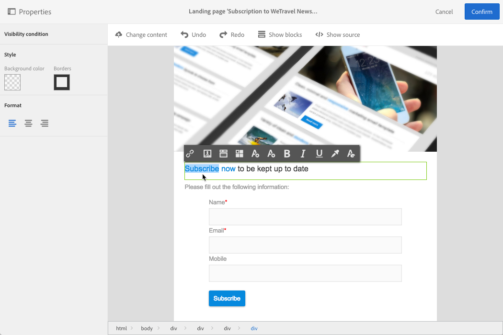

# Design de uma landing page{#designing-a-landing-page}

## Sobre o design de conteúdo de uma página de aterrissagem {#about-content-design}

Páginas de aterrissagem são criadas como qualquer [atividade de marketing](../../start/using/marketing-activities.md#about-marketing-activities).

Ao criar uma página de aterrissagem, é necessário definir o conteúdo da própria página, a página de confirmação e a página de erro. Use o alternador na barra de ações para exibir e configurar cada uma dessas páginas.

O conteúdo da página de aterrissagem é projetado por meio do editor de conteúdo do Campaign.

>[!NOTE]
>
>Se sua instância foi instalada antes da versão 19.0 do Adobe Campaign Standard, você ainda terá acesso ao editor herdado de conteúdo de email. A interface, os princípios de uso e a configuração são os mesmos descritos abaixo para páginas de aterrissagem. No entanto, todos os recursos podem não estar disponíveis ou mantidos no editor herdado de conteúdo de email, que foi substituído a partir da versão 19.0. Para editar rapidamente o conteúdo de email por meio de uma interface de arrastar e soltar com funcionalidades estendidas, use o [Designer de email](../../designing/using/designing-content-in-adobe-campaign.md).

Esta página descreve as especificidades do editor de conteúdo das páginas de aterrissagem. Para mais informações sobre as ações comuns a uma ou mais atividades de marketing, consulte estas seções do guia **Criação do conteúdo de email** l:

* [Inserção de um campo de personalização](../../designing/using/personalization.md#inserting-a-personalization-field)
* [Inclusão de um bloco de conteúdo](../../designing/using/personalization.md#adding-a-content-block).
* [Inserção de um link](../../designing/using/links.md#inserting-a-link).
* [Inserção de imagens](../../designing/using/images.md).
* [Práticas recomendadas gerais para design de conteúdo](../../designing/using/designing-content-in-adobe-campaign.md#content-design-best-practices).

>[!NOTE]
>Se você tiver uma página de aterrissagem que já esteja predefinida no formato HTML, poderá importá-la diretamente usando o botão **[!UICONTROL Change content]**.
>
>Antes de importar uma página HTML no Adobe Campaign, confirme que ela seja aberta e exibida corretamente nos diversos navegadores. Se a página HTML contiver scripts JavaScript, eles precisarão executar sem erros fora do editor. Em geral, evite usar scripts no conteúdo da mensagem para garantir que ele seja processado corretamente pelos clientes de email.

## Interface do editor de conteúdo de páginas de aterrissagem{#landing-page-content-editor-interface}

O editor de conteúdo de páginas de aterrissagem permite que você defina, modifique e personalize facilmente o conteúdo no Adobe Campaign. Para acessá-lo, clique no bloco **[!UICONTROL Content]** no painel de uma página de aterrissagem.

O editor de conteúdo é organizado em três seções diferentes. Estas seções permitem que você exiba e edite o conteúdo.

1. A **paleta** no lado esquerdo da tela permite modificar as opções gerais vinculadas a um bloco selecionado. As opções que podem ser modificadas são: cor do plano de fundo, borda, alinhamento do texto, condição de visibilidade etc. Consulte [Inserção de um campo de personalização](../../designing/using/personalization.md#inserting-a-personalization-field).
1. A **barra de ação** contém as opções gerais da página. Você pode selecionar um modelo e alterar o modo de exibição.
1. A **zona de edição** principal permite interagir diretamente com o conteúdo usando a barra de ferramentas contextual: insira um link em uma imagem, altere a fonte, exclua um campo etc.

A **barra de ação** contém botões diferentes que permitem a interação com o conteúdo que está sendo criado.

<table> 
 <thead> 
  <tr> 
   <th> Ícone  </th> 
   <th> Nome do botão  </th> 
   <th> Canal   </th> 
   <th> Descrição  </th> 
  </tr> 
 </thead> 
 <tbody> 
  <tr> 
   <td>    </td> 
   <td> Alterar conteúdo   </td> 
   <td> Página de aterrissagem e email  </td> 
   <td> Permite que você selecione conteúdo pronto para uso ou importe seu próprio conteúdo HTML. Consulte <a href="../../designing/using/using-existing-content.md">Carregamento de um conteúdo existente</a>.  </td> 
  </tr> 
  <tr> 
   <td>    </td> 
   <td> Desfazer   </td> 
   <td> Todos  </td> 
   <td> Cancela a última ação realizada.  </td> 
  </tr> 
  <tr> 
   <td>    </td> 
   <td> Refazer   </td> 
   <td> Todos  </td> 
   <td> Refaz a última ação que você cancelou.  </td> 
  </tr> 
  <tr> 
   <td>    </td> 
   <td> Mostrar blocos   </td> 
   <td> Página de aterrissagem e email  </td> 
   <td> Permite que você mostre as caixas ao redor dos blocos de conteúdo (corresponde à tag HTML <strong>&lt;div&gt;</strong>).  </td> 
  </tr> 
  <tr> 
   <td>    </td> 
   <td> Mostrar origem   </td> 
   <td> Página de aterrissagem e email  </td> 
   <td> Permite que você mostre o código fonte HTML da página.  </td> 
  </tr> 
 </tbody> 
</table>

A **barra de ferramentas** é um elemento contextual da interface do editor que oferece várias funcionalidades dependendo da zona selecionada. Ele contém botões de ação e botões que permitem alterar o estilo do texto. As modificações efetuadas aplicam-se sempre à zona selecionada. Após selecionar um bloco, você pode excluí-lo ou duplicá-lo, por exemplo. Após selecionar o texto dentro de um bloco, você pode transformá-lo em um link ou deixá-lo em negrito.

>[!CAUTION]
>
>Certas funções de barra de ferramentas permitem formatar o conteúdo HTML. No entanto, se a página contiver uma folha de estilos CSS, as **instruções** da folha de estilos podem provar ter **prioridade** sobre as instruções especificadas pela barra de ferramentas.

<table> 
 <thead> 
  <tr> 
   <th> Ícone  </th> 
   <th> Nome do botão  </th> 
   <th> Contexto  </th> 
   <th> Descrição  </th> 
  </tr> 
 </thead> 
 <tbody> 
  <tr> 
   <td>    </td> 
   <td> Link para um URL externo   </td> 
   <td> Qualquer elemento  </td> 
   <td> Permite adicionar um link a um URL. Detalhes de como configurar um link são apresentados na seção <a href="../../designing/using/links.md#inserting-a-link">Inserção de um link</a>.  </td> 
  </tr> 
  <tr> 
   <td>    </td> 
   <td> Link para uma página de aterrissagem   </td> 
   <td> Qualquer elemento  </td> 
   <td> Permite acesso a uma página de aterrissagem do Adobe Campaign. Detalhes de como configurar um link são apresentados na seção <a href="../../designing/using/links.md#inserting-a-link">Inserção de um link</a>.  </td> 
  </tr> 
  <tr> 
   <td>    </td> 
   <td> Link de assinatura   </td> 
   <td> Qualquer elemento  </td> 
   <td> Permite inserir um link de assinatura de serviço. Detalhes de como configurar um link são apresentados na seção <a href="../../designing/using/links.md#inserting-a-link">Inserção de um link</a>.  </td> 
  </tr> 
  <tr> 
   <td>    </td> 
   <td> Link de cancelamento de assinatura.  </td> 
   <td> Qualquer elemento  </td> 
   <td> Permite inserir um link de cancelamento de assinatura de serviço. Detalhes de como configurar um link são apresentados na seção <a href="../../designing/using/links.md#inserting-a-link">Inserção de um link</a>.  </td> 
  </tr> 
  <tr> 
   <td>    </td> 
   <td> Remover link   </td> 
   <td> Link  </td> 
   <td> Permite que você exclua o link, bem como todas as configurações vinculadas a ele após a confirmação.  </td> 
  </tr> 
  <tr> 
   <td>    </td> 
   <td> Inserir um campo de personalização   </td> 
   <td> Elemento de texto  </td> 
   <td> Permite adicionar um campo do banco de dados ao conteúdo. Consulte <a href="../../designing/using/personalization.md#inserting-a-personalization-field">Inserção de um campo de personalização</a>.  </td> 
  </tr> 
  <tr> 
   <td>    </td> 
   <td> Inserir um bloco de conteúdo   </td> 
   <td> Elemento de texto  </td> 
   <td> Permite adicionar um bloco de personalização ao conteúdo. Consulte <a href="../../designing/using/personalization.md#adding-a-content-block">Inclusão de um bloco de conteúdo</a>.  </td> 
  </tr> 
  <tr> 
   <td>    </td> 
   <td> Ativar conteúdo dinâmico   </td> 
   <td> Elemento de texto  </td> 
   <td> Permite inserir conteúdo dinâmico no conteúdo. Consulte <a href="../../channels/using/designing-a-landing-page.md#defining-dynamic-content-in-a-landing-page">Definição de conteúdo dinâmico</a>.  </td> 
  </tr> 
  <tr> 
   <td>    </td> 
   <td> Desativar conteúdo dinâmico   </td> 
   <td> Elemento de texto  </td> 
   <td> Permite excluir conteúdo dinâmico.  </td> 
  </tr> 
  <tr> 
   <td>    </td> 
   <td> Ampliar fonte   </td> 
   <td> Elemento de texto  </td> 
   <td> Aumenta o tamanho do texto selecionado (adiciona <strong>&lt;span style="font-size:"&gt;</strong>).  </td> 
  </tr> 
  <tr> 
   <td>    </td> 
   <td> Reduzir fonte   </td> 
   <td> Elemento de texto  </td> 
   <td> Reduz o tamanho do texto selecionado (adiciona <strong>&lt;span style="font-size:"&gt;</strong>).  </td> 
  </tr> 
  <tr> 
   <td>    </td> 
   <td> Negrito   </td> 
   <td> Elemento de texto  </td> 
   <td> Adiciona o estilo em negrito ao texto selecionado (envolve o texto com as tags <strong>&lt;strong&gt;</strong><strong>&lt;/strong&gt;</strong> ).  </td> 
  </tr> 
  <tr> 
   <td>    </td> 
   <td> Itálico   </td> 
   <td> Elemento de texto  </td> 
   <td> Adiciona o estilo em itálico ao texto selecionado (envolve o texto com as tags <strong>&lt;em&gt;</strong><strong>&lt;/em&gt;</strong> ).  </td> 
  </tr> 
  <tr> 
   <td>    </td> 
   <td> Sublinhado   </td> 
   <td> Elemento de texto  </td> 
   <td> Sublinha o texto selecionado (envolve o texto selecionado com a tag <strong>&lt;span style="text-decoration: underline;"&gt;</strong> ).  </td> 
  </tr> 
  <tr> 
   <td>    </td> 
   <td> Alterar cor de plano de fundo   </td> 
   <td> Elemento de texto  </td> 
   <td> Permite alterar a cor de plano de fundo do bloco selecionado (adiciona style="background-color: rgba(170, 86, 255, 0,87)).  </td> 
  </tr> 
  <tr> 
   <td>    </td> 
   <td> Alterar cor da fonte   </td> 
   <td> Elemento de texto  </td> 
   <td> Permite alterar a cor de todo o texto do bloco ou apenas o texto selecionado no bloco (<strong>&lt;span style="color: #56ff56;"&gt;</strong>).  </td> 
  </tr> 
  <tr> 
   <td>    </td> 
   <td> Imagem   </td> 
   <td> Bloco que contém uma imagem  </td> 
   <td> Permite inserir uma imagem de um arquivo salvo localmente.  </td> 
  </tr> 
  <tr> 
   <td>    </td> 
   <td> Excluir   </td> 
   <td> Qualquer bloco  </td> 
   <td> Exclui o bloco e seu conteúdo.  </td> 
  </tr> 
  <tr> 
   <td>    </td> 
   <td> Duplicar   </td> 
   <td> Qualquer bloco  </td> 
   <td> Duplica o bloco, incluindo todos os estilos vinculados a ele.  </td> 
  </tr> 
 </tbody> 
</table>

## Gerenciamento da estrutura e do estilo da página de aterrissagem{#managing-landing-page-structure-and-style}

### Gerenciamento de blocos no editor de conteúdo {#managing-blocks-in-the-content-editor}

Os diferentes elementos de conteúdo HTML são exibidos na página de aterrissagem como blocos, correspondendo à tag **&lt;div>** **&lt;/div>**. Selecione um bloco para interagir com ele. Ele então será cercado por uma caixa azul.

Se um bloco for selecionado, os objetos principais do elemento HTML correspondente serão exibidos em uma navegação estrutural localizada na parte inferior da zona de edição.

Quando o mouse passa sobre um dos elementos da navegação estrutural, o elemento em questão é realçado. Portanto, você pode navegar facilmente entre os diferentes blocos e selecionar exatamente o elemento HTML que deseja modificar.

Use as opções da paleta e da barra de ferramentas contextual para modificar, excluir ou duplicar o bloco.

Para os blocos que contêm texto, clique novamente no bloco para ativar o modo de edição de texto. O quadro ao redor do bloco passa a ser verde. Em seguida, você pode selecionar ou inserir texto. Use as opções da paleta e da barra de ferramentas contextual para adicionar um link ou modificar a formatação do texto.

Os parâmetros definidos para um elemento em um bloco (links, campos de personalização, blocos de conteúdo etc.) podem ser modificados a qualquer momento a partir da paleta.

### Inclusão de uma borda e de um plano de fundo no editor de conteúdo {#adding-a-border-and-a-background-in-the-content-editor}

Você também pode definir uma **cor de plano de fundo** selecionando uma cor no gráfico. Essa cor é aplicada ao bloco selecionado.

Você pode adicionar uma **borda** ao bloco selecionado.

### Alteração do estilo do texto no editor de conteúdo {#changing-the-text-style-in-the-content-editor}

Para alterar o estilo do texto, é necessário clicar dentro de um bloco de texto.

Para alterar o alinhamento do texto, selecione um dos três ícones a seguir na paleta à esquerda:

* **Alinhar à esquerda**: alinha o texto à esquerda do bloco selecionado (adiciona style=&quot;text-align: left;&quot;).
* **Centralizar**: centraliza o texto no bloco selecionado (adiciona style=&quot;text-align: center;&quot;).
* **Alinhar à direita**: alinha o texto à direita do bloco selecionado (adiciona style=&quot;text-align: right;&quot;).

Você também pode usar a barra de ferramentas para alterar os atributos da fonte: adapte o tamanho da fonte, deixe o texto em negrito ou itálico, sublinhe ou altere a cor do texto. Consulte [esta seção](../../channels/using/designing-a-landing-page.md#landing-page-content-editor-interface).

### Inserir imagens em uma página de aterrissagem {#inserting-images-in-a-landing-page}

1. Em um conteúdo de página de aterrissagem, selecione um bloco que contenha uma imagem.
1. Selecione o botão **[!UICONTROL Insert]**.

   

1. Escolha **[!UICONTROL Local image]** na barra de ferramentas contextual.

   

1. Selecione um arquivo.

   

1. Ajuste as propriedades da imagem conforme necessário.

   

## Definição de conteúdo dinâmico em uma página de aterrissagem{#defining-dynamic-content-in-a-landing-page}

Para definir o conteúdo dinâmico em uma página de aterrissagem, selecione um bloco usando a navegação estrutural ou clicando diretamente em um elemento.

Determinados blocos, como imagens, não podem ser selecionados diretamente. Nesse caso, selecione o bloco principal usando a navegação estrutural. Em seguida, você pode modificar todos os elementos incluídos nesse elemento principal, incluindo imagens. A condição será aplicada a todos os elementos secundários dentro do bloco principal.

A navegação estrutural é apresentada na seção [Gerenciamento de blocos](../../channels/using/designing-a-landing-page.md#managing-landing-page-structure-and-style).

As próximas etapas para definir o conteúdo dinâmico em uma página de aterrissagem são semelhantes às etapas a seguir para um email. Consulte [esta seção](../../designing/using/personalization.md#defining-dynamic-content-in-an-email).

>[!NOTE]
>
>Se um elemento de variante for contornado em vermelho, significa que uma expressão ainda não foi definida.

É possível navegar entre os diferentes conteúdos dinâmicos de um bloco. Para fazer isso:

1. Selecione o bloco.

   Setas são exibidas nos lados direito e esquerdo da imagem.

1. Clique na seta direita para navegar pelos conteúdos dinâmicos disponíveis.

   

   As setas em cada lado escurecem conforme você atinge o último ou o primeiro conteúdo dinâmico disponível.

   

1. Para excluir todas as condições aplicadas a um bloco, selecione esse bloco e clique no ícone **[!UICONTROL Disable dynamic content]**.
1. Selecione o conteúdo dinâmico que deseja manter.

   

Na paleta:

* Os conteúdos que têm uma expressão inserida não são mais contornados em vermelho, mas são mostrados em cinza.
* O conteúdo atualmente selecionado aparece em azul.

