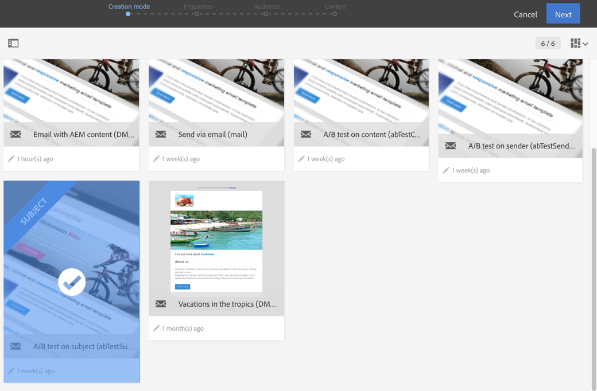

# Criação de email de teste A/B{#designing-an-a-b-test-email}

A funcionalidade do teste A/B no Adobe Campaign permite definir duas a três variantes de email. Cada variante é enviada para amostras de população, a fim de determinar qual tem o melhor resultado. Uma vez determinada, a variante vencedora é então enviada para a população restante.

É possível optar por variar o conteúdo, o assunto ou o remetente do email.

>[!NOTE]
>
>Não é possível fazer testes A/B em emails criados no Adobe Experience Manager.

## Criação de email de teste A/B {#creating-an-a-b-test-email}

É possível criar um teste A/B usando o assistente padrão de criação de email, ao qual uma etapa de configuração de teste A/B é adicionada. A criação de um email padrão está detalhada na seção [Criação de emails](../../channels/using/creating-an-email.md).

No contexto específico de um teste A/B:

1. Crie um novo email a partir de um dos três modelos específicos de teste A/B, de acordo com o elemento que deseja variar:

   * Teste A/B sobre o remetente
   * Teste A/B sobre o conteúdo
   * Teste A/B sobre o assunto

   

   >[!NOTE]
   >
   >Os modelos de teste A/B e de acompanhamento estão ocultos por padrão. Marque a caixa de teste A/B no lado esquerdo (**[!UICONTROL Filter]** painel lateral) para exibi-los.

1. Defina as propriedades gerais e o público-alvo do email, assim como para um email padrão. Consulte a seção [Criação de públicos](../../audiences/using/creating-audiences.md).
1. Na quarta etapa do assistente de criação, defina os parâmetros de teste A/B:

   * **[!UICONTROL Number of variants]**: é possível optar por usar duas ou três variantes. Se você escolher três variantes, essa opção não poderá ser modificada depois que essa etapa for confirmada no assistente.
   * **[!UICONTROL Winning strategy]**: selecione o critério que será usado para determinar a variante vencedora.
   * **[!UICONTROL Target breakdown]**: escolha que porcentagem do público-alvo receberá cada variante. A porcentagem restante receberá a variante vencedora depois de determinada. Os perfis segmentados são selecionados aleatoriamente.
   * **[!UICONTROL Winner sending method]**: escolha se deseja que a variante vencedora seja enviada automaticamente depois de determinada ou se deseja confirmar manualmente o envio para a população restante.
   * **[!UICONTROL Test duration]**: especifique a duração do teste. A variante vencedora é determinada automaticamente após essa duração. Você pode escolher manualmente a variante vencedora antes do final do teste no painel de email.

      O teste deve ser de pelo menos uma hora para que todos os dados de rastreamento sejam coletados e considerados corretamente para selecionar a variante vencedora.
   

1. Depois que os parâmetros de teste A/B forem definidos, passe para a próxima etapa no assistente e defina o conteúdo do email. Dependendo do modelo escolhido, é possível definir vários assuntos, vários nomes de remetentes ou vários conteúdos diferentes. Use o carrossel para navegar entre as diferentes variantes do elemento. Para obter mais informações, consulte a seção [Editor de conteúdo](../../designing/using/designing-content-in-adobe-campaign.md).

   

1. Confirme a criação do email. O painel de email será exibido.
1. Programe o envio. A data definida indica o início do teste A/B.
1. Verifique os parâmetros do teste A/B exibidos no bloco **[!UICONTROL A/B test parameters]**. Você pode alterá-los até confirmar o envio do teste (etapa 9) selecionando o bloco.

   

1. Prepare o envio de email para analisar o público-alvo e o número de mensagens que serão enviadas. Consulte a seção [Preparação do envio](../../sending/using/preparing-the-send.md).
1. Antes de enviar o teste A/B, verifique o email enviando provas.
1. Após a conclusão da preparação, confirme o envio do teste. Depois de confirmado, os parâmetros do teste A/B não podem ser modificados.

   O teste A/B começa na data definida no **[!UICONTROL Schedule]**. É possível rastrear o progresso usando os blocos **[!UICONTROL A/B test]** e **[!UICONTROL Deployment]**.

   Também é possível selecionar manualmente a variante vencedora a qualquer momento se desejar reduzir a duração do teste.

   Quando o teste for concluído, uma tabela de resumo é exibida no bloco **[!UICONTROL A/B Test]** e você poderá exibir os vários indicadores para as diferentes variantes que foram testadas.

1. Se você tiver selecionado **[!UICONTROL Send after confirmation]** como método de envio, é necessário selecionar manualmente a variante vencedora para iniciar o envio para a população restante. Se você tiver selecionado **[!UICONTROL Automatic]**, a variante vencedora será enviada automaticamente para a população restante assim que for determinada pelo sistema.

   >[!NOTE]
   >
   >Se houver um vínculo, a variante vencedora deverá ser selecionada manualmente. Você pode notificar o criador e o(s) modificador(es) de email que uma variante foi selecionada ou precisa ser selecionada. Consulte [Notificações do Adobe Campaign](../../administration/using/sending-internal-notifications.md).

O email agora está definido e foi enviado. Você pode acessar os logs e relatórios para medir o sucesso da campanha.

**Tópicos relacionados**:

Vídeo [Criação de email ](https://docs.adobe.com/content/help/en/campaign-learn/campaign-standard-tutorials/getting-started/create-email-from-homepage.html)

## Sobre indicadores de teste A/B {#about-a-b-test-indicators}

No painel de email, vários indicadores estão disponíveis para ajudar você a medir o teste A/B: número de cliques, aberturas, rejeições e assim por diante.

Observe que o indicador **[!UICONTROL Estimated recipient reactivity]** é uma taxa que compara o número de recipients que clicaram com o número de recipients que abriram o email. Por exemplo, se 10 recipients abriram o email e 5 recipients clicaram nele. A taxa de reatividade é de 50%.
