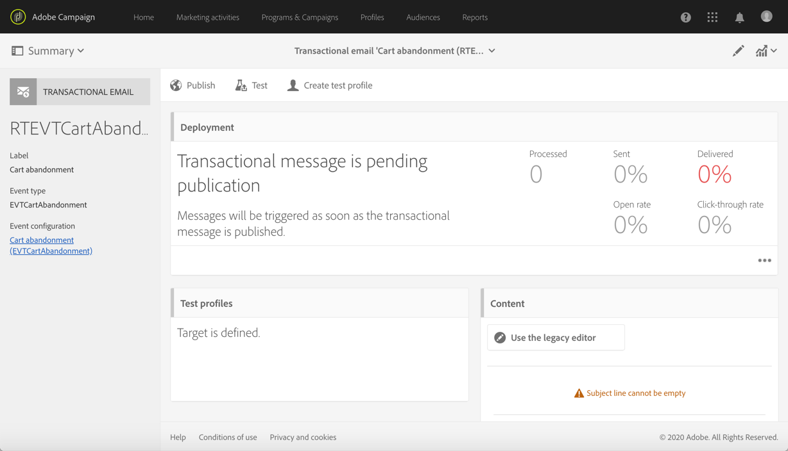

# Editar uma mensagem transacional {#editing-transactional-message}

Depois de criar e publicar um evento<!--(the cart abandonment example as explained in [this section](../../channels/using/getting-started-with-transactional-msg.md#transactional-messaging-operating-principle))-->, o mensagen transacional correspondente é criado automaticamente.

As etapas para configurar e publicar o evento são apresentadas na seção [Configuração de um evento transacional](../../channels/using/configuring-transactional-event.md) e [Publicação de um evento transacional](../../channels/using/publishing-transactional-event.md).

As etapas para acessar, editar e personalizar esta mensagem estão descritas abaixo.

>[!IMPORTANT]
>
>Somente os usuários com a função [Administration](../../administration/using/users-management.md#functional-administrators) podem acessar e editar mensagens transacionais.

Quando sua mensagem estiver pronta, ela poderá ser testada e publicada. Consulte [Testando um mensagen transacional](../../channels/using/testing-transactional-message.md) e [ciclo de vida do Mensagen transacional](../../channels/using/publishing-transactional-message.md).

## Acessar mensagens transacionais {#accessing-transactional-messages}

Para acessar o mensagen transacional que você criou:

1. Clique no logotipo **[!UICONTROL Adobe Campaign]**, no canto superior esquerdo.
1. Selecione **[!UICONTROL Marketing plans]** > **[!UICONTROL Transactional messages]** > **[!UICONTROL Transactional messages]**.

   

1. Clique na mensagem de sua escolha para editá-la.

   

Você também pode acessar diretamente um mensagen transacional pelo link localizado na área à esquerda da tela de configuração do evento correspondente. Consulte [Visualizar e publicar um evento](../../channels/using/publishing-transactional-event.md#previewing-and-publishing-the-event)

## Personalização de uma mensagem transacional {#personalizing-a-transactional-message}

Para editar e personalizar um mensagen transacional, siga as etapas abaixo.

>[!NOTE]
>
>Esta seção descreve como editar um mensagen transacional **baseado em eventos**. As especificidades do mensagen transacional **baseado em perfis** estão detalhadas [abaixo](#profile-transactional-message-specificities).
>
>As etapas de configuração para criar um mensagen transacional baseado em eventos são apresentadas em [esta seção](../../channels/using/configuring-transactional-event.md#event-based-transactional-messages).

Por exemplo, você deseja enviar uma notificação para os usuários do seu site que adicionaram produtos ao carrinho e saíram do site sem ter que fazer compras. Este exemplo é apresentado na seção [Princípio operacional de mensagens transacionais](../../channels/using/getting-started-with-transactional-msg.md#transactional-messaging-operating-principle).

1. Clique no bloco **[!UICONTROL Content]** para modificar o assunto e o conteúdo da mensagem. Neste exemplo, selecione qualquer modelo que contenha imagens e texto. Para obter mais informações sobre modelos de conteúdo de email, consulte [Criar emails usando modelos](../../designing/using/using-reusable-content.md#designing-templates).

   

1. Adicione um assunto e edite o conteúdo da mensagem de acordo com suas necessidades.

   >[!NOTE]
   >
   >O link para o carrinho abandonado é um link para um URL externo que redirecionará a pessoa para o carrinho. Esse parâmetro não é gerenciado no Adobe Campaign.

1. Neste exemplo, você deseja adicionar três campos definidos ao [criar o evento](../../channels/using/configuring-transactional-event.md): nome, último produto consultado, quantidade total do carrinho. Para fazer isso, [insira um campo de personalização ](../../designing/using/personalization.md#inserting-a-personalization-field) no conteúdo da mensagem.

1. Navegue até esses campos passando por **[!UICONTROL Context]** > **[!UICONTROL Real-time event]** > **[!UICONTROL Event context]**.

   

1. Você também pode enriquecer o conteúdo de sua mensagem. Para fazer isso, adicione campos da tabela que você vinculou à configuração do evento (consulte [Enriquecendo o evento](../../channels/using/configuring-transactional-event.md#enriching-the-transactional-message-content)). Neste exemplo, selecione o campo **[!UICONTROL Title (salutation)]** na tabela **[!UICONTROL Profile]** até **[!UICONTROL Context]** > **[!UICONTROL Real-time event]** > **[!UICONTROL Event context]**.

   

1. Insira todos os campos necessários.

   

1. Pré-visualize a mensagem selecionando o perfil definido para esse evento.

   As etapas para visualizar uma mensagem são detalhadas na seção [Pré-visualização de mensagens](../../sending/using/previewing-messages.md).

   

   Você pode verificar se os campos de personalização correspondem às informações inseridas no perfil de teste. Para obter mais informações, consulte [Definição de um perfil de teste específico](../../channels/using/testing-transactional-message.md#defining-specific-test-profile).

<!--## Using product listings in a transactional message {#using-product-listings-in-a-transactional-message}

When editing the content of a transactional email, you can create product listings referencing one or more data collections. For example, in a cart abandonment email, you can include a list of all products that were in the users' carts when they left your website, with an image, the price, and a link to each product.

>[!IMPORTANT]
>
>Product listings are only available for the email channel, when editing transactional email content through the [Email Designer](../../designing/using/designing-content-in-adobe-campaign.md#email-designer-interface) interface.

To add a list of abandoned products in a transactional message, follow the steps below.

You can also watch [this set of videos](https://experienceleague.adobe.com/docs/campaign-standard-learn/tutorials/designing-content/product-listings-in-transactional-email.html?lang=en#configure-product-listings-in-transactional-emails) explaining the steps that are required to configure product listings in a transactional email.

>[!NOTE]
>
>Adobe Campaign does not support nested product listings, meaning that you cannot include a product listing inside another one.

### Defining a product listing {#defining-a-product-listing}

Before being able to use a product listing in a transactional message, you need to define at the event level the list of products and the fields for each product of the list you want to display. For more on this, see [Defining data collections](../../channels/using/configuring-transactional-event.md#defining-data-collections).

1. In the transactional message, click the **[!UICONTROL Content]** block to modify the email content.
1. Drag and drop a structure component to the workspace. For more on this, see [Defining the email structure](../../designing/using/designing-from-scratch.md#defining-the-email-structure).

   For example, select a one-column structure component and add a text component, an image component and a button component. For more on this, see [Using content components](../../designing/using/designing-from-scratch.md#about-content-components).

1. Select the structure component you just created and click the **[!UICONTROL Enable product listing]** icon from the contextual toolbar.

   

   The structure component is highlighted with an orange frame and the **[!UICONTROL Product listing]** settings are displayed in the left palette.

   

1. Select how the elements of the collection will be displayed:

    * **[!UICONTROL Row]**: horizontally, meaning each element on one row under the other.
    * **[!UICONTROL Column]**: vertically, meaning each element next to the other on the same row.

   >[!NOTE]
   >
   >The **[!UICONTROL Column]** option is only available when using a multicolumn structure component ( **[!UICONTROL 2:2 column]**, **[!UICONTROL 3:3 column]** and **[!UICONTROL 4:4 column]** ). When editing the product listing, only fill in the first column: the other columns will not be taken into account. For more on selecting structure components, see [Defining the email structure](../../designing/using/designing-from-scratch.md#defining-the-email-structure).

1. Select the data collection you created when configuring the event related to the transactional message. You can find it under the **[!UICONTROL Context]** > **[!UICONTROL Real-time event]** > **[!UICONTROL Event context]** node.

   

   For more on configuring the event, see [Defining data collections](../../channels/using/configuring-transactional-event.md#defining-data-collections).

1. Use the **[!UICONTROL First item]** drop-down list to select which element will start the list displayed in the email.

   For example, if you select 2, the first item of the collection will not be displayed in the email. The product listing will start on the second item.

1. Select the maximum number of items to display in the list.

   >[!NOTE]
   >
   >If you want the elements of your list to be displayed vertically ( **[!UICONTROL Column]** ), the maximum number of items is limited according to the selected structure component (2, 3 or 4 columns). For more on selecting structure components, see [Editing the email structure](../../designing/using/designing-from-scratch.md#defining-the-email-structure).

### Populating the product listing {#populating-the-product-listing}

To display a list of products coming from the event linked to the transactional email, follow the steps below.

For more on creating a collection and related fields when configuring the event, see [Defining data collections](../../channels/using/configuring-transactional-event.md#defining-data-collections).

1. Select the image component you inserted, select **[!UICONTROL Enable personalization]** and click the pencil in the Settings pane.

   

1. Select **[!UICONTROL Add personalization field]** in the **[!UICONTROL Image source URL]** window that opens.

   From the **[!UICONTROL Context]** > **[!UICONTROL Real-time event]** > **[!UICONTROL Event context]** node, open the node corresponding to the collection that you created (here **[!UICONTROL Product list]** ) and select the image field that you defined (here **[!UICONTROL Product image]** ). Click **[!UICONTROL Save]**.

   

   The personalization field that you selected is now displayed in the Settings pane.

1. At the desired position, select **[!UICONTROL Insert personalization field]** from the contextual toolbar.

   

1. From the **[!UICONTROL Context]** > **[!UICONTROL Real-time event]** > **[!UICONTROL Event context]** node, open the node corresponding to the collection that you created (here **[!UICONTROL Product list]** ) and select the field that you created (here **[!UICONTROL Product name]** ). Click **[!UICONTROL Confirm]**.

   

   The personalization field that you selected is now displayed at the desired position in the email content.

1. Proceed similarly to insert the price.
1. Select some text and select **[!UICONTROL Insert link]** from the contextual toolbar.

   

1. Select **[!UICONTROL Add personalization field]** in the **[!UICONTROL Insert link]** window that opens.

   From the **[!UICONTROL Context]** > **[!UICONTROL Real-time event]** > **[!UICONTROL Event context]** node, open the node corresponding to the collection that you created (here **[!UICONTROL Product list]** ) and select the URL field that you created (here **[!UICONTROL Product URL]** ). Click **[!UICONTROL Save]**.

   >[!IMPORTANT]
   >
   >For security reasons, make sure you insert the personalization field inside a link starting with a proper static domain name.

   

   The personalization field that you selected is now displayed in the Settings pane.

1. Select the structure component on which the product listing is applied and select **[!UICONTROL Show fallback]** to define a default content.

   

1. Drag one or more content components and edit them as needed.

   

   The fallback content will be displayed if the collection is empty when the event is triggered, for example if a customer has nothing in his cart.

1. From the Settings pane, edit the styles for the product listing. For more on this, see [Managing email styles](../../designing/using/styles.md).
1. Preview the email using a test profile linked to the relevant transactional event and for which you defined collection data. For example, add the following information in the **[!UICONTROL Event data]** section for the test profile you want to use:

   

   For more on defining a test profile in a transactional message, see [this section](../../channels/using/testing-transactional-message.md#defining-specific-test-profile).-->

## Especificidades de mensagen transacional baseadas em perfis {#profile-transactional-message-specificities}

Você pode enviar mensagens transacionais com base em perfis de marketing do cliente, o que permite aproveitar todas as informações do perfil para personalizar o conteúdo da mensagem, usar o link de unsubscription e aplicar regras de tipologia de marketing, como [regras de fadiga](../../sending/using/fatigue-rules.md).

* Para obter mais informações sobre as diferenças entre mensagens transacionais baseados em eventos e perfis, consulte [esta seção](../../channels/using/getting-started-with-transactional-msg.md#transactional-message-types).

* As etapas de configuração para criar um mensagen transacional baseado em perfis estão detalhadas em [nesta seção](../../channels/using/configuring-transactional-event.md#profile-based-transactional-messages).

As etapas para criar, editar e personalizar um mensagen transacional de perfil são, em geral, as mesmas que para um mensagen transacional de evento.

As diferenças são listadas abaixo.

1. [Acesse a mensagem transacional criada para editá-la.](#accessing-transactional-messages)
1. Na mensagem transacional, clique na seção **[!UICONTROL Content]**. Além dos modelos de e-mail transacionais, você também pode escolher qualquer modelo de e-mail direcionado ao recurso **[!UICONTROL Profile]**.

   

1. Selecione o template de email padrão. Semelhante a todos os emails de marketing, ele inclui um **link de unsubscription**.

   

   Para obter mais informações sobre modelos, consulte [esta seção](../../designing/using/using-reusable-content.md#content-templates).

1. Além disso, ao contrário das configurações baseadas em eventos em tempo real, você tem **acesso direto a todas as informações do perfil** para personalizar sua mensagem. Você pode adicionar [campos de personalização](../../designing/using/personalization.md#inserting-a-personalization-field) como faria com qualquer outro email de marketing padrão.

1. Salve as alterações antes de publicar a mensagem. Para obter mais informações, consulte [Publicação de mensagem transacional](../../channels/using/publishing-transactional-message.md#publishing-a-transactional-message).

<!--### Monitoring a profile transactional message delivery {#monitoring-a-profile-transactional-message-delivery}

Once the message is published and your site integration is done, you can monitor the delivery.

1. To view the message delivery log, click the icon at the bottom right of the **[!UICONTROL Deployment]** block.

1. Click the **[!UICONTROL Execution list]** tab.

   

1. Select the latest execution delivery.

   An **execution delivery** is a non-actionable and non-functional technical message created once a month for each transactional message, and each time a transactional message is edited and published again

1. Select the **[!UICONTROL Sending logs]** tab. In the **[!UICONTROL Status]** column, **[!UICONTROL Sent]** indicates that a profile has opted in.

   

1. Select the **[!UICONTROL Exclusions logs]** tab to view recipients who have been excluded from the message target, such as addresses on denylist.

   

>[!NOTE]
>
>For more information on accessing and using the logs, see [Monitoring a delivery](../../sending/using/monitoring-a-delivery.md).

For any profile that has opted out, the **[!UICONTROL Address on denylist]** typology rule excluded the corresponding recipient.

This rule is part of a specific typology that applies to all transactional messages based on the **[!UICONTROL Profile]** table.

**Related topics**:

* [Integrate the event triggering](../../channels/using/getting-started-with-transactional-msg.md#integrate-event-trigger)
* [About typologies and typology rules](../../sending/using/about-typology-rules.md)-->
