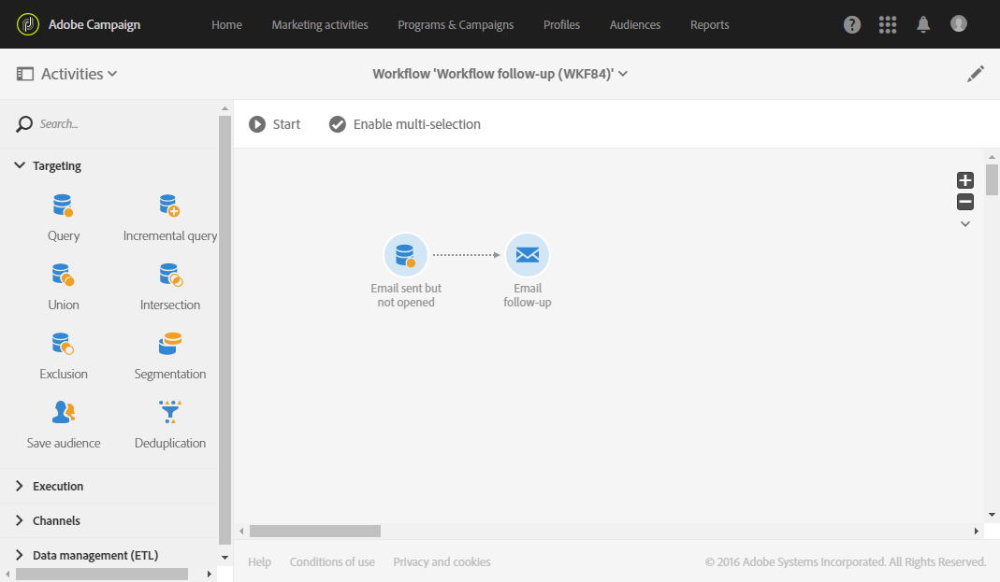

# Mensagens de acompanhamento{#follow-up-messages}

Você pode enviar uma mensagem de acompanhamento aos clientes que receberam um mensagen transacional específico. Para fazer isso, é necessário configurar um fluxo de trabalho direcionado ao evento correspondente.

Vamos reutilizar o exemplo descrito na seção do princípio [operacional de mensagens](../../channels/using/getting-started-with-transactional-msg.md#transactional-messaging-operating-principle) transacionais: um e-mail de abandono de carrinho é enviado para os usuários do site que adicionaram produtos ao carrinho, mas deixaram o site sem precisar fazer compras.

Você deseja enviar um lembrete amigável a todos os clientes que receberam a notificação de abandono do carrinho, mas que não a abriram após três dias.

Cada cliente em questão receberá então uma mensagem de acompanhamento com base nos mesmos dados que foram usados no primeiro email enviado.

## Acessar as mensagens de acompanhamento {#accessing-the-follow-up-messages}

Once you have created and published an event (the cart abandonment as per the [example](../../channels/using/getting-started-with-transactional-msg.md#transactional-messaging-operating-principle) above), the corresponding transactional message and follow-up message are created automatically.

The configuration steps are presented in the [Configuring an event to send a follow-up message](../../administration/using/configuring-transactional-messaging.md#configuring-an-event-to-send-a-follow-up-message) section.

Para lidar com um evento em um fluxo de trabalho, um template do delivery é necessário. No entanto, ao publicar o evento, o [mensagen transacional](../../channels/using/event-transactional-messages.md) criado não pode ser usado como modelo. Portanto, é necessário criar um template do delivery de acompanhamento específico projetado para suportar esse tipo de evento e ser usado como modelo em um fluxo de trabalho.

Para acessar este modelo:

1. Click the **[!UICONTROL Adobe Campaign]** logo, in the top left corner.
1. Selecione **[!UICONTROL Resources]** > **[!UICONTROL Templates]** > **[!UICONTROL Delivery templates]**.
1. Marque a **[!UICONTROL Follow-up messages]** caixa no painel esquerdo.

   

Somente as mensagens de acompanhamento são exibidas.

>[!NOTE]
>
>Para acessar mensagens transacionais, você deve fazer parte do grupo de segurança **[!UICONTROL Administrators (all units)]**.

## Envio de uma mensagem de acompanhamento {#sending-a-follow-up-message}

Depois de criar o template do delivery de acompanhamento, você pode usá-lo em um fluxo de trabalho para enviar uma mensagem de acompanhamento.

1. Acesse a lista da atividade de marketing e crie um novo fluxo de trabalho.

   Consulte [Criação de um workflow](../../automating/using/building-a-workflow.md#creating-a-workflow).

1. Drag and drop a **[!UICONTROL Scheduler]** activity into your workflow and open it. Defina a frequência de execução como uma vez por dia.

   A atividade do Scheduler é apresentada na seção [Scheduler](../../automating/using/scheduler.md) .

1. Drag and drop a **[!UICONTROL Query]** activity into your workflow and open it.

   The Query activity is presented in the [Query](../../automating/using/query.md) section.

1. Para executar o query em um recurso diferente do recurso do perfil, vá até a guia atividade **[!UICONTROL Properties]** e clique na lista **[!UICONTROL Resource]** suspensa.

   

   >[!NOTE]
   >
   >Por padrão, a atividade é pré-configurada para procurar perfis.

1. Selecione o evento que deseja público alvo para que você acesse apenas os dados desse evento.

   

1. Vá até a guia atividade e arraste e solte o **[!UICONTROL Target]** **[!UICONTROL Delivery logs (logs)]** elemento da paleta no espaço de trabalho.

   

   Selecione **[!UICONTROL Exists]** para público alvo de todos os clientes que receberam o email.

   

1. Mova o **[!UICONTROL Tracking logs (tracking)]** elemento da paleta para o espaço de trabalho e selecione **[!UICONTROL Does not exist]** para público alvo de todos os clientes que não abriram o email.

   

1. Arraste e solte o evento que está sendo direcionado (abandono **do** carrinho neste exemplo) da paleta para o espaço de trabalho. Em seguida, defina uma regra para público alvo de todas as mensagens enviadas três dias atrás.

   

   Isso significa que todos os recipient que receberam o mensagen transacional três dias antes da execução do fluxo de trabalho e ainda não o abriram são direcionados.

   Click **[!UICONTROL Confirm]** to save the query.

1. Drag and drop an **Email delivery** activity into your workflow.

   A atividade delivery Email é apresentada na seção delivery  Email.

   

   Você também pode usar um delivery  SMS ou uma atividade de delivery [de aplicativo](../../automating/using/push-notification-delivery.md) móvel. Nesse caso, selecione o **[!UICONTROL Mobile (SMS)]** canal ou **[!UICONTROL Mobile application]** evento ao criar a configuração. Consulte [Criação de um evento](../../administration/using/configuring-transactional-messaging.md#creating-an-event).

1. Open the **Email delivery** activity. No assistente de criação, marque a **[!UICONTROL Follow-up messages]** caixa e selecione o template do delivery de acompanhamento criado após a publicação do evento.

   

1. No conteúdo da mensagem de acompanhamento, você pode aproveitar o conteúdo do seu evento adicionando campos de personalização.

   

1. Encontre os campos que você definiu ao criar seu evento selecionando **[!UICONTROL Context]** > **[!UICONTROL Real-time event]** > **[!UICONTROL Event context]**. See [Personalizing a transactional message](../../channels/using/event-transactional-messages.md#personalizing-a-transactional-message).

   

   Isso significa que você pode aproveitar o mesmo conteúdo, incluindo dados enriquecidos, que foi usado na primeira vez que o evento foi enviado, para criar um lembrete personalizado.

1. Salve a atividade e o start do fluxo de trabalho.

Quando o fluxo de trabalho for iniciado, todos os clientes que tiverem recebido sua notificação de abandono do carrinho três dias atrás, mas não a tiverem aberto, receberão uma mensagem de acompanhamento com base nos mesmos dados.

>[!NOTE]
>
>Se você selecionou o **[!UICONTROL Profile]** targeting dimension ao criar a configuração do evento, a mensagem de acompanhamento também impulsionará o banco de dados de marketing da Adobe Campaign. Consulte [Mensagens transacionais de perfil](../../channels/using/profile-transactional-messages.md).
