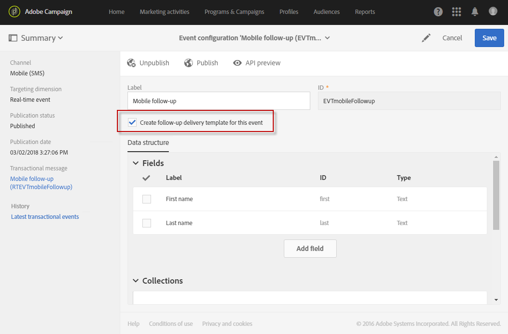

# Mensagens de acompanhamento {#follow-up-messages}

Uma mensagem de acompanhamento é um template de delivery de marketing predefinido que pode ser usado em um workflow para enviar outra comunicação aos recipients de uma mensagem transacional específica.

Vamos reutilizar o exemplo descrito na seção [Princípio operacional das mensagens transacionais](../../channels/using/getting-started-with-transactional-msg.md#transactional-messaging-operating-principle): um email de abandono de carrinho é enviado para os usuários do site que adicionaram produtos ao carrinho, mas saíram do site sem concluir as compras.

Você deseja enviar um lembrete amigável para todos os clientes que receberam a notificação de abandono do carrinho, mas que não a abriram após três dias. Eles receberão uma mensagem de acompanhamento com base nos mesmos dados usados no primeiro email enviado.

## Configurar um evento para enviar uma mensagem de acompanhamento {#configuring-an-event-to-send-a-follow-up-message}

Para enviar uma mensagem de acompanhamento, primeiro é necessário configurar adequadamente o evento correspondente à mensagem transacional que já foi recebida.

1. Use a mesma configuração de evento criada para enviar uma mensagem transacional de evento. Consulte [Configuração de um evento transacional](../../channels/using/configuring-transactional-event.md).
1. Ao configurar seu evento, marque a caixa **[!UICONTROL Create follow-up delivery template for this event]** antes de publicar o evento.

   

1. [Visualize e publique o evento](../../channels/using/publishing-transactional-event.md#previewing-and-publishing-the-event).

Depois que o evento for publicado, uma mensagem transacional e um template do delivery de acompanhamento vinculado ao novo evento serão criados automaticamente. As etapas para enviar a mensagem de acompanhamento são detalhadas em [this section](#sending-a-follow-up-message).

## Acessar as mensagens de acompanhamento {#accessing-the-follow-up-messages}

Para lidar com um evento em um workflow, um template do delivery é necessário. No entanto, ao publicar o evento, a [mensagem transacional](../../channels/using/editing-transactional-message.md) que foi criada não pode ser usada como um modelo. Portanto, é necessário criar um template do delivery de acompanhamento específico projetado para suportar esse tipo de evento e ser usado como um template em um workflow.

Para acessar este template:

1. Clique no logotipo **[!UICONTROL Adobe Campaign]** no canto superior esquerdo.
1. Selecione **[!UICONTROL Resources]** > **[!UICONTROL Templates]** > **[!UICONTROL Delivery templates]**.
1. Marque a caixa **[!UICONTROL Follow-up messages]** no painel esquerdo.

   

Somente as mensagens de acompanhamento são exibidas.

>[!IMPORTANT]
>
>Somente os usuários com a função [Administration](../../administration/using/users-management.md#functional-administrators) podem acessar e editar mensagens transacionais.

## Envio de uma mensagem de acompanhamento {#sending-a-follow-up-message}

Depois de criar o template do delivery de acompanhamento, você pode usá-lo em um workflow para enviar uma mensagem de acompanhamento.

<!--You need to set up a workflow targeting the event corresponding to the transactional message that was already received.-->

1. Acesse a lista de atividades de marketing e crie um novo workflow.

   Consulte [Criação de um workflow](../../automating/using/building-a-workflow.md#creating-a-workflow).

1. Arraste e solte uma atividade **[!UICONTROL Scheduler]** no seu fluxo de trabalho e abra-a. Defina a frequência de execução como uma vez por dia.

   A atividade Scheduler é apresentada na seção [Scheduler](../../automating/using/scheduler.md).

1. Arraste e solte uma atividade **[!UICONTROL Query]** no seu fluxo de trabalho e abra-a.

   A atividade Query é apresentada na seção [Query](../../automating/using/query.md).

1. Para executar o query em um recurso diferente do perfil, vá para a guia **[!UICONTROL Properties]** da atividade e clique na lista suspensa **[!UICONTROL Resource]**.

   

   >[!NOTE]
   >
   >Por padrão, a atividade é pré-configurada para procurar perfis.

1. Selecione o evento que deseja direcionar para que você acesse apenas os dados desse evento.

   

1. Vá para a guia **[!UICONTROL Target]** da atividade e arraste e solte o elemento **[!UICONTROL Delivery logs (logs)]** da paleta no espaço de trabalho.

   

   Selecione **[!UICONTROL Exists]** para direcionar todos os clientes que receberam o email.

   

1. Mova o elemento **[!UICONTROL Tracking logs (tracking)]** da paleta para o espaço de trabalho e selecione **[!UICONTROL Does not exist]** para direcionar todos os clientes que não abriram o email.

   

1. Arraste e solte o evento que você está direcionando (**Abandono do carrinho** neste exemplo) da paleta para o espaço de trabalho. Em seguida, defina uma regra para direcionar todas as mensagens enviadas três dias atrás.

   

   Isso significa que todos os recipients que receberam a mensagem transacional três dias antes da execução do workflow e ainda não a abriram são direcionados.

   Clique em **[!UICONTROL Confirm]** para salvar a query.

1. Arraste e solte uma atividade **Email delivery** no seu fluxo de trabalho.

   A atividade Email delivery é apresentada na seção [Email delivery](../../automating/using/email-delivery.md).

   

   Você também pode usar um [SMS delivery](../../automating/using/sms-delivery.md) ou uma atividade [Push notification delivery](../../automating/using/push-notification-delivery.md) . Nesse caso, selecione o canal **[!UICONTROL Mobile (SMS)]** ou **[!UICONTROL Mobile application]** ao criar a configuração do evento. Consulte [Criação de um evento](../../channels/using/configuring-transactional-event.md#creating-an-event).

1. Abra a atividade **Email delivery** . No assistente de criação, marque a caixa **[!UICONTROL Follow-up messages]** e selecione o template do delivery de acompanhamento criado após a publicação do evento.

   

1. No conteúdo da mensagem de acompanhamento, você pode aproveitar o conteúdo do evento adicionando campos de personalização.

   

1. Encontre os campos definidos ao criar seu evento selecionando **[!UICONTROL Context]** > **[!UICONTROL Real-time event]** > **[!UICONTROL Event context]**. Consulte [Personalização de uma mensagem transacional](../../channels/using/editing-transactional-message.md#personalizing-a-transactional-message).

   

   Isso significa que você pode aproveitar o mesmo conteúdo, incluindo dados enriquecidos, que foi usado na primeira vez que o evento foi enviado, para criar um lembrete amigável personalizado.

1. Salve a atividade e inicie o workflow.

Quando o fluxo de trabalho for iniciado, todos os clientes que receberam a notificação de abandono do carrinho três dias atrás, mas não a abriram, receberão uma mensagem de acompanhamento com base nos mesmos dados.

>[!NOTE]
>
>Se você selecionou o targeting dimension **[!UICONTROL Profile]** ao criar a configuração de evento, a mensagem de acompanhamento também aproveitará o banco de dados de marketing do Adobe Campaign. Consulte [Mensagens transacionais de perfil](../../channels/using/editing-transactional-message.md#profile-transactional-message-specificities).
