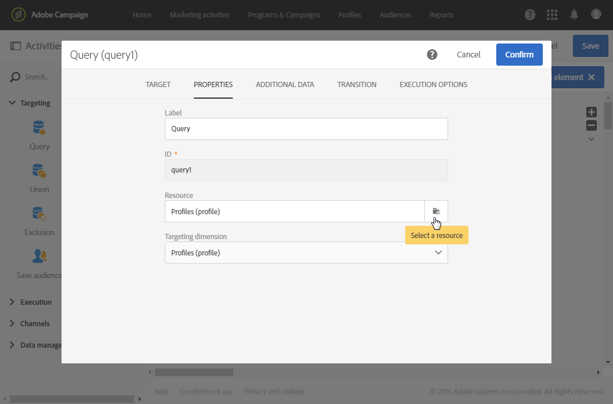
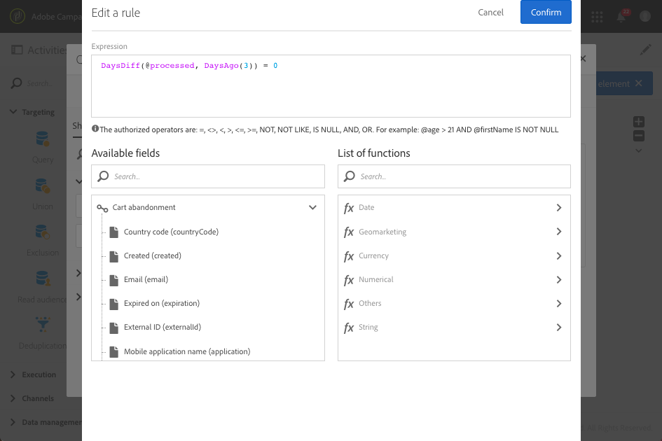

# Follow-up messages{#follow-up-messages}

Você pode enviar uma mensagem de acompanhamento aos clientes que receberam uma mensagem transacional específica. Para fazer isso, você precisa configurar um fluxo de trabalho direcionado ao evento correspondente.

Let's reuse the example described in the [Transactional messaging operating principle](../../channels/using/about-transactional-messaging.md#transactional-messaging-operating-principle) section: a cart abandonment email is sent to your website users who added products to their cart, but left the site without going through with their purchases.

Você deseja enviar um lembrete amigável a todos os clientes que receberam a notificação de abandono de carrinho, mas que não o abriu após três dias.

Cada cliente preocupado receberá uma mensagem de acompanhamento com base nos mesmos dados usados no primeiro email enviado.

## Accessing the follow-up messages {#accessing-the-follow-up-messages}

Once you have created and published an event (the cart abandonment as per the [example](../../channels/using/about-transactional-messaging.md#transactional-messaging-operating-principle) above), the corresponding transactional message and follow-up message are created automatically.

The configuration steps are presented in the [Configuring an event to send a follow-up message](../../administration/using/configuring-transactional-messaging.md#use-case--configuring-an-event-to-send-a-transactional-message) section.

Para lidar com um evento em um fluxo de trabalho, é necessário um modelo de entrega. However, when publishing the event, the [transactional message](../../channels/using/event-transactional-messages.md) that is created cannot be used as a template. Portanto, é necessário criar um modelo de entrega de follow-up específico projetado para suportar esse tipo de evento e ser usado como modelo em um fluxo de trabalho.

Para acessar este modelo:

1. Click the **[!UICONTROL Adobe Campaign]** logo, in the top left corner.
1. Select **[!UICONTROL Resources]** &gt; **[!UICONTROL Templates]** &gt; **[!UICONTROL Delivery templates]**.
1. Check the **[!UICONTROL Follow-up messages]** box in the left pane.

   

Apenas as mensagens de acompanhamento são exibidas.

>[!NOTE]
>
>To access the transactional messages, you must have administration rights or appear in the **[!UICONTROL Message Center agents]** (mcExec) security group.

## Sending a follow-up message {#sending-a-follow-up-message}

Depois de criar o modelo de entrega de acompanhamento, você pode usá-lo em um fluxo de trabalho para enviar uma mensagem de acompanhamento.

1. Acesse a lista de atividades de marketing e crie um novo fluxo de trabalho.

   See [Creating a workflow](../../automating/using/building-a-workflow.md#creating-a-workflow).

1. Drag and drop a **[!UICONTROL Scheduler]** activity into your workflow and open it. Defina a frequência de execução como um dia.

   The Scheduler activity is presented in the [Scheduler](../../automating/using/scheduler.md) section.

1. Drag and drop a **[!UICONTROL Query]** activity into your workflow and open it.

   The Query activity is presented in the [Query](../../automating/using/query.md) section.

1. To run the query on a resource other than the profile resource, go to the activity's **[!UICONTROL Properties]** tab and click the **[!UICONTROL Resource]** drop-down list.

   

   >[!NOTE]
   >
   >Por padrão, a atividade é pré-configurada para pesquisar perfis.

1. Selecione o evento que deseja definir como meta para que você acesse somente os dados desse evento.

   

1. Go to the activity's **[!UICONTROL Target]** tab and drag and drop the **[!UICONTROL Delivery logs (logs)]** element from the **[!UICONTROL Email]** section into the workspace.

   

   Select **[!UICONTROL Exists]** to target all of the customers who received the email.

   

1. Move the **[!UICONTROL Tracking logs (tracking)]** element from the palette to the workspace and select **[!UICONTROL Does not exist]** to target all of the customers who did not open the email.

   

1. Drag and drop the event that you are targeting (**Cart abandonment** in this example) from the **[!UICONTROL Email]** section into the workspace. Em seguida, defina uma regra para definir como meta todas as mensagens enviadas três dias atrás.

   

   Isso significa que todos os destinatários que receberam a mensagem transacional três dias antes da execução do fluxo de trabalho e ainda não foram abertos são direcionados.

   Click **[!UICONTROL Confirm]** to save the query.

1. Drag and drop an **Email delivery** activity into your workflow.

   The Email delivery activity is presented in the [Email delivery](../../automating/using/email-delivery.md) section.

   

   You can also use an [SMS delivery](../../automating/using/sms-delivery.md) or a [Mobile app delivery](../../automating/using/push-notification-delivery.md) activity. In this case, make sure you select the **[!UICONTROL Mobile (SMS)]** or **[!UICONTROL Mobile application]** channel when creating your event configuration. See [Creating an event](../../administration/using/configuring-transactional-messaging.md#creating-an-event).

1. Open the **Email delivery** activity. In the creation wizard, check the **[!UICONTROL Follow-up messages]** box and select the follow-up delivery template that was created after publishing the event.

   

1. No conteúdo da mensagem de acompanhamento, você pode aproveitar o conteúdo do evento adicionando campos de personalização.

   

1. Find the fields that you defined when creating your event by selecting **[!UICONTROL Transactional event]** &gt; **[!UICONTROL Event context]**. See [Personalizing a transactional message](../../channels/using/event-transactional-messages.md#personalizing-a-transactional-message).

   

   Isso significa que você pode aproveitar o mesmo conteúdo, incluindo dados aprimorados, que foram usados na primeira vez que o evento foi enviado, para criar um lembrete personalizado personalizado.

1. Salve a atividade e inicie o fluxo de trabalho.

Depois que o fluxo de trabalho é iniciado, cada cliente que recebeu sua notificação de abandono de carrinho três dias atrás, mas não abriu, receberá uma mensagem de acompanhamento com base nos mesmos dados.

>[!NOTE]
>
>If you selected the **[!UICONTROL Profile]** targeting dimension when creating the event configuration, the follow-up message will also leverage the Adobe Campaign marketing database. See [Profile transactional messages](../../channels/using/profile-transactional-messages.md).

