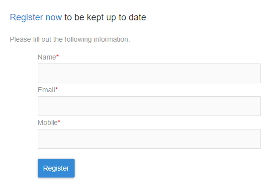
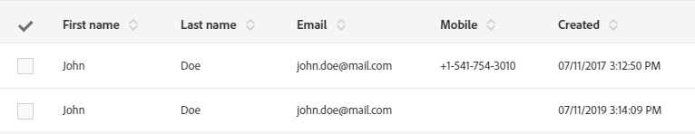
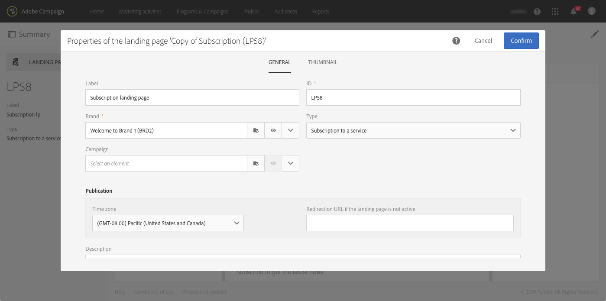
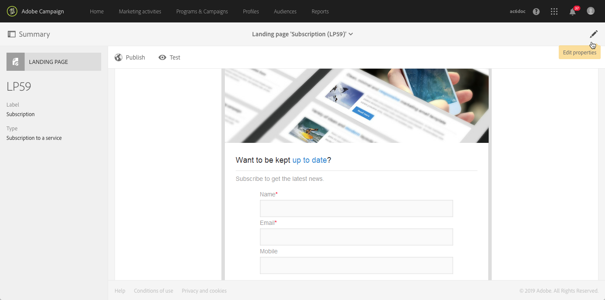
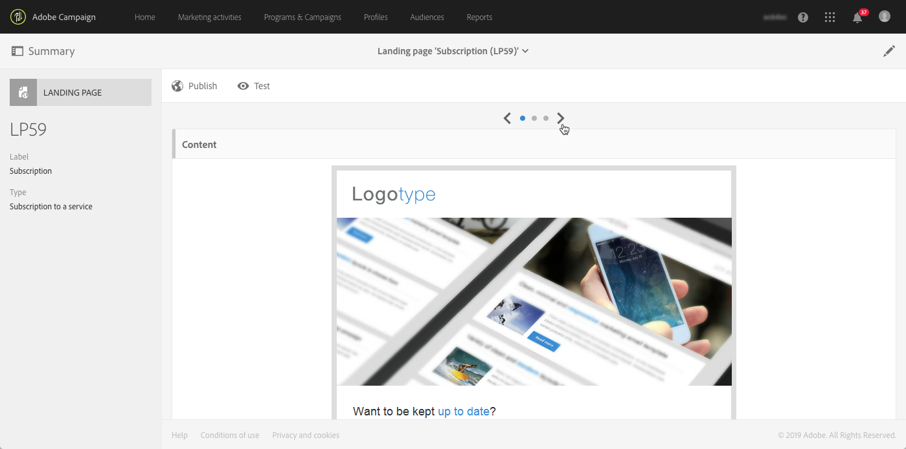
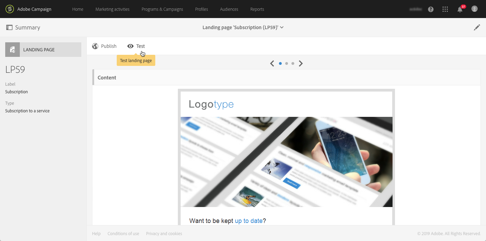
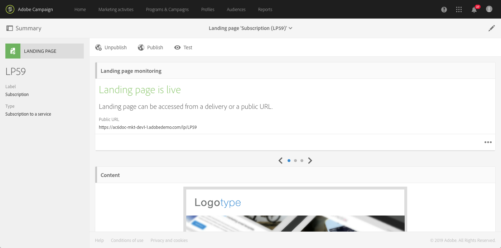

# Introdução às páginas de destino {#getting-started-with-landing-pages}

As principais etapas ao configurar páginas de destino são as seguintes:

Nesta página, você encontrará informações sobre cada uma dessas etapas, bem como referências às documentações dedicadas para obter mais detalhes.

 [Descubra como criar páginas de aterrissagem em vídeo](#video)

**Tópicos relacionados:**

* [Criação de um serviço](../../audiences/using/creating-a-service.md)
* [Configuração de um processo duplo de aceitação](setting-up-a-double-opt-in-process.md)

## Limitações da landing page{#landing-page-limitations}

A seção abaixo lista as limitações que devem ser observadas antes de iniciar a configuração da página de destino.

**Gravação e atualização de dados**

* As páginas de destino só são limitadas aos recursos **[!UICONTROL Profile]** e **[!UICONTROL Subscription]**. O registro pode ser salvo e atualizado de **[!UICONTROL Profile]** e uma assinatura/unsubscription para um **[!UICONTROL Service]**.
Para saber mais sobre a configuração de recursos, consulte [Configuração da estrutura de dados do recurso](../../developing/using/configuring-the-resource-s-data-structure.md).

>[!IMPORTANT]
>
>Uma página de destino não pode exibir ou atualizar dados de nenhum outro recurso diferente de **[!UICONTROL Profile]** e **[!UICONTROL Subscription]**.

**Pré-carregamento**

* A página de destino não pode exibir uma lista de registros automaticamente. Ela não pode listar os serviços que os perfis já assinaram. Para saber mais sobre os serviços, consulte esta [página](../../audiences/using/creating-a-service.md).

* A página de destino com um formulário pré-preenchido (os dados são pré-carregados com a página) só pode ser acessada de um email do Adobe Campaign. Não é possível acessar esse formulário por uma página de site.

**Reconciliação**

* Na reconciliação, assim que uma correspondência é encontrada, o processo de reconciliação é interrompido. Isso significa que a reconciliação só pode ser feita em um registro de perfil, e não em vários registros que estiverem duplicados.

Por exemplo, você deseja enviar a seguinte página de destino de aquisição aos seus perfis para atualizar o banco de dados do Campaign com os números de celular deles.

Se um dos perfis preencher sua página de destino com novas informações, mas já tiver um perfil duplicado, o perfil correspondente com a data de criação mais antiga será atualizado, pois os perfis são priorizados dependendo apenas da data de criação.

Aqui, apenas o primeiro perfil foi atualizado por ser a entrada mais antiga.

**Teste de páginas de destino**

* As páginas de destino funcionam somente em perfis, e não em perfis de teste, o que significa que elas não podem ser testadas como parte de uma prova de email.

## Etapa 1: configurar o template de landing page {#configure-the-landing-page-template}

Antes de configurar uma página de destino, a primeira etapa consiste em configurar um modelo de página de destino que corresponda às suas necessidades. Quando o modelo estiver pronto, todas as páginas de destino baseadas nele serão pré-configuradas com os parâmetros desejados.

1. No menu avançado, selecione **[!UICONTROL Resources]** / **[!UICONTROL Templates]** / **[!UICONTROL Landing page templates]** pelo logotipo do Adobe Campaign e duplique o modelo que deseja usar.
1. Nas propriedades do modelo, especifique todos os parâmetros que suas páginas de destino devem ter em comum. Por exemplo, o targeting dimension, os parâmetros de acesso à página para visitantes identificados ou não, ações específicas para a validação do formulário por um visitante, a marca/logotipo a ser usada no conteúdo etc. Para saber mais sobre as propriedades das landing pages, consulte [esta seção](../../channels/using/configuring-landing-page.md)
1. Salve as modificações.

Para saber mais sobre os modelos de página de destino, consulte [esta seção](../../channels/using/getting-started-with-landing-pages.md).

## Etapa 2: criar e configurar a landing page {#create-and-configure-the-landing-page}

No modelo definido na etapa anterior, crie uma nova página de destino em um programa ou campanha.

1. Crie a página de destino com base no modelo desejado.
1. Insira os parâmetros gerais da página de destino (rótulo, descrição etc.).
1. Depois acesse o painel da página de destino. Edite as propriedades da página de destino, se necessário (consulte [Configuração de uma página de destino](../../channels/using/configuring-landing-page.md)). Por padrão, as propriedades são as configuradas no modelo de página de destino.
Por motivos de segurança e desempenho da plataforma, recomendamos que você defina uma data de expiração nas propriedades da página de destino. Depois de concluída, a publicação da página de destino será automaticamente desfeita na data selecionada. Para saber mais sobre parâmetros de validade, consulte [esta seção](../../channels/using/testing-publishing-landing-page.md#setting-up-validity-parameters).

   

>[!NOTE]
>
>Suas modificações só terão efeito para a página de destino que está sendo editada. Se quiser aplicar essas modificações a outras páginas de destino, você poderá executá-las em um modelo dedicado e criar outras páginas de destino com base nesse modelo.

## Etapa 3: criar a landing page {#design-the-landing-page}

Agora é possível definir o conteúdo da página de destino. Por padrão, a página de destino contém três páginas que podem ser acessadas usando setas de rolagem: a página de conteúdo principal, uma página de confirmação e uma página de erro.

Vários campos são configurados por padrão em cada página. Se necessário, você poderá editar as propriedades e o mapeamento.

Você também pode configurar o comportamento do botão de confirmação quando um perfil clicar nele e personalizar o conteúdo de acordo com suas necessidades (imagem, campos de personalização etc.). Por exemplo, você pode inserir o nome de um perfil na página de confirmação da página de destino para agradecer o registro.

Para saber mais sobre design de página de destino, consulte [esta seção](../../channels/using/designing-a-landing-page.md).

## Etapa 4: testar a landing page {#test-the-landing-page}

Assim que a página de destino estiver definida, você poderá simular como ela será executada e se comportará quando estiver online.

>[!IMPORTANT]
>
>Os testes de página de destino só podem ser realizados com perfis, e não com perfis de teste. Quando o formulário for enviado, os dados do perfil selecionado serão atualizados. Para evitar modificar perfis reais, use um perfil falso de cliente.

Se você estiver satisfeito com o comportamento da página de destino, poderá publicá-la para disponibilizá-la online.

Para saber mais sobre como testar uma página de destino, consulte [esta seção](../../channels/using/testing-publishing-landing-page.md#testing-the-landing-page-).

## Etapa 5 — publicação da landing page {#publish-the-landing-page}

Depois que os testes forem concluídos com êxito, você poderá publicar a página de destino usando o botão **[!UICONTROL Publish]** da barra de ação no painel. Um bloco de monitoramento mostra o avanço e o status da publicação.

Após ser publicada, a página de destino fica acessível online. Você poderá atualizar a landing page a qualquer momento depois que ela for publicada. Para isso, será necessário republicá-la após cada modificação. Você também pode desfazer a publicação de uma página de destino a qualquer momento para que ela não esteja mais disponível.

Depois de publicada, sua página de destino estará pronta para ser usada. Depois disso, você poderá colocar diferentes mecanismos que permitirão acessá-la para adquirir novos perfis no seu banco de dados ou obter informações adicionais sobre os perfis existentes.

Para saber mais sobre publicação da página de destino, consulte [esta seção](../../channels/using/testing-publishing-landing-page.md#publishing-a-landing-page).

## Tutorial em vídeo {#video}

Este vídeo mostra como criar e editar uma landing page.

>[!VIDEO](https://video.tv.adobe.com/v/24093?quality=12)

Vídeos extras explicativos do Campaign Standard estão disponíveis [aqui](https://experienceleague.adobe.com/docs/campaign-standard-learn/tutorials/overview.html?lang=pt-BR).
