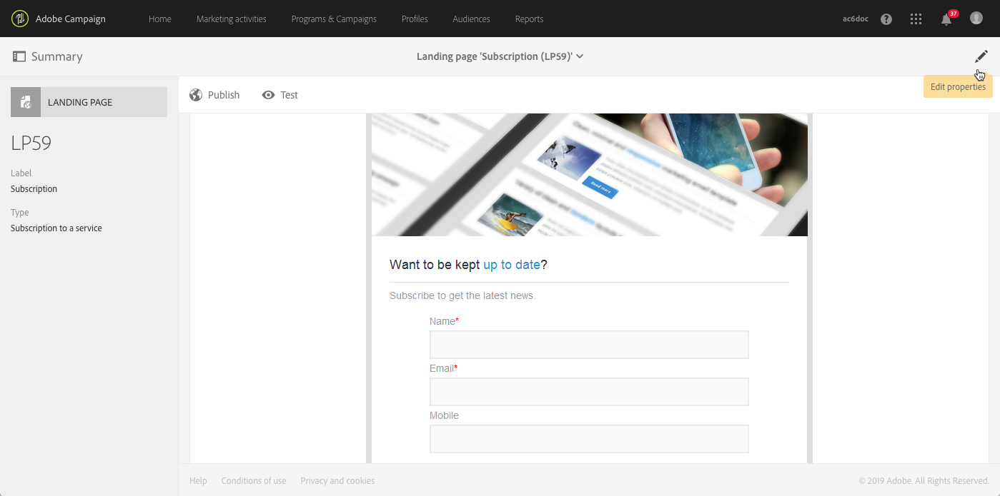

# Introdução às landing pages {#getting-started-with-landing-pages}

As principais etapas ao configurar landing pages são as seguintes:

Nesta página, você encontrará informações sobre cada uma dessas etapas, bem como referências às documentações dedicadas para obter mais detalhes.

**Tópicos relacionados:**

* [Criação de um vídeo tutorial de landing page](https://docs.adobe.com/content/help/pt-BR/campaign-standard-learn/tutorials/communication-channels/landing-pages/landing-page-create-and-edit.translate.html)
* [Criação de um serviço](../../audiences/using/creating-a-service.md)
* [Configuração de um processo duplo de aceitação](setting-up-a-double-opt-in-process.md)

## Limitações da landing page{#landing-page-limitations}

A seção abaixo lista as limitações que devem ser observadas antes de iniciar a configuração da landing page.

**Gravação e atualização de dados**

* As landing pages só são limitadas aos recursos **[!UICONTROL Profile]** e **[!UICONTROL Subscription]**. O registro pode ser salvo e atualizado de **[!UICONTROL Profile]** e uma assinatura/unsubscription para um **[!UICONTROL Service]**.
Para saber mais sobre a configuração de recursos, consulte [Configuração da estrutura de dados do recurso](../../developing/using/configuring-the-resource-s-data-structure.md).

>[!CAUTION]
>
>Uma landing page não pode exibir ou atualizar dados de nenhum outro recurso diferente de **[!UICONTROL Profile]** e **[!UICONTROL Subscription]**.

**Pré-carregamento**

* A landing page não pode exibir uma lista de registros automaticamente. Ela não pode listar os serviços que os perfis já assinaram. Para saber mais sobre os serviços, consulte esta [página](../../audiences/using/creating-a-service.md).

* A landing page com um formulário pré-preenchido (os dados são pré-carregados com a página) só pode ser acessada de um email do Adobe Campaign. Não é possível acessar esse formulário por uma página de site.

**Reconciliação**

* Na reconciliação, assim que uma correspondência é encontrada, o processo de reconciliação é interrompido. Isso significa que a reconciliação só pode ser feita em um registro de perfil, e não em vários registros que estiverem duplicados.

Por exemplo, você deseja enviar a seguinte landing page de aquisição aos seus perfis para atualizar o banco de dados do Campaign com os números de celular deles.

Se um dos perfis preencher sua landing page com novas informações, mas já tiver um perfil duplicado, o perfil correspondente com a data de criação mais antiga será atualizado, pois os perfis são priorizados dependendo apenas da data de criação.

Aqui, apenas o primeiro perfil foi atualizado por ser a entrada mais antiga.

**Teste de landing pages**

* As landing pages funcionam somente em perfis, e não em perfis de teste, o que significa que elas não podem ser testadas como parte de uma prova de email.

## Etapa 1: configurar o template de landing page {#configure-the-landing-page-template}

Antes de configurar uma landing page, a primeira etapa consiste em configurar um template de landing page que corresponda às suas necessidades. Quando o template estiver pronto, todas as landing pages baseadas nele serão pré-configuradas com os parâmetros desejados.

1. No menu avançado, selecione **[!UICONTROL Resources]** / **[!UICONTROL Templates]** / **[!UICONTROL Landing page templates]** pelo logotipo do Adobe Campaign e duplique o template que deseja usar.
1. Nas propriedades do template, especifique todos os parâmetros que suas landing pages devem ter em comum. Por exemplo, o targeting dimension, os parâmetros de acesso à página para visitantes identificados ou não, ações específicas para a validação do formulário por um visitante, a marca/logotipo a ser usada no conteúdo etc. Para saber mais sobre as propriedades e landing pages, consulte [esta seção](../../channels/using/configuring-landing-page.md).
1. Salve as modificações.

Para saber mais sobre os templates de landing page, consulte [esta seção](../../channels/using/getting-started-with-landing-pages.md).

## Etapa 2: criar e configurar a landing page {#create-and-configure-the-landing-page}

No template definido na etapa anterior, crie uma nova landing page em um programa ou campanha.

1. Crie a landing page com base no template desejado.
1. Insira os parâmetros gerais da landing page (rótulo, descrição etc.).
1. Depois acesse o painel da landing page. Edite as propriedades da landing page, se necessário (consulte [Configuração de uma landing page](../../channels/using/configuring-landing-page.md)). Por padrão, as propriedades são as configuradas no template de landing page.
Por motivos de segurança e desempenho da plataforma, recomendamos que você defina uma data de expiração nas propriedades da landing page. Depois de concluída, a publicação da landing page será automaticamente desfeita na data selecionada. Para saber mais sobre parâmetros de validade, consulte [esta seção](../../channels/using/testing-publishing-landing-page.md#setting-up-validity-parameters).

   

>[!NOTE]
>
>Suas modificações só terão efeito para a landing page que está sendo editada. Se quiser aplicar essas modificações a outras landing pages, você poderá executá-las em um template dedicado e criar outras landing pages com base nesse template.

## Etapa 3: criar a landing page {#design-the-landing-page}

Agora é possível definir o conteúdo da landing page. Por padrão, a landing page contém três páginas que podem ser acessadas usando setas de rolagem: a página de conteúdo principal, uma página de confirmação e uma página de erro.

Vários campos são configurados por padrão em cada página. Se necessário, você poderá editar as propriedades e o mapeamento.

Você também pode configurar o comportamento do botão de confirmação quando um perfil clicar nele e personalizar o conteúdo de acordo com suas necessidades (imagem, campos de personalização etc.). Por exemplo, você pode inserir o nome de um perfil na página de confirmação da landing page para agradecer o registro.

Para saber mais sobre design de landing page, consulte [esta seção](../../channels/using/designing-a-landing-page.md).

## Etapa 4: testar a landing page {#test-the-landing-page}

Assim que a landing page estiver definida, você poderá simular como ela será executada e se comportará quando estiver online.

>[!CAUTION]
>
>Os testes de landing page só podem ser realizados com perfis, e não com perfis de teste. Quando o formulário for enviado, os dados do perfil selecionado serão atualizados. Para evitar modificar perfis reais, use um perfil falso de cliente.

Se você estiver satisfeito com o comportamento da landing page, poderá publicá-la para disponibilizá-la online.

Para saber mais sobre como testar uma landing page, consulte [esta seção](../../channels/using/testing-publishing-landing-page.md#testing-the-landing-page-).

## Etapa 5: publicar a landing page {#publish-the-landing-page}

Depois que os testes forem concluídos com êxito, você poderá publicar a landing page usando o botão **[!UICONTROL Publish]** da barra de ação no painel. Um bloco de monitoramento mostra o avanço e o status da publicação.

Após ser publicada, a landing page fica acessível online. Você poderá atualizar a landing page a qualquer momento depois que ela for publicada. Para isso, será necessário republicá-la após cada modificação. Você também pode desfazer a publicação de uma landing page a qualquer momento para que ela não esteja mais disponível.

Depois de publicada, sua landing page estará pronta para ser usada. Depois disso, você poderá colocar diferentes mecanismos que permitirão acessá-la para adquirir novos perfis no seu banco de dados ou obter informações adicionais sobre os perfis existentes.

Para saber mais sobre publicação da landing page, consulte [esta seção](../../channels/using/testing-publishing-landing-page.md#publishing-a-landing-page).
