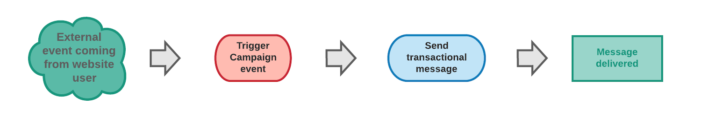
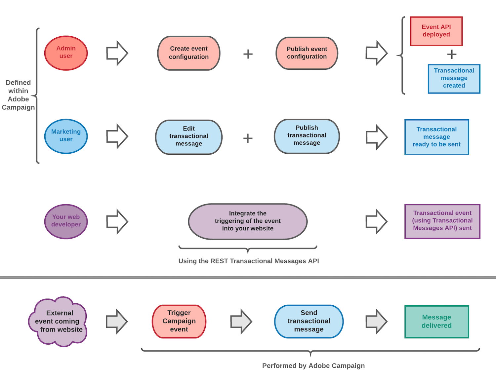

# Introdução a mensagens transacionais {#getting-started-with-transactional-messaging}

Uma mensagem transacional é uma comunicação individual e única enviada em tempo real a um usuário por um provedor, como um site. É particularmente esperado, pois contém informações importantes que o destinatário deseja verificar ou confirmar.

* **Quando a entrega é feita?** Como essa mensagem contém informações importantes, o usuário espera que ela seja enviada em tempo real. Portanto, o atraso entre o evento acionado e a mensagem recebida deve ser muito curto.

* **Por que é importante?** Geralmente, uma mensagem transacional tem altas taxas de abertura. Potanto, ela deve ser criada cuidadosamente, uma vez que pode ter um forte impacto no comportamento dos clientes porque define a relação com o cliente.

* **Por exemplo?** Pode ser uma mensagem de boas-vindas após criar uma conta, uma confirmação de que um pedido foi enviado, uma fatura, uma mensagem confirmando uma alteração de senha ou uma notificação depois que um cliente navegou em seu site etc.

O Adobe Campaign permite integrar essa funcionalidade a um sistema de informações que envia eventos a serem transformados em mensagens transacionais personalizadas.

As mensagens transacionais podem ser enviadas por email, SMS ou [notificação por push](../../channels/using/transactional-push-notifications.md), dependendo das suas opções. Verifique o contrato de licença.

>[!NOTE]
>
>O Adobe Campaign prioriza o processamento das mensagens transacionais antes de qualquer outra entrega.

<!--Guidelines to implement transactional messaging capabilities in your website are detailed in [this section](../../api/using/managing-transactional-messages.md).-->

Antes de começar com mensagens transacionais, leia as [práticas recomendadas e limitações](../../channels/using/transactional-messaging-limitations.md) correspondentes.

## Princípio operacional das mensagens transacionais {#transactional-messaging-operating-principle}

O processo geral de mensagens transacionais pode ser descrito da seguinte maneira:

Por exemplo, imagine que você é uma empresa com um site onde os clientes podem comprar produtos.

O Adobe Campaign permite enviar um email de notificação para clientes que adicionaram produtos ao carrinho. Quando um deles sai do site sem concluir a compra (evento externo que aciona um evento do Campaign), um email de abandono de carrinho é enviado automaticamente a eles (entrega de mensagem transacional).

As principais etapas para colocar isso em prática são detalhadas abaixo [nesta seção](#key-steps).

## Tipos de mensagem transacional {#transactional-message-types}

Dois tipos de mensagens transacionais estão disponíveis no Adobe Campaign.

**Mensagens transacionais de evento** direcionam os dados contidos no próprio evento. Estas mensagens:
* Não contêm informações de perfil e, portanto, não podem incluir links de unsubscription.
* Não são compatíveis com as regras de fadiga (mesmo no caso de um enriquecimento com perfis).
* Têm o target de delivery definido pelos dados contidos no próprio evento.

Você pode enviar uma mensagem transacional de evento para um cliente que precisa recuperar uma senha esquecida, por exemplo, ou confirmar um pedido. Na verdade, você não quer que o seu recipient cancele a inscrição desse tipo de comunicação e essa notificação não deve ser adicionada ao contador de mensagens de marketing como parte de uma regra de fadiga.

**Mensagens transacionais de perfil** direcionam os perfis do banco de dados de marketing do Campaign. Com esse tipo de mensagem, você pode:
* Aproveite os dados contidos no banco de dados do Adobe Campaign.
* Personalize sua mensagem com informações de perfil adicionando um [enriquecimento](../../channels/using/configuring-transactional-event.md#enriching-the-transactional-message-content) à configuração do evento.
* Aplicar [regras de tipologia de marketing](../../sending/using/managing-typology-rules.md) ou [regras de fadiga](../../sending/using/fatigue-rules.md).
* Incluir o link de unsubscription nas mensagens.
* Adicionar as mensagens transacionais aos relatórios globais da entrega.
* Usar as mensagens transacionais na jornada do cliente.

Por exemplo, você pode usar esse tipo de mensagem ao entrar em contato com seus clientes depois que eles abandonarem o carrinho em seu site, para incentivá-los a prosseguir com a compra. Ao fazer isso, você pode personalizar mais facilmente a mensagem com acesso direto a todas as informações do banco de dados de perfis, aplicar regras de marketing e incluir essa mensagem na jornada e nos relatórios globais do cliente para obter uma melhor visualização do comportamento do cliente.

O tipo de mensagem é definido ao configurar o evento que será transformado em mensagem transacional. Consulte as [Mensagens transacionais baseadas em eventos](../../channels/using/configuring-transactional-event.md#event-based-transactional-messages) e as [Mensagens transacionais baseadas em perfil](../../channels/using/configuring-transactional-event.md#profile-based-transactional-messages) seções de configuração.

## Principais etapas {#key-steps}

As principais etapas ao criar e gerenciar mensagens transacionais personalizadas no Adobe Campaign estão resumidas no esquema abaixo.

Cada uma dessas etapas é detalhada mais abaixo.

>[!IMPORTANT]
>
>Somente usuários com a função [Administração](../../administration/using/users-management.md#functional-administrators) podem configurar eventos transacionais e acessar mensagens transacionais.

### Etapa 1 - Criar e publicar a configuração do evento {#create-event-configuration}

<!---->

| Criar um evento | Usuário(a) | Ação | Resultado |
| --- |--- |--- |--- |
|  | Esta etapa deve ser executada por um administrador que tenha [direitos administrativos](../../administration/using/users-management.md#functional-administrators). | Configure um evento que será chamado de &quot;Abandono do carrinho&quot; e publique essa configuração de evento. | A API que será usada pelo desenvolvedor do site é implantada e uma mensagem transacional é criada automaticamente. |

A criação e a publicação de um evento são apresentadas nas seções [Configuração de um evento transacional](../../channels/using/configuring-transactional-event.md) e [Publicação de um evento transacional](../../channels/using/publishing-transactional-event.md).

### Etapa 2 — edição e publicação da mensagem transacional {#create-transactional-message}

<!---->

| Editar a mensagem | Usuário(a) | Ação | Resultado |
| --- |--- |--- |--- |
|  | Esta etapa pode ser executada por um usuário de marketing que tem [direitos administrativos](../../administration/using/users-management.md#functional-administrators). | Edite e personalize a mensagem transacional, teste-a e publique-a. | A mensagem transacional estará pronta para ser enviada. |

Para obter mais informações sobre como editar e publicar uma mensagem transacional, consulte [Editar mensagens transacionais](../../channels/using/editing-transactional-message.md) e [Ciclo de vida da mensagem transacional](../../channels/using/publishing-transactional-message.md).

### Etapa 3 - Integrar o acionamento de evento {#integrate-event-trigger}

<!---->

Depois de criar um evento, você precisa integrar o acionamento desse evento ao seu site.<!--In this example, you want a "Cart abandonment" event to be triggered whenever one of your clients leaves your website before purchasing the products in their cart.--> Para fazer isso, o desenvolvedor da Web do seu site deve usar a **API REST do Adobe Campaign Standard**.

| Implementar o acionador | Usuário(a) | Ação | Resultado |
| --- |--- |--- |--- |
|  | Essa etapa é executada pelo desenvolvedor do site. | Use a API de mensagens transacionais REST para integrar o evento ao seu site. | O evento será acionado quando um cliente abandonar o carrinho. |

Para obter mais informações sobre como usar a API REST do Campaign para gerenciar mensagens transacionais, consulte a [documentação da API REST](../../api/using/managing-transactional-messages.md).

### Etapa 4 - Entrega de mensagem {#message-delivery}

<!---->

Depois que todas as etapas acima forem executadas, a mensagem poderá ser entregue.

| Enviar a mensagem | Usuário(a) | Ação | Resultado |
| --- |--- |--- |--- |
|  | Esta etapa é executada por clientes que visitam seu site. | Assim que um usuário sai do site sem solicitar os produtos no carrinho, o evento Campaign correspondente é acionado. | O usuário recebe automaticamente um email de notificação. |

## Tópicos relacionados

* [Etapas principais para enviar uma mensagem](../../channels/using/key-steps-to-send-a-message.md)
* [Introdução a canais de comunicação](../../channels/using/get-started-communication-channels.md)
* [Notificações por push transacionais](../../channels/using/transactional-push-notifications.md)
* [Mensagens de acompanhamento](../../channels/using/follow-up-messages.md)
