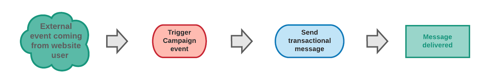

# Introdução a mensagens transacionais {#getting-started-with-transactional-messaging}

## Visão geral {#overview}

### O que é um mensagen transacional?

É uma comunicação individual e exclusiva, enviada em tempo real por um provedor como um site. É particularmente esperado, pois contém informações importantes que o recipient deseja verificar ou confirmar.

* **Quando é o prazo?** Como essa mensagem contém informações importantes, o usuário espera que ela seja enviada em tempo real. Consequentemente, o atraso entre o evento desencadeado e a mensagem que chega tem de ser muito curto.

* **Por que é importante?** Geralmente, um mensagen transacional tem altas taxas de abertura. Por conseguinte, deve ser cuidadosamente concebido, uma vez que pode ter um forte impacto no comportamento dos clientes, na medida em que define a relação com os clientes.

* **Por exemplo?** Pode ser uma mensagem de boas-vindas depois de criar uma conta, uma confirmação de que um pedido foi entregue, uma fatura, uma mensagem confirmando uma alteração de senha ou uma notificação depois que um cliente navegou em seu site...

### envio de mensagens transacionais

A Adobe Campaign permite integrar essa funcionalidade a um sistema de informações que envia eventos que serão transformados em mensagens transacionais personalizados.

As mensagens transacionais podem ser enviadas por email, SMS ou notificação por push, dependendo das suas opções. Verifique o contrato de licença.

>[!NOTE]
>
>A Adobe Campaign prioriza os mensagens transacionais de processamento em relação a qualquer outro delivery.

As mensagens transacionais também estão disponíveis na API do Adobe Campaign Standard. Para obter mais informações, consulte a [documentação dedicada](../../api/using/managing-transactional-messages.md).

>[!NOTE]
>
>Todas as mensagens transacionais agora são enviadas com o MTA aprimorado do Adobe Campaign para otimizar a capacidade de delivery, a taxa de transferência e o tratamento de rejeições. Todos os impactos são os mesmos das mensagens de marketing padrão. Para obter mais informações, consulte [esta seção](../../administration/using/configuring-email-channel.md).

### tipos de mensagens transacionais {#transactional-message-types}

Dois tipos de mensagens transacionais estão disponíveis no Adobe Campaign:

**As** mensagens transacionais do evento estão direcionando um evento:
* Elas não contêm informações sobre o perfil.
* Elas não são compatíveis com as regras de fadiga (mesmo no caso de um enriquecimento com perfis).
* O público alvo do delivery é definido pelos dados contidos no próprio evento.

**As** mensagens transacionais do perfil estão direcionando perfis do banco de dados de marketing da Campanha. Com este tipo de mensagens, você pode:
* Aplique [regras de tipologia de marketing](../../sending/using/managing-typology-rules.md) ou [regras de fadiga](../../sending/using/fatigue-rules.md).
* Incluir o link de unsubscription nas mensagens.
* Adicionar as mensagens transacionais aos relatórios globais do delivery.
* Usar as mensagens transacionais na jornada do cliente.

O tipo de mensagem é definido ao configurar o evento que será transformado em mensagem transacional. Consulte [esta seção](../../channels/using/configuring-transactional-event.md#transactional-event-specific-configurations).

>[!IMPORTANT]
>
>Para acessar todos os mensagens transacionais, você deve fazer parte do grupo de segurança **[!UICONTROL Administrators (all units)]**.

## Princípio operacional das mensagens transacionais {#transactional-messaging-operating-principle}

O processo geral de mensagens transacionais pode ser descrito da seguinte forma:

Por exemplo, digamos que você seja uma empresa com um site onde seus clientes possam comprar produtos.

A Adobe Campaign permite que você envie um email de notificação para clientes que adicionaram produtos ao carrinho: quando um deles sai do seu site sem ter que fazer compras (evento externo que dispara uma evento Campanha), um email de abandono do carrinho é automaticamente enviado a ele (delivery do mensagen transacional).

<!--The steps for putting this into place are detailed below.-->

### Principais etapas{#key-steps}

As etapas principais ao criar e gerenciar mensagens transacionais personalizados no Adobe Campaign são resumidas no gráfico abaixo.

Cada uma dessas etapas é mais detalhada abaixo.

### Etapa 1 - Criar e publicar a configuração do evento {#create-event-configuration}

| Usuário | Ação | Resultado |
|--- |--- |--- |
| Esta etapa deve ser executada por um usuário com [direitos de administração](../../administration/using/users-management.md#functional-administrators). | Configure um evento que será chamado de &quot;abandono do carrinho&quot; e publique essa configuração de evento. | A API que será usada pelo desenvolvedor do site é implantada e um mensagen transacional é criado automaticamente. |

A criação e publicação de um evento são apresentadas nas seções [Configuração de um evento transacional](../../channels/using/configuring-transactional-event.md) e [Publicação de um evento transacional](../../channels/using/publishing-transactional-event.md).

### Etapa 2 - Editar e publicar o mensagen transacional {#create-transactional-message}

| Usuário | Ação | Resultado |
|--- |--- |--- |
| Esta etapa pode ser executada por qualquer usuário de marketing com [direitos padrão de acesso do usuário](../../administration/using/users-management.md#basic-users). | Edite e personalize o mensagen transacional, teste-o e publique-o. | O mensagen transacional estará pronto para ser enviado. |

Para obter mais informações sobre edição e publicação de um mensagen transacional, consulte [Edição de mensagens transacionais](../../channels/using/editing-transactional-message.md) e [ciclo de vida do Mensagen transacional](../../channels/using/publishing-transactional-message.md).

### Etapa 3 - Integrar o acionamento do evento {#integrate-event-trigger}

<!--**Event triggering integration**-->

| Usuário | Ação | Resultado |
|--- |--- |--- |
| Esta etapa é executada pelo desenvolvedor do seu site. | Use a API Mensagens transacionais REST para integrar o evento ao seu site. | O evento será acionado quando um cliente abandonar seu carrinho. |

Depois de criar um evento, é necessário integrar o acionamento desse evento ao seu site.<!--In this example, you want a "Cart abandonment" event to be triggered whenever one of your clients leaves your website before purchasing the products in their cart.--> Para fazer isso, o desenvolvedor da Web do site deve usar a API **REST da** Adobe Campaign Standard.

Para obter mais informações sobre como usar a API REST de Campanha para gerenciar mensagens transacionais, consulte a [documentação da API REST](../../api/using/managing-transactional-messages.md).

### Etapa 4 - delivery de mensagem {#message-delivery}

Assim que todas essas etapas forem realizadas, a mensagem poderá ser entregue.

Assim que um usuário sair do site sem solicitar os produtos em seu carrinho, o evento de Campanha correspondente será acionado. O usuário recebe automaticamente um email de notificação.

## Tópicos relacionados

* [Etapas principais para enviar uma mensagem](../../channels/using/key-steps-to-send-a-message.md)
* [Introdução a canais de comunicação](../../channels/using/get-started-communication-channels.md)
* [Notificações por push transacionais](../../channels/using/transactional-push-notifications.md)
* [Mensagens de acompanhamento](../../channels/using/follow-up-messages.md)
