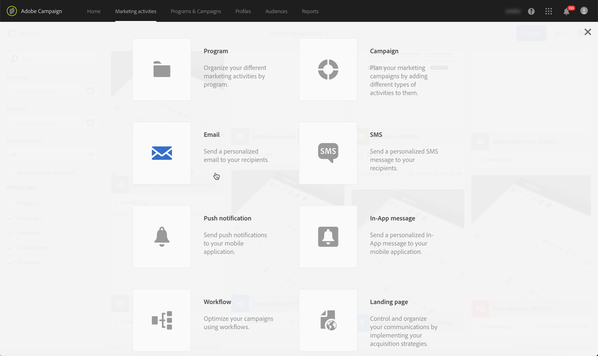
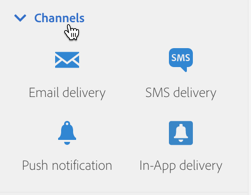
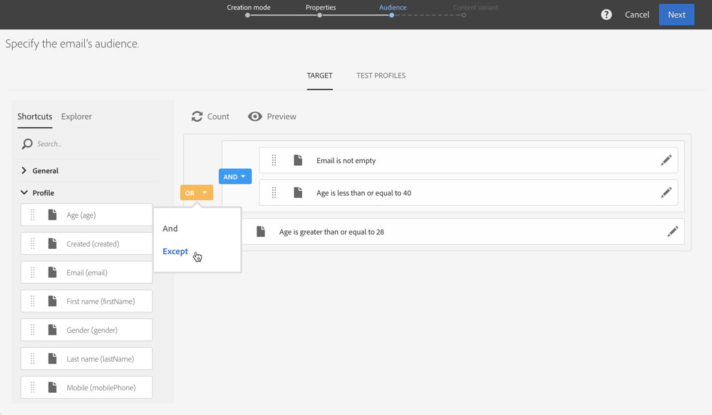
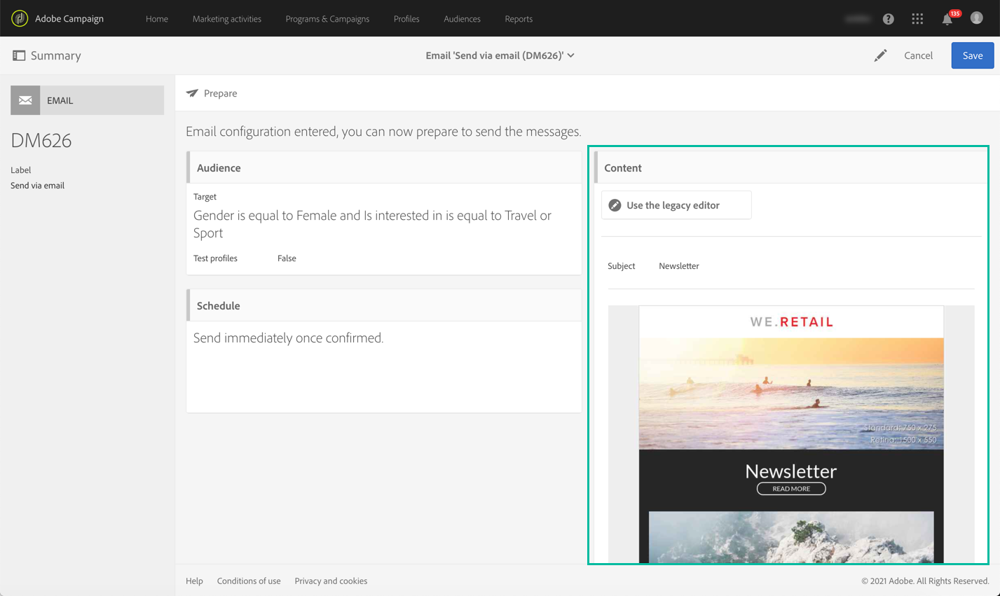
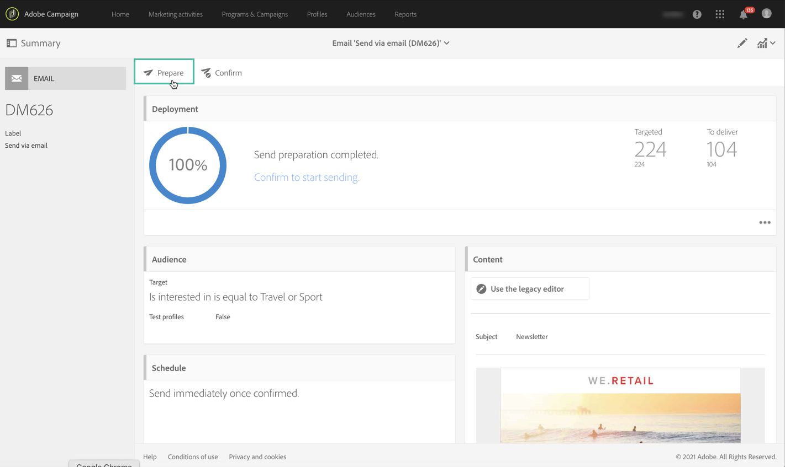
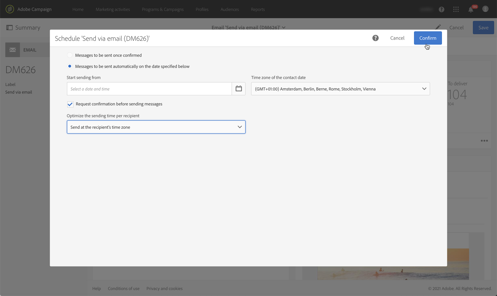
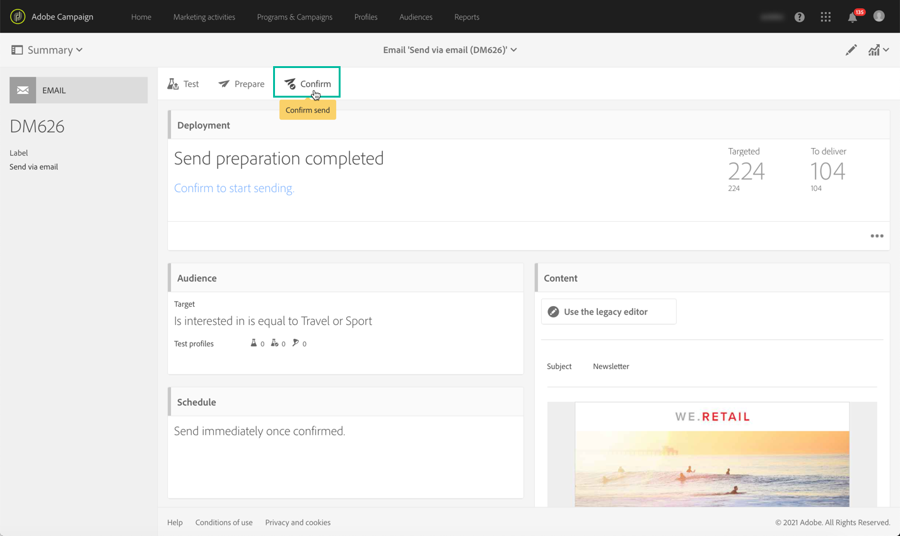
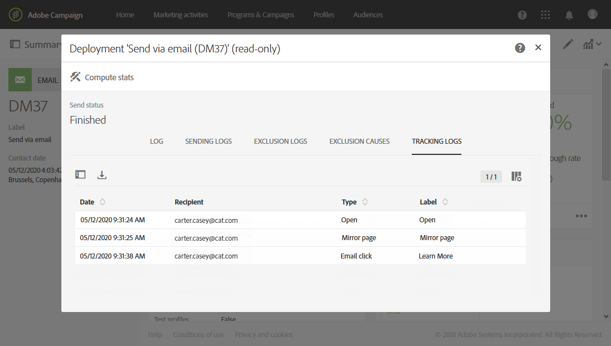
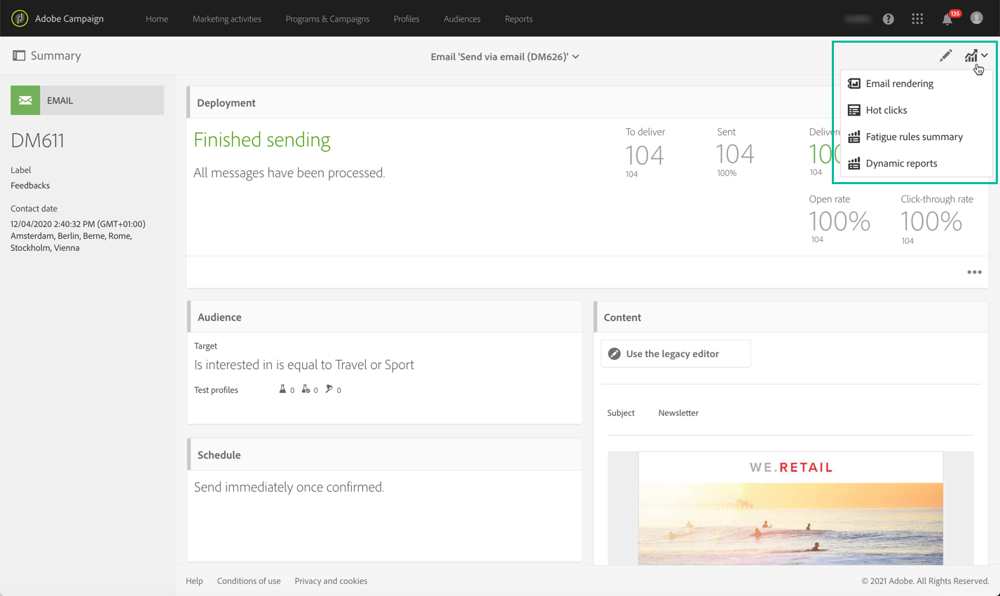

# Etapas principais para enviar uma mensagem{#key-steps-to-send-a-message}

Nesta seção, você aprenderá a criar e enviar mensagens personalizadas para um público-alvo usando o Adobe Campaign Standard.

Informações específicas sobre como criar e configurar cada canal de comunicação estão disponíveis nestas seções:

* [Criação de um email](../../channels/using/creating-an-email.md)
* [Criação de um SMS](../../channels/using/creating-an-sms-message.md)
* [Criação de uma entrega de correspondência direta](../../channels/using/creating-the-direct-mail.md)
* [Criando uma notificação por push](../../channels/using/preparing-and-sending-a-push-notification.md).
* [Preparação e envio de uma mensagem no aplicativo](../../channels/using/preparing-and-sending-an-in-app-message.md)

Para saber sobre as práticas recomendadas de entrega, consulte a seção [Práticas recomendadas de entrega](../../sending/using/delivery-best-practices.md).

## Criar sua mensagem

Aproveite as [atividades de marketing](../../start/using/marketing-activities.md) do Campaign Standard para criar um email, SMS, correspondência direta, notificação por push ou mensagem no aplicativo.

As mensagens podem ser criadas na lista de atividades de marketing ou em um fluxo de trabalho usando [atividades dedicadas](../../automating/using/about-channel-activities.md).

## Definir o público-alvo

Defina os recipients da mensagem. Para fazer isso, use o [editor de consultas](../../automating/using/editing-queries.md) do painel esquerdo para filtrar os dados contidos no banco de dados e criar regras para direcionar o público-alvo.

Há vários tipos de públicos-alvo disponíveis:

* **[!UICONTROL Target]** é o principal destino do seu email,
* **[!UICONTROL Test profiles]** são os perfis usados para testar e validar seu email (consulte [Gerenciamento de perfis de teste](../../audiences/using/managing-test-profiles.md)).

## Projetar e personalizar conteúdo

No bloco **[!UICONTROL Content]**, crie e personalize o conteúdo da mensagem usando campos do banco de dados. Para obter mais informações sobre como projetar conteúdo para um canal específico, consulte as seções listadas na parte superior desta página.

## Preparar e testar

[Prepare](../../sending/using/preparing-the-send.md) a mensagem. Esse processo calcula a população do target e prepara a mensagem personalizada.

**Verifique e teste sua mensagem** antes de enviá-la usando os recursos do Campaign Standard: visualização, renderização de email, revisão de texto, etc. Para obter mais informações, consulte [esta seção](../../sending/using/previewing-messages.md).

Use o bloco **[!UICONTROL Schedule]** para definir quando suas mensagens serão enviadas (consulte [Agendando mensagens](../../sending/using/about-scheduling-messages.md)).

## Enviar e rastrear

Quando a mensagem estiver pronta, você poderá confirmar o envio. O bloco **[!UICONTROL Deployment]** exibe o progresso do envio e o resultado.

Vários logs estão disponíveis para ajudar você a monitorar a entrega de suas mensagens (consulte [monitoramento de uma entrega](../../sending/using/monitoring-a-delivery.md)). Você também pode acompanhar o comportamento dos recipients de entrega graças às [funcionalidades de rastreamento](../../sending/using/tracking-messages.md) da Campaign Standard.

Meça a eficácia de suas mensagens e a evolução de seus envios e campanhas por meio de vários indicadores e gráficos (consulte [Acesso a relatórios](../../reporting/using/about-dynamic-reports.md)).

