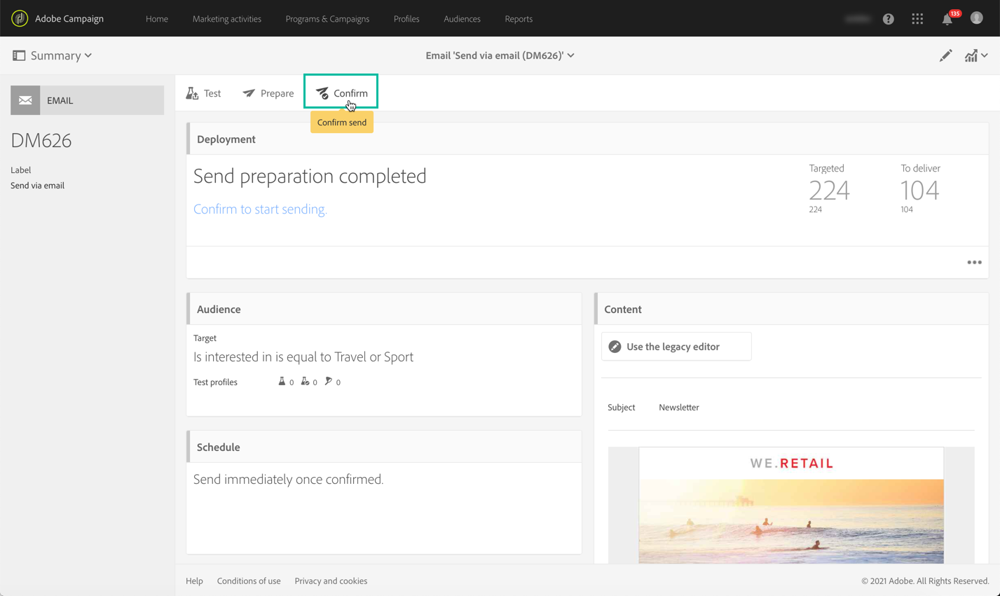

# Etapas principais para enviar uma mensagem{#key-steps-to-send-a-message}

Nesta seção, você aprenderá a criar e enviar mensagens personalizadas para um público-alvo direcionado usando o Adobe Campaign Standard.

Informações específicas sobre como criar e configurar cada canal de comunicação estão disponíveis nas seguintes seções:

* [Criar email](../../channels/using/creating-an-email.md)
* [Criação de SMS](../../channels/using/creating-an-sms-message.md)
* [Criação de um delivery de mala direta](../../channels/using/creating-the-direct-mail.md)
* [Criação de uma notificação por push](../../channels/using/preparing-and-sending-a-push-notification.md).
* [Preparação e envio de uma mensagem no aplicativo](../../channels/using/preparing-and-sending-an-in-app-message.md)

Para saber mais sobre as práticas recomendadas de delivery, consulte a seção [Práticas recomendadas de delivery](../../sending/using/delivery-best-practices.md) .

## Criar sua mensagem

Aproveite o Campaign Standard [marketing activities](../../start/using/marketing-activities.md) para criar um email, SMS, correspondência direta, notificação por push ou mensagem no aplicativo.

As mensagens podem ser criadas a partir da lista de atividades de marketing ou de um workflow usando [atividades dedicadas](../../automating/using/about-channel-activities.md).

## Definir o público

Defina os recipients da mensagem. Para fazer isso, use o [Editor de consultas](../../automating/using/editing-queries.md) do painel esquerdo para filtrar os dados contidos no banco de dados e criar regras para direcionar seu público-alvo.

Há vários tipos de públicos-alvo disponíveis:

* **[!UICONTROL Target]** é o principal público-alvo do seu email,
* **[!UICONTROL Test profiles]** são os perfis usados para testar e validar seu email (consulte  [Gerenciamento de perfis de teste](../../audiences/using/managing-test-profiles.md)).

## Design e personalização de conteúdo

No bloco **[!UICONTROL Content]** , crie e personalize o conteúdo da mensagem usando campos do banco de dados. Para obter mais informações sobre como criar o conteúdo para um canal específico, consulte as seções listadas na parte superior desta página.

## Preparar e testar

 Prepare a mensagem. Esse processo calcula a população do target e prepara a mensagem personalizada.

**Verifique e teste sua** mensagem antes de enviá-la usando os recursos do Campaign Standard: pré-visualização, renderização de email, prova, etc. Para obter mais informações, consulte [esta seção](../../sending/using/previewing-messages.md).

Use o bloco **[!UICONTROL Schedule]** para definir quando suas mensagens serão enviadas (consulte [Agendamento de mensagens](../../sending/using/about-scheduling-messages.md)).

## Enviar e rastrear

Quando a mensagem estiver pronta, você poderá confirmar o envio. O bloco **[!UICONTROL Deployment]** exibe o progresso do envio e o resultado.

Vários logs estão disponíveis para ajudá-lo a monitorar a entrega de suas mensagens (consulte [monitorando um delivery](../../sending/using/monitoring-a-delivery.md)). Você também pode rastrear os recipients do delivery graças ao comportamento do Campaign Standard [tracking funcionalidades](../../sending/using/tracking-messages.md).

Meça a eficácia de suas mensagens e a evolução de seus envios e campanhas por meio de vários indicadores e gráficos (consulte [Acesso a relatórios](../../reporting/using/about-dynamic-reports.md)).

