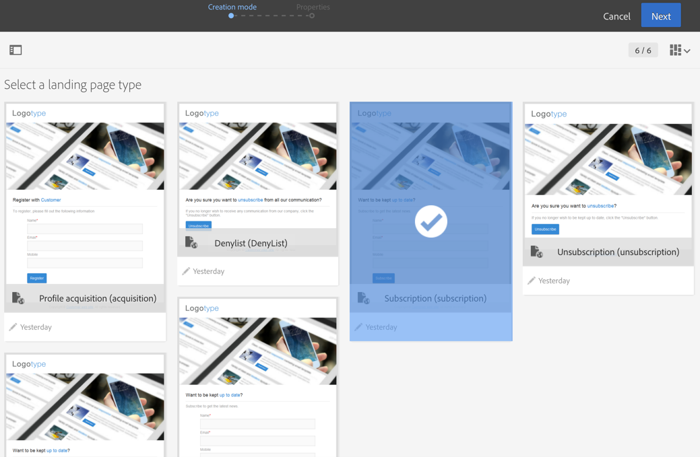

# Sobre modelos de páginas de destino {#landing-page-templates}

O Campaign vem com um conjunto de modelos de página de destino integrados:

* **[!UICONTROL Acquisition]**: este é o modelo padrão para páginas de destino, que permite capturar e atualizar dados no banco de dados do Campaign.
* **[!UICONTROL Subscription]**: esse modelo deve ser usado para oferecer assinaturas de um serviço.
* **[!UICONTROL Unsubscription]**: esse modelo pode ser vinculado a partir de um email enviado aos assinantes de um serviço, para permitir que eles cancelem a assinatura desse serviço.
* **[!UICONTROL Denylist]**: esse modelo deve ser usado quando um perfil não deseja mais ser contatado pelo Campaign. Para obter mais informações sobre o gerenciamento de inclui na lista de bloqueios, consulte [Sobre participação e não participação no Campaign](../../audiences/using/about-opt-in-and-opt-out-in-campaign.md).

Esses modelos são propostos por padrão ao criar uma nova página de destino.



Para acessar modelos de página de destino, clique no logotipo do Adobe Campaign no canto superior esquerdo e selecione **[!UICONTROL Resources]** > **[!UICONTROL Templates]** > **[!UICONTROL Landing page templates]**.

>[!NOTE]
>
>A Adobe recomenda criar seus próprios modelos duplicando um modelo integrado. Alguns parâmetros só podem ser definidos em modelos de páginas de destino e não podem ser modificados diretamente na página de destino.

Ao criar um modelo, recomendamos adicionar um atributo **‘type’** às tags. Essas informações serão processadas pelo editor e ajudarão o usuário a vincular um campo do banco de dados ao campo de formulário ao configurar o aplicativo web.

Exemplo de código HTML no modelo:

```
<input id="email" type="email" name="email"/>
```

A lista oficial de atributos &#39;type&#39; está disponível no seguinte endereço: [https://www.w3schools.com/tags/att_input_type.asp](https://www.w3schools.com/tags/att_input_type.asp)
