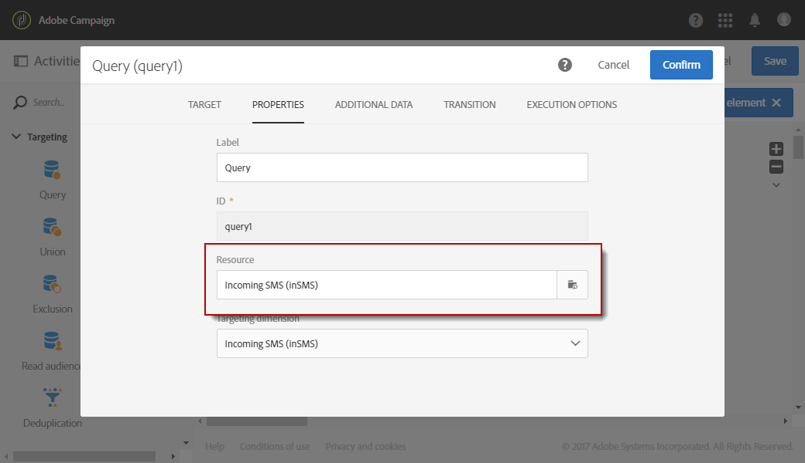
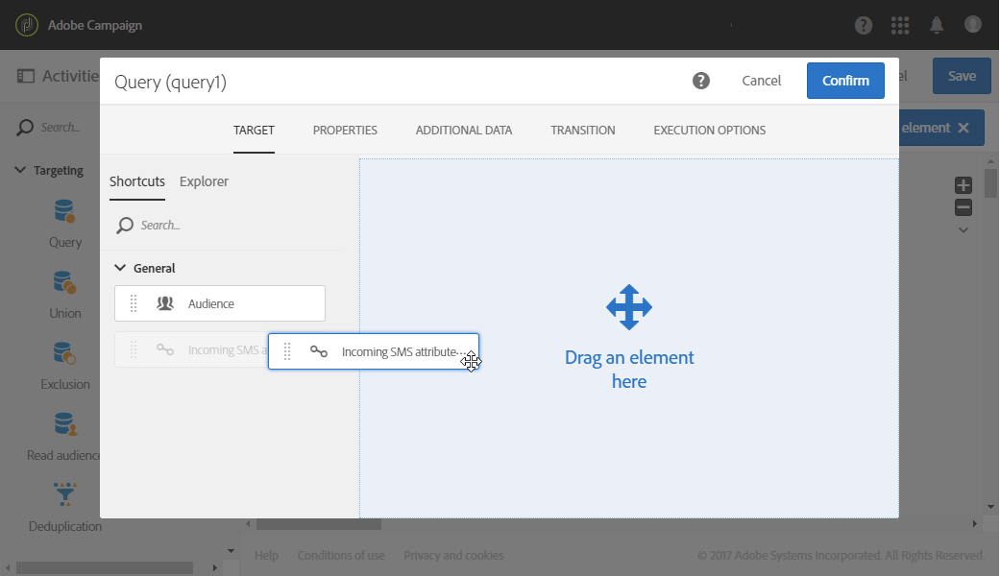

# Gerenciar SMS de entrada{#managing-incoming-sms}

## Gerenciando o STOP SMS {#managing-stop-sms}

Quando um perfil responde a uma mensagem SMS enviada pelo Campaign, você pode configurar mensagens que serão automaticamente enviadas para ele, bem como a ação a ser executada.

Essa configuração é definida na **[!UICONTROL Automatic reply sent to the MO]** seção da conta externa [do Roteamento](../../administration/using/configuring-sms-channel.md#defining-an-sms-routing)SMS. MO significa &quot;Mobile Originated&quot;, o que significa que você pode configurar uma resposta automática para o celular que enviou o SMS.

Para fazer isso:

1. From the advanced menu, via the Adobe Campaign logo, select **[!UICONTROL Administration > Application settings > External accounts]** then the **[!UICONTROL SMS routing via SMPP]** external account.
1. Na **[!UICONTROL Automatic reply sent to the MO]** categoria, clique em **[!UICONTROL Create element]** start para configurar sua resposta automática.

   

1. Escolha a palavra-chave que acionará essa resposta automática. As palavras-chave não diferenciam maiúsculas de minúsculas. Por exemplo, aqui, se os recipient enviarem a palavra-chave &quot;PARAR&quot;, eles receberão a resposta automática.

   Deixe essa coluna vazia se desejar enviar a mesma resposta, independentemente da palavra-chave.

   

1. No **[!UICONTROL Short code]** campo, especifique um número normalmente usado para enviar delivery e que servirá como nome de remetente. Você também pode decidir deixar a **[!UICONTROL Short code]** coluna vazia, para enviar a mesma resposta, independentemente do código curto.

   

1. Digite a resposta que deseja enviar aos seus recipient no campo **[!UICONTROL Reply]**.

   To carry out an action without sending a reply, leave the **[!UICONTROL Reply]** column empty. Por exemplo, isso permite remover da quarentena o número de telefone de um usuário que responde com uma mensagem diferente de &quot;PARAR&quot;.

   

1. No **[!UICONTROL Additional action]** campo, vincule uma ação à sua resposta automática:

   * A **[!UICONTROL Send to quarantine]** ação quarentena automaticamente o número de telefone do perfil.
   * A **[!UICONTROL Remove from quarantine]** ação remove o número de telefone do perfil da quarentena.
   * A **[!UICONTROL None]** ação permite que você envie apenas a mensagem para seus recipient sem executar uma ação.

   Por exemplo, na configuração abaixo, se os recipient enviarem a palavra-chave &quot;PARAR&quot;, eles receberão automaticamente uma confirmação de unsubscription e seu número de telefone será enviado para a quarentena com o **[!UICONTROL Denylisted]** status. Esse status se refere apenas ao número de telefone, o perfil é incluir na lista de bloqueios para que o usuário continue recebendo mensagens de email.

   

Seus recipient agora podem ser automaticamente cancelados de inscrição em suas mensagens e enviados para a quarentena com essa resposta automática. The quarantined recipients are listed in the **[!UICONTROL Addresses]** table available through the **[!UICONTROL Administration]** > **[!UICONTROL Channels]** > **[!UICONTROL Quarantines]** menu. For more information on quarantines, refer to this [section](../../sending/using/understanding-quarantine-management.md).

Esses SMS recebidos podem ser armazenados, se necessário. For more information on this, refer to this [section](#storing-incoming-sms).

## Armazenamento de SMS recebido {#storing-incoming-sms}

Na **[!UICONTROL SMS routing via SMPP]** conta externa, você pode optar por armazenar mensagens recebidas, por exemplo, quando um assinante responde &quot;PARAR&quot; em uma mensagem SMS para ser removido das listas do recipient.

Ao verificar **[!UICONTROL Store incoming MO in the database]** a **[!UICONTROL SMPP channel settings]** categoria, todo o SMS será armazenado na tabela inSMS e poderá ser recuperado por meio de uma atividade de query em um fluxo de trabalho.

Para fazer isso:

1. In the **[!UICONTROL SMPP channel settings]** field, check **[!UICONTROL Store incoming MO in the database]**.

   

1. In the **[!UICONTROL Marketing activities]** tab, click **[!UICONTROL Create]** then select **[!UICONTROL Workflow]**.

   

1. Selecione o tipo de fluxo de trabalho.
1. Edite as propriedades do seu fluxo de trabalho e clique em **[!UICONTROL Create]**. For more on workflows creation, refer to this [section](../../automating/using/building-a-workflow.md).
1. Drag and drop a **[!UICONTROL Query]** activity and double-click the activity.
1. Na **[!UICONTROL Properties]** guia do query, escolha **[!UICONTROL Incoming SMS (inSMS)]** no **[!UICONTROL Resource]** campo.

   

1. Em seguida, na **[!UICONTROL Target]** guia, arraste e solte a **[!UICONTROL Incoming SMS attributes]** regra.

   

1. Aqui, queremos público alvo de cada mensagem recebida do dia anterior. In the **[!UICONTROL Field]** category, select **[!UICONTROL Creation date (created)]**.
1. Em **[!UICONTROL Filter type]**, selecione **[!UICONTROL Relative]** e em **[!UICONTROL Level of precision]**, escolha **[!UICONTROL Day]**.

   

1. Você pode optar por recuperar dados de hoje, do dia anterior ou dos últimos dias. Clique **[!UICONTROL Confirm]** quando seu query estiver configurado.

Esse query recuperará todas as mensagens STOP recebidas, dependendo do intervalo de tempo escolhido.

A atividade permite, por exemplo, criar uma população e personalizar melhor seus delivery.
