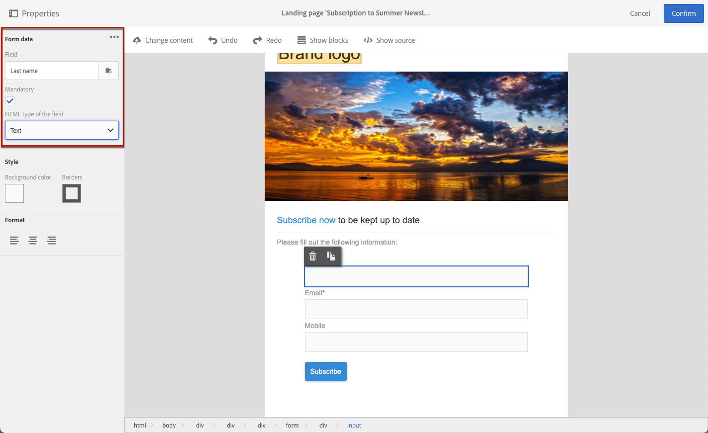
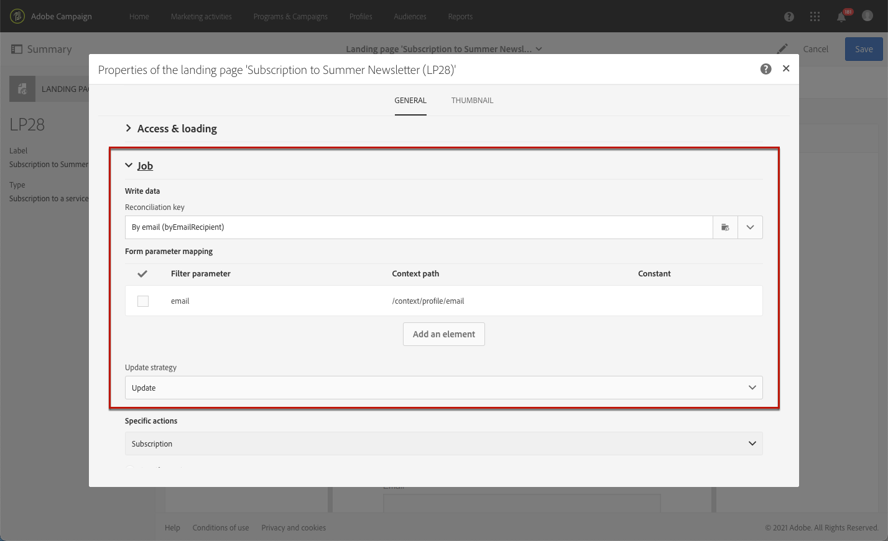
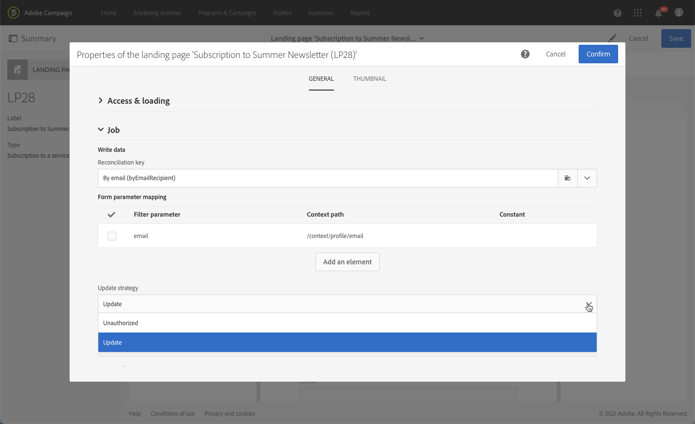
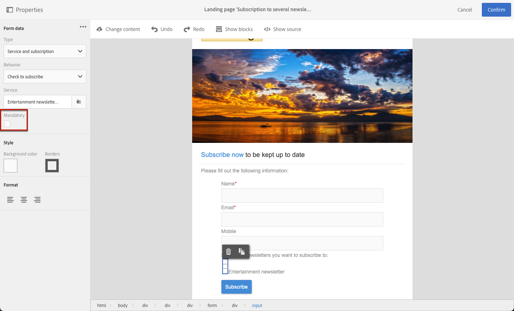

# Gerenciamento de dados de formulário de landing page{#managing-landing-page-form-data}

No conteúdo da landing page, os campos de entrada são usados para armazenar ou atualizar dados do banco de dados do Campaign.

Para fazer isso, esses campos devem ser mapeados para campos de banco de dados.

Você pode definir e gerenciar o mapeamento por meio da **[!UICONTROL Form data]** na paleta esquerda.

## Mapeamento de campos de formulário {#mapping-form-fields}

Para atualizar o banco de dados do Campaign de acordo com suas necessidades, vincule campos de banco de dados relevantes à zona de entrada, ao botão de opção ou aos blocos de tipo de caixa de seleção da landing page.

Para fazer isso, siga as etapas abaixo:

1. Selecione um bloco no conteúdo da landing page.

   >[!NOTE]
   >
   >Os campos padrão das landing pages incorporadas são pré-configurados. Você pode modificá-los conforme necessário.

1. Acesse o **[!UICONTROL Form data]** na paleta esquerda.

1. Para alterar o tipo de campo, selecione um valor na variável **[!UICONTROL HTML type of the field]** lista suspensa.

   

   >[!NOTE]
   >
   >Para obter mais informações sobre como usar o tipo de caixa de seleção em uma landing page, consulte [Atualizar várias assinaturas de serviço](#multiple-subscriptions) e [Caixa de seleção do contrato](#agreement-checkbox) seções.

1. Se você selecionar um tipo de campo que não seja compatível com o campo de banco de dados atualmente selecionado na variável **[!UICONTROL Field]** , uma mensagem de aviso será exibida. Para obter o mapeamento ideal, selecione um valor apropriado.

   

1. Use o **[!UICONTROL Field]** para selecionar um campo de banco de dados que será vinculado ao campo de formulário.

   

   >[!NOTE]
   >
   >As landing pages só podem ser mapeadas com o **[!UICONTROL Profiles]** ou **[!UICONTROL Service]** recursos.

   Neste exemplo, mapeie a variável **Nome** da sua página de aterrissagem para o campo **[!UICONTROL Last name]** do campo **[!UICONTROL Profiles]** recurso.

   

1. Marque a opção **[!UICONTROL Mandatory]**, se necessário. Nesse caso, a landing page só poderá ser enviada se o usuário tiver preenchido esse campo.

   

   Se um campo obrigatório não estiver preenchido, uma mensagem de erro será exibida quando o usuário enviar a página.

1. Clique em **[!UICONTROL Confirm]** para salvar as alterações.

<!--If you choose a mandatory **[!UICONTROL Checkbox]**, make sure that it is of **[!UICONTROL Field]** type.-->

## Armazenamento e reconciliação de dados{#data-storage-and-reconciliation}

Os parâmetros de reconciliação de dados permitem definir como os dados inseridos na landing page serão gerenciados depois que forem enviados por um usuário.

Para fazer isso:

1. Edite as propriedades de landing page acessadas pelo ícone  no painel da landing page e exiba os parâmetros **[!UICONTROL Job]**.

   

1. Selecione o **[!UICONTROL Reconciliation key]**: esse campo de banco de dados é usado para determinar se o visitante tem um perfil já conhecido no banco de dados do Adobe Campaign. Pode ser, por exemplo, email, nome, sobrenome. A chave de reconciliação permite atualizar ou criar um perfil, de acordo com a **[!UICONTROL Update strategy]** definido abaixo.

1. Defina o **[!UICONTROL Form parameter mapping]**: esta seção permite mapear os parâmetros do campo de landing page e os usados na chave de reconciliação.

1. Selecione o **[!UICONTROL Update strategy]**: se a chave de reconciliação recuperar um perfil de banco de dados, você poderá optar por atualizar esse perfil com os dados inseridos no formulário ou impedir essa atualização.

   

## Várias subscrições de serviço {#multiple-subscriptions}

Você pode usar várias caixas de seleção em uma única página de aterrissagem para permitir que os usuários assinem ou cancelem a inscrição de vários serviços.

Para fazer isso, siga as etapas abaixo:

1. Ao criar a landing page:

   * Selecione um bloco e, na caixa suspensa **[!UICONTROL Form data]** escolha **[!UICONTROL Checkbox]** como o tipo de campo.

      

   * Se você estiver familiarizado com o HTML, também poderá inserir uma caixa de seleção manualmente usando o **[!UICONTROL Show source]** botão.

      

      Isso permite inserir a caixa de seleção sempre que for conveniente na página.

      

1. Verifique se a caixa de seleção está marcada no conteúdo. A variável **[!UICONTROL Type]** é exibida na janela **[!UICONTROL Form data]** seção da paleta esquerda. Selecione **[!UICONTROL Service and subscription]** na lista.

   

1. Escolha uma opção no **[!UICONTROL Behavior]** lista suspensa.

   

1. Selecione um [serviço](../../audiences/using/creating-a-service.md) da lista correspondente.

   

1. Verifique se **[!UICONTROL Mandatory]** está desmarcada. Caso contrário, seus usuários não terão uma escolha.

   

1. Para adicionar mais caixas de seleção que permitam assinar outros serviços, repita as etapas acima quantas vezes forem necessárias.

   

Quando a landing page for publicada, os usuários poderão marcar várias caixas de seleção para assinar vários boletins informativos da mesma página.

## Caixa de seleção do contrato {#agreement-checkbox}

Você pode adicionar uma caixa de seleção que o perfil precisa marcar antes de enviar a landing page.

Por exemplo, isso permite solicitar o consentimento dos usuários para a política de privacidade ou fazê-los aceitar seus termos e condições, antes de enviarem o formulário.

>[!IMPORTANT]
>
>A seleção dessa caixa de seleção é obrigatória para os usuários. Se não for selecionada, eles não poderão enviar a landing page.

Para inserir e configurar essa caixa de seleção, faça o seguinte:

1. Ao criar a landing page:

   * Selecione um bloco e, na caixa suspensa **[!UICONTROL Form data]** escolha **[!UICONTROL Checkbox]** como o tipo de campo.

      

   * Se você estiver familiarizado com o HTML, também poderá inserir uma caixa de seleção manualmente usando o **[!UICONTROL Show source]** botão.

      

      <!--Manually insert a checkbox, such as in the example below:

      <!--Click **[!UICONTROL Hide source]**.-->

1. Verifique se a caixa de seleção está marcada.

   

1. A variável **[!UICONTROL Type]** é exibida na janela **[!UICONTROL Form data]** seção da paleta esquerda. Selecione **[!UICONTROL Agreement]** na lista.

   

   >[!NOTE]
   >
   >A variável **[!UICONTROL Agreement]** O elemento não está mapeado para um campo do banco de dados do Campaign.

1. Clique em  ícone ao lado de **[!UICONTROL Form data]** para acessar as propriedades avançadas da caixa de seleção.

1. Você pode editar a mensagem, se necessário.

   

   Esse texto será exibido como um aviso se o usuário não marcar a caixa de seleção antes de enviar o formulário.

   >[!NOTE]
   >
   >Esta ação é obrigatória por padrão e não pode ser alterada.

1. Clique em **[!UICONTROL Confirm]**.

Agora, sempre que a landing page for exibida, o usuário precisará marcar essa caixa de seleção antes de enviar o formulário. Caso contrário, o aviso será exibido e o usuário não poderá enviar o formulário até que a caixa de seleção seja ativada.