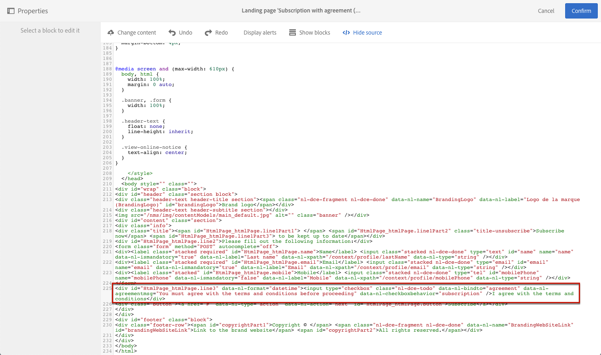

# Gerenciamento de dados de formulário de landing page{#managing-landing-page-form-data}

## Alteração das propriedades dos dados de formulário de landing page{#changing-a-landing-page-form-data-properties}

Você pode vincular campos de banco de dados à zona de entrada, ao botão de opção ou aos blocos de tipo de caixa de seleção. Para fazer isso, selecione o bloco e acesse o **[!UICONTROL Form data]** na paleta.

* A zona de entrada **Field** permite selecionar um campo de banco de dados a ser vinculado ao campo de formulário.
* A opção **Mandatory** permite autorizar o envio da página somente se o usuário tiver preenchido o campo. Se um campo obrigatório não estiver preenchido, uma mensagem de erro será exibida.

## Mapeamento de campos de formulário {#mapping-form-fields}

Os campos de entrada são usados para armazenar ou atualizar dados no banco de dados do Campaign. Para isso, você precisa vincular campos de banco de dados à zona de entrada, ao botão de opção ou aos blocos de tipo de caixa de seleção. Para fazer isso:

1. Selecione um bloco na landing page.
1. Preencha a parte **[!UICONTROL Form data]** na paleta.

   

1. Escolha um campo de banco de dados a ser vinculado ao campo de formulário na zona de seleção **[!UICONTROL Field]**. As landing pages só podem ser mapeadas com **Perfis**.

1. Marque a opção **[!UICONTROL Mandatory]**, se necessário. A página só poderá ser enviada se o usuário tiver preenchido esse campo. Se um campo obrigatório não estiver preenchido, uma mensagem de erro será exibida quando o usuário validar a página.

1. Defina o tipo de campo escolhendo, por exemplo **[!UICONTROL Text]**, **[!UICONTROL Number]** ou **[!UICONTROL Date]** na área de seleção **[!UICONTROL HTML type of the field]**.
Se você escolher uma **[!UICONTROL Checkbox]** obrigatória, verifique se ela é do tipo **[!UICONTROL Field]**.

>[!NOTE]
>
>Os campos padrão das landing pages incorporadas são pré-configurados. Você pode modificá-los conforme necessário.

## Armazenamento e reconciliação de dados{#data-storage-and-reconciliation}

Os parâmetros de reconciliação de dados permitem definir como os dados inseridos na landing page serão gerenciados depois que forem enviados por um usuário.

Para fazer isso:

1. Edite as propriedades de landing page acessadas pelo ícone  no painel da landing page e exiba os parâmetros **[!UICONTROL Job]**.

   

1. Selecione a **[!UICONTROL Reconciliation key]**: esses campos de banco de dados (por exemplo: email, nome, sobrenome) são usados para determinar se o visitante tem um perfil já conhecido no banco de dados do Adobe Campaign. Isso permite atualizar ou criar um perfil, de acordo com os parâmetros de estratégia de atualização definidos.
1. Defina o **[!UICONTROL Form parameter mapping]**: esta seção permite mapear os parâmetros do campo de landing page e os usados na chave de reconciliação.
1. Selecione a **[!UICONTROL Update strategy]**: se a chave de reconciliação recuperar um perfil de banco de dados, você poderá optar por atualizar esse perfil com os dados inseridos no formulário ou impedir essa atualização.

## Caixa de seleção Contrato {#agreement-checkbox}

Você pode adicionar uma caixa de seleção que o perfil deve marcar antes de enviar a landing page.

Por exemplo, isso permite solicitar o consentimento dos usuários para a política de privacidade ou fazer com que eles aceitem seus termos e condições, antes de enviarem o formulário.

<!--This is particularly useful in the following case:

When a profile opens the landing page from an Outlook.com mailbox, Outlook checks whether the links on the landing page are suspicious. However, this Outlook security feature (called safelinks) has an unwanted effect: it automatically activates the buttons included on the landing page. Consequently, profiles are automatically subscribed or unsubscribed without confirmation when the landing page is displayed after clicking the email link, even if they do not submit the form.

To avoid this, Adobe recommends you always add to your landing page a checkbox which enables the profile to agree before proceeding with subscription or unsubscription.-->

>[!IMPORTANT]
>
>Marcar essa caixa de seleção é obrigatório para seus usuários. Se não estiver selecionada, ela não poderá enviar a landing page.

Para inserir e configurar essa caixa de seleção, faça o seguinte:

1. Ao criar a landing page, clique em **[!UICONTROL Show source]**.

   

1. Insira uma caixa de seleção manualmente, como no exemplo abaixo:

   

   <!--
   
<input type="checkbox" class="nl-dce-todo" data-nl-bindto="agreement" data-nl-agreementmsg="You must agree with the terms and conditions before proceeding" />I agree with the terms and conditions

   -->

1. Clique em **[!UICONTROL Hide source]**.

1. A nova caixa de seleção é exibida. Selecione-o.

   

1. A lista suspensa correspondente é exibida na seção **[!UICONTROL Form data]** da paleta. Selecione **[!UICONTROL Agreement]** na lista.

   

   >[!NOTE]
   >
   >O elemento **[!UICONTROL Agreement]** não está mapeado para um campo do banco de dados do Campaign.

1. Clique no ícone  ao lado de **[!UICONTROL Form data]** para acessar as propriedades avançadas da caixa de seleção.

1. Você pode editar a mensagem, se necessário.

   

   Esse texto será exibido como um aviso se o usuário não marcar a caixa de seleção antes de enviar o formulário.

   >[!NOTE]
   >
   >Esta ação é obrigatória por padrão e não pode ser alterada.

1. Clique em **[!UICONTROL Confirm]**.

Agora, sempre que a landing page for exibida, o usuário precisará marcar essa caixa de seleção antes de enviar o formulário. Caso contrário, o aviso será exibido e o usuário não poderá enviar o formulário até que a caixa de seleção seja ativada.