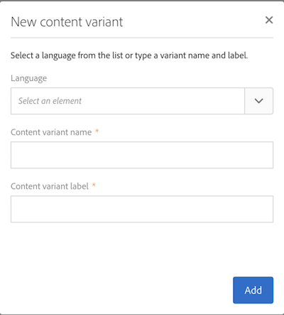

# Modelos de mensagens multilíngues {#multilingual-messages-template}

Um modelo multilíngue é um modelo específico para gerenciar mensagens multilíngues. Esse tipo de modelo está disponível para mensagens de **email** e **SMS** e pode ser usado no modo independente, em um fluxo de trabalho ou em um delivery recorrente.

Nos modelos de recursos multilíngues, o gerenciamento de idiomas é baseado em variantes. **Cada variante representa um idioma**. O Adobe Campaign Standard pode configurar no máximo 40 variantes.

Adobe Campaign contém um idioma padrão, definido como **EN**. O idioma padrão pode ser alterado para outra variante, mas nunca deve ser excluído.

Durante a criação do modelo, é possível adicionar o número de variantes correspondente ao número de idiomas necessários na mensagem.

Para executar a criação de SMS ou modelo de email, siga estas etapas:

1. Duplicado de um modelo multilíngue existente (SMS ou Email).

   

   >[!NOTE]
   >
   >Você também pode modificar um modelo padrão existente em um modelo multilíngue clicando no **[!UICONTROL Initialize content variant]** botão nas propriedades do modelo.

1. Modifique as propriedades para personalizar o rótulo, o rastreamento etc.
1. Modifique o número de variantes desejadas clicando no bloco de variantes. A janela de variantes é exibida

   

   É possível adicionar ou remover variantes. Para adicionar uma variante, preencha a **[!UICONTROL New content variant]** janela.

   

   >[!NOTE]
   >
   >Não exclua a variante &quot;padrão&quot;, pois é a variante enviada para perfis sem um parâmetro de idioma preferencial concluído.

1. Personalize a variante do rótulo, se necessário, e clique em **[!UICONTROL Confirm]**.
1. Também é possível adicionar diretamente o conteúdo para cada variante.

Agora você está pronto para criar um email ou uma mensagem SMS com base nesse modelo multilíngue.

**Tópicos relacionados:**

* [Criação de um email multilíngue](../../channels/using/creating-a-multilingual-email.md)
* [Criar perfis](../../audiences/using/creating-profiles.md)
