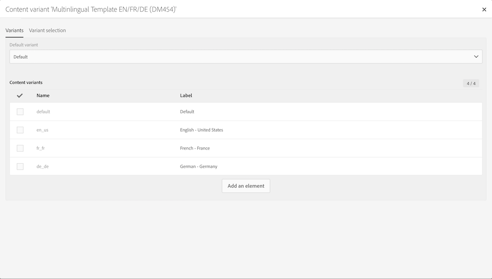

# Templates de mensagens multilíngues {#multilingual-messages-template}

Um template multilíngue é específico para gerenciar mensagens multilíngues. Esse tipo de template está disponível para mensagens de **email** e **SMS** e pode ser usado no modo independente, em um fluxo de trabalho ou em um delivery recorrente.

Nos templates de recursos multilíngues, o gerenciamento de idiomas é baseado em variantes. **Cada variante representa um idioma**. O Adobe Campaign Standard pode configurar, no máximo, 40 variantes.

O Adobe Campaign contém um idioma padrão, definido como **EN**. O idioma padrão pode ser alterado para outra variante, mas nunca deve ser excluído.

Durante a criação do template, é possível adicionar a quantidade de variantes correspondentes ao número de idiomas necessários na mensagem.

Para criar um template de SMS ou de email, siga estas etapas:

1. Duplique um template multilíngue (SMS ou Email).

   

   >[!NOTE]
   >
   >Você também pode modificar um template padrão em um template multilíngue clicando no botão **[!UICONTROL Initialize content variant]** nas propriedades do template.

1. Modifique as propriedades para personalizar o rótulo, o rastreamento etc.

1. Modifique o número de variantes desejadas clicando no bloco de variantes. A janela a seguir é exibida.

   

   É possível adicionar ou remover variantes. Para adicionar uma variante, preencha a janela **[!UICONTROL New content variant]**.

   

   >[!NOTE]
   >
   >Não exclua a variante “padrão”, pois ela é enviada para os perfis sem parâmetro de idioma preferencial preenchido.

1. Personalize a variante de rótulo, se necessário, e clique em **[!UICONTROL Confirm]**.

1. Você também pode adicionar diretamente o conteúdo de cada variante.

Agora você está pronto para criar uma mensagem de email ou SMS com base nesse template multilíngue.

**Tópicos relacionados:**

* [Criação de um email multilíngue](../../channels/using/creating-a-multilingual-email.md)
* [Criação de perfis](../../audiences/using/creating-profiles.md)
