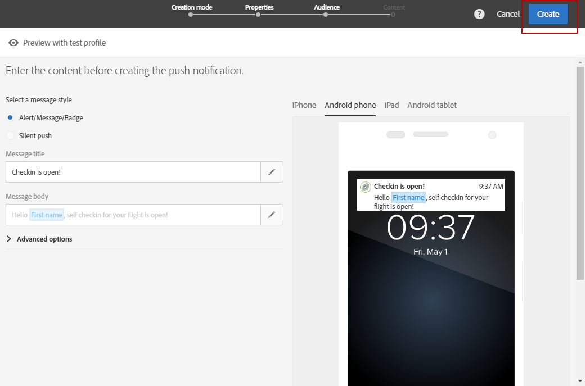

# Preparação e envio de uma notificação por push{#preparing-and-sending-a-push-notification}

## Preparação da notificação {#preparing-the-notification}

As etapas para criar uma notificação por push com o Adobe Campaign são:

1. No **[!UICONTROL Marketing activities]** janela, [criar uma nova atividade de marketing](../../start/using/marketing-activities.md#creating-a-marketing-activity).

   Observe que uma única notificação por push também pode ser criada a partir de um [campaign](../../start/using/marketing-activities.md#creating-a-marketing-activity) ou da Adobe Campaign [home page](../../start/using/interface-description.md#home-page).

   Você também pode usar uma atividade de delivery de notificação por push em um workflow. Essa atividade é apresentada na seção [Entrega por notificação por push](../../automating/using/push-notification-delivery.md) seção.

1. Selecione **[!UICONTROL Push notification]**.
1. Selecione um modelo.

   

   Por padrão, você pode selecionar um dos dois modelos a seguir:

   * **[!UICONTROL Send push to Campaign profiles]**: use este modelo para direcionar os perfis do Adobe Campaign CRM que assinaram seu aplicativo para dispositivos móveis e aceitaram receber notificações por push. Você pode inserir [personalização](../../designing/using/personalization.md#inserting-a-personalization-field) campos na sua notificação por push, como o nome do recipient.
   * **[!UICONTROL Send push to app subscribers]**: use esse modelo para enviar uma notificação por push a todos os usuários de aplicativos móveis conhecidos e anônimos que optaram por receber notificações do seu aplicativo. Você pode personalizar essas mensagens com dados coletados do seu aplicativo móvel.

   Também é possível selecionar templates multilíngues. Para obter mais informações, consulte [Criação de uma notificação por push multilíngue](../../channels/using/creating-a-multilingual-push-notification.md).

   Para obter mais informações sobre templates, consulte [Gerenciamento de modelos](../../start/using/marketing-activity-templates.md) seção.

1. Insira suas propriedades de notificação por push e selecione o aplicativo móvel na caixa **[!UICONTROL Associate a Mobile App to a delivery]** campo.

   Observe que o menu suspenso exibirá os aplicativos SDK V4 e Experience Platform SDK.

   

   Você pode vincular a notificação por push a uma campanha. Para fazer isso, selecione-o nas campanhas já criadas.

1. Na tela a seguir, você pode especificar um público-alvo, por exemplo, todos os clientes do VIP que se inscreveram em um aplicativo para dispositivos móveis específico. Para obter mais informações, consulte [Criação de públicos](../../audiences/using/creating-audiences.md).

   Seu público-alvo será filtrado automaticamente com base no aplicativo para dispositivos móveis selecionado na etapa anterior.

   

1. Agora você pode personalizar sua notificação por push. Primeiro, escolha o estilo da mensagem: **[!UICONTROL Alert/Message/Badge]** ou **[!UICONTROL Silent push]**. Os tipos de notificação por push estão descritos no [Sobre as notificações por push](../../channels/using/about-push-notifications.md) seção.

   Edite o conteúdo da sua notificação por push e defina as opções avançadas. Consulte [Personalização de uma notificação por push](../../channels/using/customizing-a-push-notification.md).

   

   O conteúdo e as opções de notificação por push configuradas aqui são passados para o aplicativo móvel na forma de uma carga. A estrutura detalhada da carga é descrita na seção [Como entender a estrutura de payload das notificações por push do Campaign Standard](../../administration/using/push-payload.md) nota técnica.

1. Clique em **[!UICONTROL Create]**.

   

1. Antes de enviar a notificação, você pode testá-la com perfis de teste e ver exatamente o que os recipients verão antes de enviar o delivery. Selecionar **[!UICONTROL Audiences]** no resumo do delivery e clique no link **[!UICONTROL Test profiles]** guia.

   Para obter mais informações sobre o envio de testes, consulte [Perfis de teste](../../sending/using/sending-proofs.md).

1. Selecione os perfis de teste e clique em **[!UICONTROL Preview]** para exibir a notificação: o conteúdo é personalizado com os dados do perfil de teste.
1. Verifique o layout de notificação por push em diferentes dispositivos: selecione iPhone, Android phone, iPad ou Android tablet para visualizar a renderização.

   

1. A variável **[!UICONTROL Estimated Payload Size]** é uma estimativa baseada nos dados do perfil de teste. O tamanho real do conteúdo pode variar. O limite da mensagem é 4 KB.

   >[!CAUTION]
   >
   >Se o tamanho da carga exceder o limite de 4 KB, a mensagem não será entregue.

Observe que os dados de personalização afetam o tamanho da mensagem.

## Envio da notificação {#sending-the-notification}

As notificações por push podem ser enviadas para um público selecionado no Adobe Campaign definindo os critérios de público. Para o exemplo abaixo, nosso público-alvo selecionado consiste em 4 assinantes de aplicativos para dispositivos móveis direcionados.

1. Clique em **[!UICONTROL Prepare]** para calcular o target e gerar as notificações.

   

1. Ao concluir com êxito a preparação, a variável **[!UICONTROL Deployment]** apresenta os seguintes KPIs: **[!UICONTROL Target]** e **[!UICONTROL To deliver]**. Observe que **[!UICONTROL To deliver]** count é menor que o **[!UICONTROL Targeted]** um devido a exclusões que podem ser visualizadas ao clicar em  na parte inferior do **[!UICONTROL Deployment]** janela.

   

1. No **[!UICONTROL Exclusion logs]** , você poderá encontrar a lista de todas as mensagens excluídas do público-alvo enviado e o motivo por trás dessa exclusão.

   Aqui, podemos ver que um de nossos assinantes de aplicativos móveis foi excluído porque o endereço estava na inclui na lista de bloqueios de assinantes e os outros assinantes porque o perfil era uma duplicata.

   

1. Clique em **[!UICONTROL Exclusion causes]** para exibir o volume de mensagens excluídas.

   

1. Clique agora em **[!UICONTROL Confirm]** para enviar notificações por push.
1. Verifique o status do delivery no painel de mensagens e logs. Para obter mais informações, consulte [Envio de mensagens](../../sending/using/confirming-the-send.md) e [Logs de entrega](../../sending/using/monitoring-a-delivery.md#delivery-logs).

   Neste exemplo, o painel de mensagens exibe que o Adobe Campaign tentou enviar duas notificações por push: uma foi entregue com êxito ao dispositivo e a outra falhou. Para saber por que o delivery tem erros, clique no link  na parte inferior do **[!UICONTROL Deployment]** janela.

   

1. No **[!UICONTROL Deployment]** clique na guia **[!UICONTROL Sending logs]** para acessar a lista de notificações por push enviadas e seus status. Para esse delivery, uma notificação por push foi enviada com êxito, enquanto a outra falhou devido a um token de dispositivo inválido. Esse assinante será adicionado ao incluo na lista de bloqueios de delivery adicional.

   >[!NOTE]
   >
   >Os motivos podem ser qualquer falha downstream para o Adobe Campaign. No caso de falhas de provedores como apns e fcm, a razão também refletirá isso. Para obter mais informações sobre falhas de provedor, consulte o [Apple](https://developer.apple.com/library/content/documentation/NetworkingInternet/Conceptual/RemoteNotificationsPG/CommunicatingwithAPNs.html) e [Android](https://firebase.google.com/docs/cloud-messaging/http-server-ref) documentação.

   

Agora você pode medir o impacto da entrega de notificações por push com relatórios dinâmicos.

**Tópicos relacionados:**

* [Relatório de notificação por push](../../reporting/using/push-notification-report.md)
* [Enviar uma notificação por push em um workflow](../../automating/using/push-notification-delivery.md)
